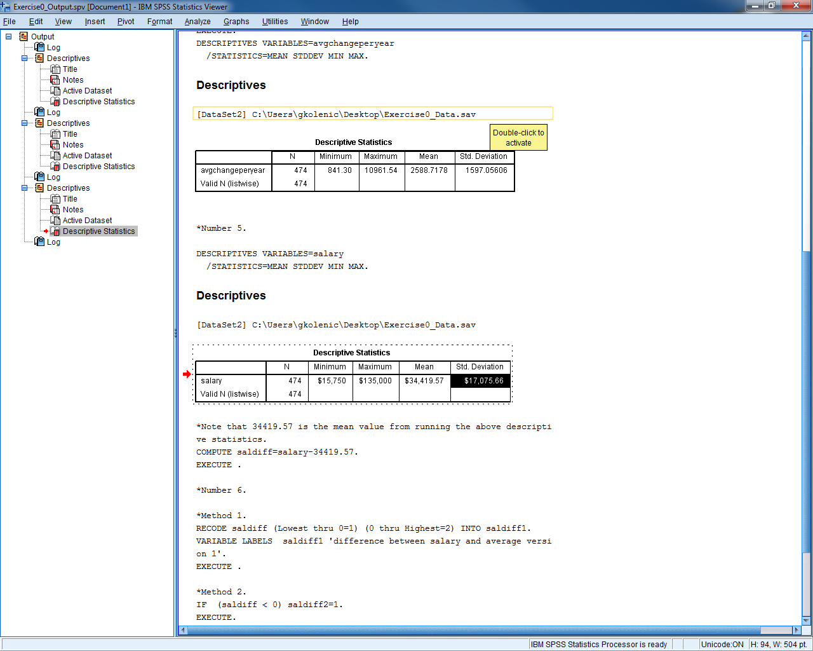
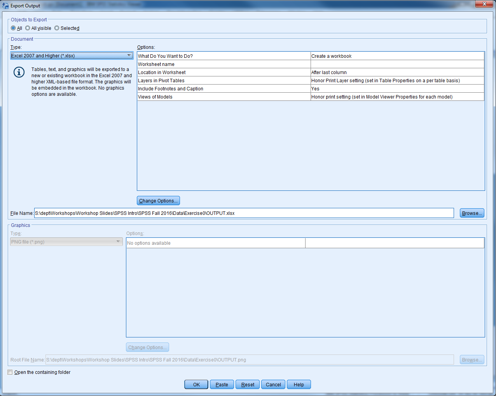
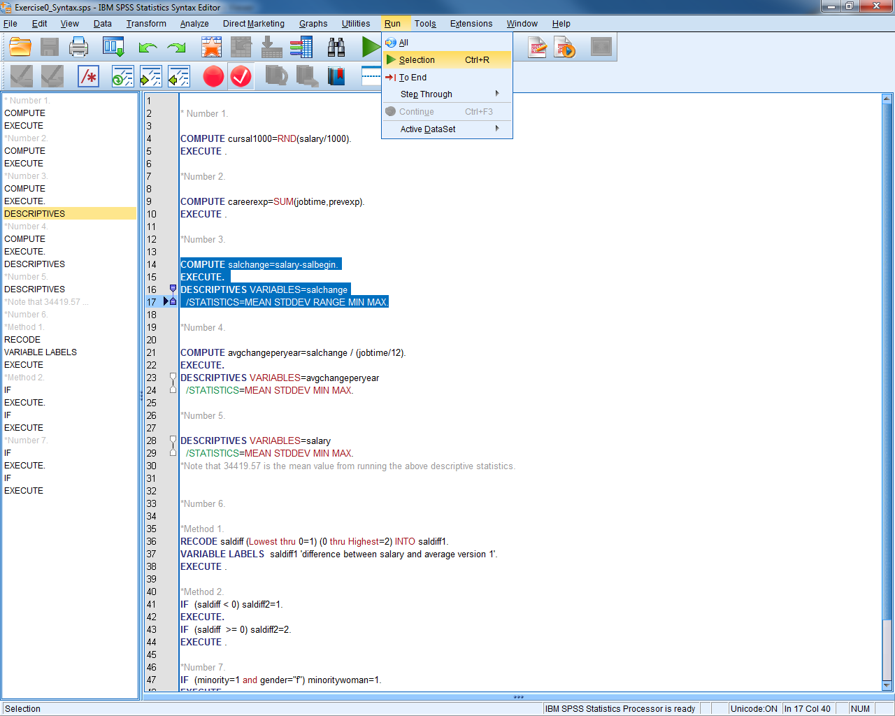
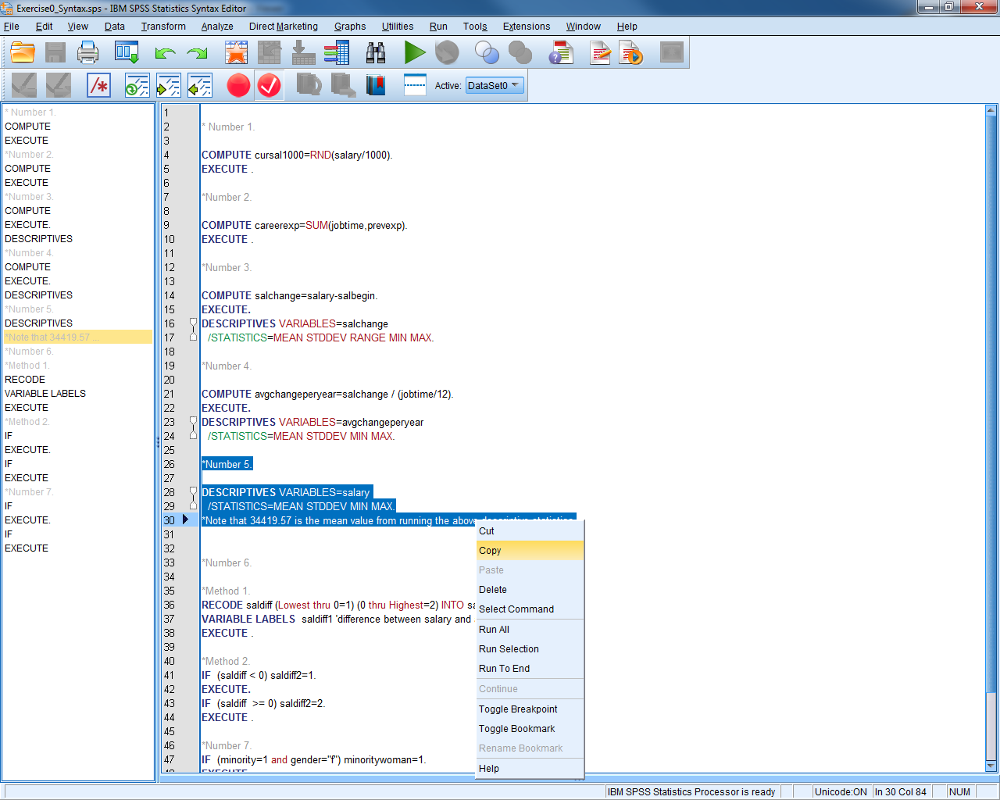
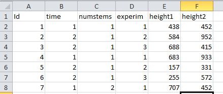
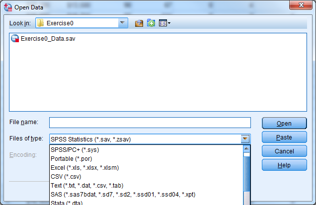
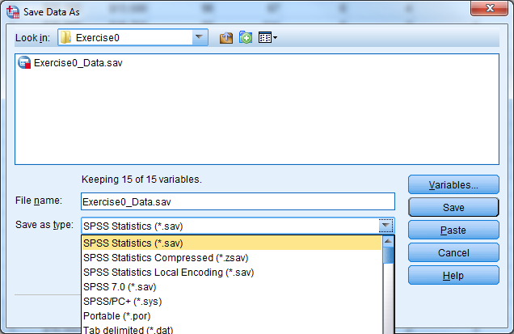

# The Basics of SPSS

## What does SPSS Stand For?

-   Originally, SPSS stood for Statistical Package for the Social
    Sciences.

-   Now, it stands for Statistical Product and Service Solutions.

-   SPSS has also been known as "PASW" which stands for Predictive
    Analytics Software.

## SPSS Compared to Other Statistical Software Packages

We can think of statistical software packages on a spectrum organized by
difficulty and complexity. On one end we have Excel which is easy and
familiar to most people. On the other end we have C++ which is difficult
and unfamiliar. All software packages are somewhere in between. SPSS is
closer to the Excel end of the spectrum which makes is convenient to
use. SPSS builds on what you already know from Excel, which makes the
transition from Excel to a more powerful statistical software package
easier.

Minitab

JMP Stata

SPSS SAS

Matlab

> R/S-Plus

Excel C++

These differences seem big at first, but they are a small price to pay
for the additional data management, graphical, and statistical
capabilities that SPSS will give you over Excel. While SPSS seems to be
more restrictive than Excel, the restrictions it sets ensure that your
data set is ready for statistical analysis.

## The Three Parts of SPSS

There are three parts to SPSS, each with its own window: Data Editor,
Output Viewer, and Syntax Window. The sections below describe each of
these parts in detail.

-   Data Editor Enter and View Data Values, files end in .sav or.por

-   Output Viewer View Statistical Results, files end in .spv

-   Syntax Window Write & Run Syntax Command, files end in .sps

### Data Editor

The Data Editor is visible when SPSS starts up. There are two views of
the Data Editor: Data View and Variable View. In Data View, each row
represents one case (e.g., one survey respondent), while each column
represents one variable (one piece of information, e.g. age). By using
the scroll bars to go up and down, you can examine any case in the
sample. By using the scroll bars to go right and left, you can see any
variable.

The first step in an SPSS session is to open a data file or start
entering data in a new data file. A data file is a binary file ending in
the extension .sav or .por, which contains a given data set. Any
requested statistics or analyses that are performed pertain to this data
set.

#### Open a Data File

To open a data file, go to "File" at the upper left of the menu bar.
Click "Open" then "Data". Locate the file that you want to open and
double-click on it.

**Try it: Open Exercise0\_Data**

{width="6.497396106736658in"
height="3.8020833333333335in"}

{width="6.497395013123359in"
height="4.052083333333333in"}

***Start a New Data File***

To start a new data file, go to "File" at the upper left of the menu
bar. Click "New" then "Data".

### Output Viewer

The output viewer is a window where any statistical results, including
tables or graphs, can be viewed. The output window does not appear until
the first time SPSS is asked to provide some sort of results. The output
viewer will also record the syntax used to generate the results.

**Try it: Open Exercise0\_Output**

{width="6.5in" height="5.2in"}

The output viewer is divided into two parts: on the left, a narrow
window shows an outline which organizes all the results. The outline can
be used to delete certain portions of the output, rearrange pieces of
the output, jump to specific results, and temporarily hide (or make
visible) certain parts of the output. More on this later.

The actual results themselves are in the larger window to the right.
When printing the output, only the information in this window is
printed. Once the viewer has been opened, it will remain open even if
all the output is deleted and the output window is empty.

Occasionally the results from a procedure will be quite lengthy, and
only the first portion will appear in the window. In these cases, a
small red triangle pointing down will appear at the bottom of this
visible portion. To see those results in their entirety, double-click on
that section of output. Scroll bars will appear which pertain to that
piece of output; scroll down to see the remainder.

#### Labels in Output

Variable labels and value labels will be used in place of the actual
variable names or values, by default. This can be changed under "Edit"
"Options" "Output" tab. SPSS can display labels only, the actual names
or values only, or both.

#### Tables & Charts

Results are commonly presented in the output viewer in table form or
chart (graph) form. To edit a table, double-click on that table
(anywhere will do). An editing window is set up around that table,
indicated by a rough gray outline. New menus appear in the menu bar at
the top. Once this editing mode is begun, double-clicking in any cell in
a table will allow you to change the names, labels, or values in those
cells.

**Helpful Hint:** To remove scientific notation in a table, double-click
on the table and highlight the columns or rows containing the notation.
Under "Format" "Cell Properties" and select a new numeric format, such
as \#,\#\#\#.\#\#. The number of decimal places can be increased or
decreased here as well.

Editing a chart is similar to editing a table. Begin by double-clicking
anywhere on the chart and the Chart Editor window will appear. Once in
the Chart Editor, many things can be altered simply by double-clicking
and changing fields in the dialogue boxes which appear.

**Try it: Double click on the Descriptive Statistics table for the
salary variable. Change the Std. Deviation to have only two digits to
the right of the decimal point.**

{width="6.497396106736658in"
height="4.479166666666667in"}

#### Export Output

You can save the output file for future use or to send to colleagues. In
order to open a SPSS output file, your computer must have SPSS.
Sometimes it is useful to export the information from your output file
into another format, such as Microsoft Excel or Microsoft Word. Excel is
a great platform to export to---tables turn out very nicely. To export,
select "File" "Export" and the export wizard will appear. Select the
file type and the location to save the file, then select "OK".

**Try it: Export the output table as an Excel file and investigate the
Excel file.**

{width="6.5in" height="5.200694444444444in"}

Starting with SPSS Version 11.5, selected output objects, such as charts
and tables, can also be exported in an Excel or Word format. This is a
very useful feature that can be used to export selected tables from the
Output Viewer into an Excel format, for additional work such as creation
of custom graphs. To export charts, select the charts in the output
window by clicking once on them, and then go to "File" "Export" select
"Selected" where it asks what objects to export. Choose the "html" file
type for charts, and under the Graphics portion of the dialogue box a
drop down menu allows one to access the various types of image files
available. The bitmap image format is one option. Although these images
are somewhat large in terms of kilobytes, they can be read by a great
many programs, including Word, Power Point and others.

One last option for exporting SPSS output is to copy and paste all
output into a Word file. The steps are as follows:

-   Click once to select the piece(s) of output to move.

-   Go to "Edit" "Copy", press the short-cut ctrl-C, or right-click and
    select "Copy").

-   In Word, place the cursor where the output will go.

-   Under "Edit", click "Paste", or use the short-cut ctrl-V.

You can then resize and move around the pasted objects in Word. The same
process outlined above should work for other Microsoft programs, such as
Power Point or Excel. While pasted objects can be edited in theory, this
is usually difficult. It is best to do all editing in SPSS before
pasting to Word.

### Syntax Window

The Syntax Window looks like the Output Viewer, but it is a text editing
window in which SPSS commands can be written out by hand. It allows
users to type commands in the right-hand side window rather than use
menus. Commands executed using written code are no different from
commands executed using the pull-down menus and dialogue boxes. There
are some rare instances when something is available only by writing
syntax, and cannot be found in any menu.

The syntax window provides these advantages:

-   It allows a user to do repetitive tasks more quickly, using copy &
    paste.

-   It provides a written record of data management and analyses
    performed.

-   It can be sent to other SPSS users to help in setting up data files
    or to re-create your analyses.

**Try it: Open Exercise0\_Syntax.**

{width="6.5in" height="5.2in"}

You can generate syntax in a few different ways:

-   Write out the syntax by hand.

-   Use the "Paste" button inside a dialogue box.

-   Copy and paste the syntax from the output viewer.

The "Paste" button in dialogue boxes causes the written syntax
equivalent of a command to be entered into the syntax window. A new
syntax window will open if no syntax window was open previously.

#### Run Syntax

To run commands in the syntax window, highlight the commands of interest
and go to "Run" "Selection". Alternatively, you can click on the toolbar
button that looks like a "Play" symbol on a CD player or press ctrl-R as
a short-cut. You can also run all commands in the syntax window by using
"Run" "All".

**Try it: In the Syntax Window, highlight number 3 and run the selection
highlighted below. Check the Output Viewer.**

{width="6.497395013123359in"
height="4.041666666666667in"}

*Repetitive Commands*

As a simple example of repetitive commands, consider a user who needs to
take logs of thirty different variables. To go through the menus and do
thirty computations would be quite time-consuming. This is a case where
using syntax would be easier, because cut, copy, and paste commands are
available in the Syntax Window. If you pasted one such computation
command to the syntax window, you could then copy the command out thirty
times. You would only need to edit the variable names in each line.

The steps for using syntax for repetitive commands are:

-   Paste one example command into the syntax window.

-   Copy this command by highlighting it and typing ctrl-C or by right
    clicking and copying.

-   Paste the command repeatedly using ctrl-V or right clicking and
    pasting.

-   Edit each line by changing the variable names.

-   Run the commands!

Once again, the cut, copy, and paste commands have these short-cuts:

-   Cut ctrl-X

-   Copy ctrl-C

-   Paste ctrl-V

**Helpful Hint:** If you want to start setting up a data set, by
formatting variables, recoding, etc., you can begin before you receive
all the data. Test your data management commands on the cases you do
have, and save the syntax file. When you receive the final data
delivery, you can re-run the syntax one last time and be ready to go!

**Try it: Highlight Number 5, copy and paste the syntax. Modify the
syntax such that VARIABLES=salbegin.**

{width="6.5in" height="5.2in"}

#### Reading in Raw Data with Syntax

Reading in raw data files is another common use of the syntax window.
Many organizations will provide large, publicly available data sets by
distributing the raw data and a SPSS syntax file which reads in and
formats that data. If you receive a raw data file and a SPSS syntax
file, sometimes referred to as data definition statements, then follow
these steps to get a copy of the data file in SPSS format:

-   Start SPSS, but do not open any data file yet.

-   Open the syntax file containing the commands to read the data.

-   At the top of the syntax, find the "FILE HANDLE" statement. Change
    the path and the name of the file to match the current file location
    and name (the file should contain instructions as well).

-   Select "Run" "All" .

#### Syntax Examples

**1) Accessing an SPSS data file and rename the dataset**

GET FILE = \'C:\\SPSS\\data\\example.sav\'.

EXECUTE .

DATASET NAME example.

**2) Entering new variables and data**

DATA LIST LIST / age (F2.0) sex (A1) income (F2.1) ethnic (F1.0).

BEGIN DATA

45 F 60.9 2

52 M 22.3 1

34 M 45.8 3

67 F 34.5 1

END DATA.

**3) Creating new numeric or string variables**

NUMERIC ses (F1.0) / numkids yrsmarr (F2.0).

STRING state (A2) / region (A1) / citycode (A4).

**4) Labeling variables**

VARIABLE LABELS age \"Age\" sex \"Sex\" income \"Annual income in
thousands\"

ethnic \"Ethnic category\".

**5) Labeling values of a variable**

VALUE LABELS sex \'M\' \"Male\" \'F\' \"Female\"

/ ethnic 1 \"European American\" 2 \"African American\" 3 \"Asian
American\".

**6) Defining missing values**

MISSING VALUES sex ('X') ethnic (8,9) income (7777) age (0).

**7) Calculating a new variable using a function**

COMPUTE log10inc = LG10(income) .

EXECUTE .

**8) Calculating a new variable using "if then" logic**

IF (sex=\'M\' and age \>= 65) olderman=1.

IF (sex=\'F\' or age \< 65) olderman=0.

EXECUTE .

or:

COMPUTE olderman = (sex=\'M\' and age \>= 65).

EXECUTE .

**9) Recoding a variable**

RECODE ethnic (1=0) (2=1) (3=1) .

EXECUTE .

**10) Recoding into a new variable, keeping the original intact**

RECODE ethnic (1=0) (2=1) (3=1) INTO wh\_nonwh .

EXECUTE .

RECODE income (LOWEST THRU 25 = 1) (26 THRU 44 = 2) (45 THRU HIGHEST=3)

INTO incomcat .

EXECUTE .

**11) Obtaining descriptive statistics for continuous variables**

DESCRIPTIVES

VARIABLES=income age

/STATISTICS=MEAN STDDEV VARIANCE MIN MAX SEMEAN .

**12) Getting frequencies for categorical variables**

FREQUENCIES

VARIABLES=sex ethnic olderman.

**13) Obtaining a cross-tabulation between two categorical variables**

CROSSTABS

/TABLES = jobcat BY gender

/STATISTIC = CHISQ

/CELLS = COUNT ROW COLUMN .

**14) Producing a histogram**

GRAPH

/HISTOGRAM(NORMAL)=income

/TITLE= \'Histogram of Income\'.

**15) Creating side-by-side box-plots**

EXAMINE

VARIABLES=income BY ethnic

/PLOT=BOXPLOT

/STATISTICS=NONE

/NOTOTAL.

**16) Generating a scatter plot**

GRAPH

/SCATTERPLOT(BIVAR)=age WITH income

/MISSING=LISTWISE .

**17) Obtaining a line graph**

GRAPH

/LINE(SIMPLE)=MEAN(income) BY ethnic.

**18) Getting a line graph with multiple lines (e.g. one for women, one
for men)**

GRAPH

/LINE(MULTIPLE)=MEAN(income) BY ethnic BY sex.

**19) Choosing a subset of the data to analyze or examine**

COMPUTE filt\_var=(gender=\'m\').

FILTER BY filt\_var.

EXECUTE .

**20) Returning to the entire sample after looking at a subset**

FILTER OFF.

EXECUTE.

**21) Splitting the observations into strata, so that future analyses
will be repeated for each stratum separately**

SORT CASES BY ethnic .

SPLIT FILE

BY ethnic .

#### Writing Syntax Tips

-   Each command must begin on a new line and must end with a period.

-   A comment can be included in a syntax file. The comment starts with
    an asterisk (\*) and can go beyond one line. A period (.) is
    required in the end of the last line to terminate the comment.

-   SPSS syntax is case insensitive. Capitalized words are used to
    indicate keywords and command names in SPSS documentation, while
    lowercase letters indicate user-specified words; this is only a
    convention.

-   String values must be enclosed in single or double quotes.

-   Commands, sub-commands, and keywords can be abbreviated to three
    letters, but use four or five to avoid ambiguities.

-   Variable names must always be typed out in full. Numbers and
    underscores are valid in a variable name if they are not the first
    letter.

-   The use of capitals will not distinguish two variable names; "name"
    and "NAME" are identical.

-   Sub-commands are preceded by a forward slash ( / ); they need not
    begin on a new line. However, lines of code can't be more than 80
    characters long.

-   The word "EXECUTE" and a period (.) should be included after each
    command, such as COMPUTE and RECODE, that requires changes to the
    data set. Adding in "EXECUTE." will never hurt anything; if in
    doubt, include it.

-   Labels and other items enclosed in quotes must not run onto the next
    line.

-   The word "then" never appears in "if then" types of commands.

## Good to Know

### Dialogue Boxes

The main way that a user tells SPSS what to do is through dialogue
boxes. These are windows that pop up when you click on an item in a menu
or double-click on particular objects.

**Try it: In Data View for Exercise0\_Data, select "Analyze"
"Descriptive Statistics" "Descriptives".**

{width="5.03125in" height="3.53125in"}

While dialogue boxes vary according to the task involved, they all have
at least some of the following buttons:

-   "OK" Carries out the procedure; executes the command now.

-   "Continue" Returns to the main dialogue box after specifying an
    option.

-   "Paste" Writes out the syntax for the procedure in a syntax window.

-   "Reset" Returns the dialogue box to its original blank state.

-   "Cancel" Closes the dialogue box without taking any action.

-   "Help" Opens up a help window specific to that procedure.

In most dialogue boxes, you select certain variables from the list on
the left and move these variables into the active variable box on the
right. Here are some tips:

-   Click on any variable in the variable list, then type the first few
    letters of a variable name to zoom to that name in the list.

-   Hold down shift and click on any two variables to select every
    variable in between.

-   Hold down ctrl and click to select multiple variables that are not
    necessarily adjacent in the list.

You could choose to display either variable labels or names in the
variable list. For example, if you want the names to be displayed, go to
then "Edit" menu and click "Options". When a new window comes up, click
on the tab labeled "General". In the "Variable Lists" section, choose
option "Display names" and "Display labels" for variable labels.

### Adding Comments

You can add descriptive comments to data files by going to "Utilities"
"Data File Comments".

## Tips for Preparing an Excel File for Use with SPSS

-   Place the variable names in the first row. Be sure the names follow
    these rules:

    -   variable names should be no more than 64 characters long (and no
        longer than 8 characters is usually recommended)

    -   variable names must start with a letter

    -   variable names may only have letters, numbers, or underscores in
        them

    -   the following characters must not appear in variable names:
        %,\$,\#,@,!,+,\*,\~,",-,.

    -   no blank spaces can appear in variable names

    -   each variable name must be unique, with no duplicate variable
        names

    -   variable names can be on one row only

<!-- -->

-   Only include the raw, un-summarized data. Delete extraneous data in
    your Excel file, like row or column totals, graphs, etc.

-   Include an identifying number for each case that is unique. If you
    have several spreadsheets for one person, include the identifier on
    each sheet.

-   Only include one value per cell. Don't enter data such as "120/80"
    for blood pressure. Enter systolic blood pressure as one variable,
    and diastolic blood pressure as another variable.

-   Don\'t leave blank rows in the data.

-   Don't mix numeric and character values, such as names and ID
    numbers, in the same column.

-   Character variables are allowed in statistical packages but are not
    as flexible as numeric variables. Use numeric values when feasible.

-   If you have missing values, you can indicate them with a numeric
    code, such as 99 or 999, or you can leave the cell blank. Be sure,
    if you use a missing value code, that it is not a plausible real
    data value.

-   Save the spreadsheet with values only -- not formulas.

An ideal Excel data set might look like this:

{width="5.59375in" height="2.357273622047244in"}

## Exercise 1 -- Properly Formatted Data

In order to analyze data properly in SPSS, we need to follow the
guidelines set out in the course notes.

Open Exercise1\_Data and see what guidelines we have ignored.

## Importing Data into SPSS

SPSS can easily read in data from Excel, SAS or Stata, as well as
several lesser used options.

To open a file from another program, go to "File" "Open". Under "File
Type" find the program the data file was created in. Select this type
and find the file you'd like to open. Click "Open". It's that easy --
the data file should appear. If your data is not stored in a format that
SPSS can read, then first convert the file to Excel format. Excel is a
useful liaison between other programs and SPSS.

**Try it: Select "File" "Open". Investigate the different file types
that you can open.**

{width="5.375in" height="3.490304024496938in"}

Data files that are in TEXT FORMAT (.txt) are either delimited or
divided into columns of fixed length. SPSS provides a wizard that asks
questions and makes intelligent guesses in order to import your text
data. This facility is somewhat like Excel's data-reading wizard.

Delimited files have rows of values that are separated by tabs, commas,
or spaces.

A row of data from a tab-delimited file might look like:

Name Age Gender Occupation Yearly Salary

Jim 25 Male Accountant 65,000

A row of data from a comma-delimited file might look like:

Name,Age,Gender,Occupation,Yearly,Salary

Jim,25 ,Male,Accountant,65,000

Read delimited files into SPSS by going to "File" "Read Text Data".
First, locate the name of the text file and click Open. Answer the
questions as you go along, clicking Next to move on to the next
question. Be sure to choose the Delimited file type, and identify the
character (comma, space, tab, etc) that acts as the delimiter.

Similarly, read fixed-column data files by going to "File" "Read Text
Data". Open the file containing the text data. Follow along with the
questions, clicking Next to move along. Be sure to select the Fixed
width option.

You may name the variables for either delimited or fixed with files
during the import procedure, or after the data have already been read
into the Data Editor. Sometimes the variable names are already in the
top row of the text file. You will be able to tell SPSS whether these
names are present or absent in the text file.

Note that for fixed width data, particularly when many variables are
involved, it may be easier to use syntax commands rather than the menus.
This will provide a record of how the data were imported, and it will
allow you to stop and resume the import process in a later SPSS session.
When using the menus, there is no way to stop halfway through and save
your work.

## Exporting Data from SPSS

To save files in a certain format so that you can move data from SPSS to
another program (this is exporting from SPSS), make certain you are in
the Data Editor window, and go to "File" "Save As" and then select "File
Type". Be sure to give this new file a name.

You can export to most of the same file types as you can import.

You can also select a subset of variables to save in a new data file by
selecting the "Variables..." button in the "Save Data As" window. Once
you have selected the variables that you want for the new data file,
select "Continue" then "Save".

Try it: Select "File" "Save As". Investigate the different file types.
Select the "Variables" button and investigate.

{width="6.496790244969379in"
height="3.3645833333333335in"}

{width="4.625in" height="3.5625in"}

## Exercise 2 -- Importing/Exporting Excel

Open Exercise2\_Data (an Excel file). Modify this Excel file such that
it can be imported into SPSS properly. Save the file and close it.

Open the file in SPSS (import it). Export this file back into Excel, but
only save the following variables: id, salary, minority.

## Getting Help from SPSS

Underneath the help menu are several different options. Here are a few:

-   "Topics" Search for a word or command

-   "Tutorial" Get an introduction to some SPSS basics

-   "Case Studies" Look at some example analyses using SPSS

-   "Statistics Coach" Get help in choosing the right statistical
    procedure

-   "Syntax Reference" View syntax manuals in their complete form (.pdf)

-   "SPSS Home Page" Open an internet browser and go to www.spss.com

-   "About" View version number and license expiration date

-   "Product Registration" Renew the license once it has expired

When looking at a help entry for a statistical procedure, there will
usually be a link labeled "Show Me", which provides explicit
instructions for carrying out the procedure via an example.

The "Command Syntax Reference" menu allows users to access the entire
text that can be found in the hard-copy manuals. The on-line manuals
open in Adobe Acrobat Reader and come with an index of topics. Click on
any page number to go instantly to that page.

**Helpful Hint:** when examining the on-line syntax guides, click the
small button at the bottom marked "100%" and choose 150% or 200% for
easier reading.
