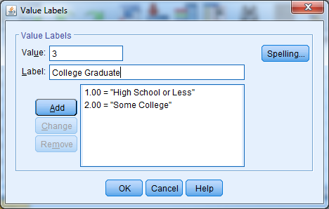
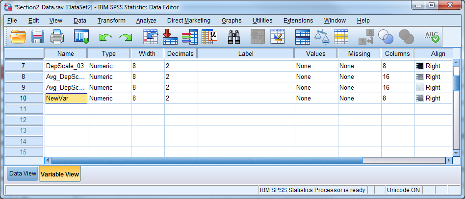
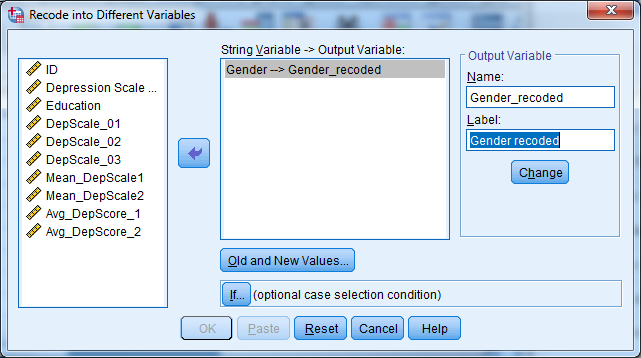
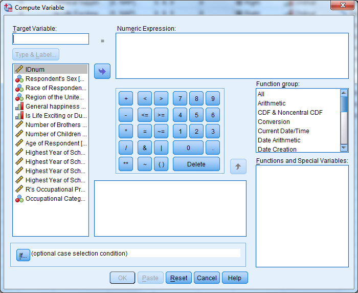
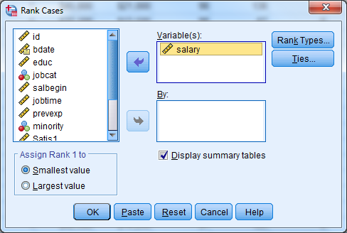

# Working with Variables

Data for this section: [section3_data.sav](https://github.com/CSCAR/workshop-spss/raw/master/data/section3_data.sav)

## Variable View in Data Editor

Variables in SPSS vary in length and may consist of letters, numbers,
dates, or dollar values. Some values, such as "don't know" replies on a
survey, may be codes for missing values. SPSS allows you to label
variables and values with more meaningful phrases that can appear in the
output for greater clarity.

To view or edit the current format for a variable, double-click on the
variable's name in the Data Editor. Doing this will open the Variable
View tab in the Data Editor window. Alternatively, select the "Variable
View" tab at the bottom left corner of the data editor window.

**Try it: Open [section3_data.sav](https://github.com/CSCAR/workshop-spss/raw/master/data/section3_data.sav). Select "Variable View".**

[{width="6.5in" height="2.7083333333333335in"} ](./media/spss-image15.png){target="_blank"}

There are eleven columns in the Variable View, containing values that
are attributes for the variables that you can change:

-   Name The name of each variable in the data set

-   Type The type (numeric, character, date, etc) and length

-   Width The amount of information in bytes stored in memory

-   Decimals The number of decimals displayed for numeric vars

-   Label A specific label for a variable

-   Values Variable value labels

-   Missing Missing value codes

-   Columns Column width for variable display

-   Align The alignment of values within a cell

-   Measure The measurement scale for a variable

-   Input The role of the variable when analyzing the data

### Variable Name

Be sure the names follow these rules:

-   Variable names should be no more than 64 characters long, and
    preferably no more than 8 characters long.

-   Variable names must start with a letter.

-   Variable names may only have letters, numbers, or underscores in
    them.

-   Variable names may not have the following characters:
    %,\$,\#,@,!,+,\*,\~,",-,..

-   Variable names may not have blank spaces.

-   Each variable name must be unique; the same variable name can't
    appear twice.

-   Variable names must be on one row only.

### Variable Type

The most fundamental characteristic of a variable is its type. These are
the four most important types:

-   Numeric includes comma, dot, and scientific notation types

-   String also called character, alpha, or alpha-numeric

-   Dollar includes custom currency type but is still numeric

-   Date is still numeric but displayed using hours, minutes, and
    seconds

[{width="8in" height="4.572916666666667in"}](./media/spss-image16.png){target="_blank"}

Most statistical analyses use only numeric variables. SPSS can handle a
short string variable, such as gender coded as "m" and "f", when that
variable defines groups for a t-test or an analysis of variance (ANOVA).

The Dollar type changes the way the values appear in the data editor and
the output, but all analyses treat the Dollar type as numeric.

The appearance of a date variable does not affect the way that the .sav
file stores the date. SPSS understands date/time variables as the number
of seconds since midnight, October 14, 1582 which is a significant date
marking a change in the Gregorian calendar. If you subtract one date
from the other to create a new variable, the result will be in seconds.
To change back to days, hours, or years, it is necessary to use a
function to turn the information into a more usable, practical form. See
the section Computing New Variables for more information.

**Try it: Use [section3_data.sav](https://github.com/CSCAR/workshop-spss/raw/master/data/section3_data.sav). Change the Variable Type for the ID
variable from Dollar to Numeric.**

[{width="6.5in" height="3.6909722222222223in"} ](./media/spss-image17.png){target="_blank"}

[{width="6.5in" height="3.113888888888889in"} ](./media/spss-image18.png){target="_blank"}

### Variable Labels

Variable labels attach a description to a variable, and this description
can show up in the output. To enter a variable label, click in the Label
cell for a given variable in Variable View, and enter a description for
the variable. Variable labels can be up to 255 characters as of Version
15.0.

**Try it: Use [section3_data.sav](https://github.com/CSCAR/workshop-spss/raw/master/data/section3_data.sav). Provide a label for DepScale
(Depression Scale 1998).**

[{width="6.5in" height="3.6909722222222223in"} ](./media/spss-image19.png){target="_blank"}

### Value Labels

Value labels are similar, except that they refer to specific values
within that variable. You don't have to enter labels for all values. A
value label can be up to 120 bytes long. Suppose the following question
was in a survey:

Which of the following describes your political beliefs best?

1\) Democrat 2) Republican 3) Libertarian 4) Other

You will enter the responses as 1, 2, 3, or 4. These numbers are
arbitrarily, however, and some users may not know or may forget their
meaning. Value labels allow the user to attach meaning to the numbers.
Value labels are absolutely critical in large data files. Like variable
labels, value labels will appear in many of the results provided by
SPSS.

To assign value labels, click on the Values cell for a given variable,
and click on the small grey box. Enter a number in the Value box, then
the corresponding label in the Value Label box. Then press "Add". If you
do not press "Add", the information you have typed for that value will
be ignored.

**Try it: Use [section3_data.sav](https://github.com/CSCAR/workshop-spss/raw/master/data/section3_data.sav). Enter in value labels for variable
Education:**

**1=High School or Less**

**2=Some College**

**3=College Graduate**

[{width="4.875in" height="3.1041666666666665in"} ](./media/spss-image20.png){target="_blank"}

### Missing Value Labels

There are two kinds of missing values: system-missing, in which the cell
is empty, and user-missing, which flags a value as an invalid response.
There often could be several reasons that a value is not available, and
user-missing values allow us to discriminate between them. Examples of
user-defined missing values are:

-   99 "Don't Know" reply on a survey

-   777 Inapplicable, such as with number of births for a male
    respondent

-   -999 Respondent refused to answer, which often occurs with income

Enter user-missing values just like any other response during data
entry. You need to tag the value as missing, however, so that SPSS does
not include it in any computations. Consider the repercussions if we
forgot to specify the 777 in the above example as Inapplicable, and then
attempted to calculate the average number of births!

You can specify user-missing values by clicking on the cell in the
Missing column for a given variable, and then clicking on the small grey
box that appears as "(...)". You may specify single values or a range of
values.

**Try it: Use [section3_data.sav](https://github.com/CSCAR/workshop-spss/raw/master/data/section3_data.sav).Enter missing value codes for Education
(99).**

[{width="3.375in" height="2.4895833333333335in"} ](./media/spss-image21.png){target="_blank"}

### Columns & Alignment

You can change the alignment of the data by changing the Columns or
Align attributes. You can use the Align attribute to center values or
align them to the right or left of the cell in the Data Editor.
Additionally, you can decrease or increase the width of the columns
using the Columns attribute. A shortcut is to place the mouse at the
right edge of a variable name, click on the border, and drag the column
to be wider or narrower.

Asterisks (\*) in the cells within a particular column mean that the
column is not wide enough to display the data values. Simply increase
the column width and the values should appear properly in the Data
Editor. Another possible problem might be that the width is too small to
display all of the information for a variable.

The Columns and Align attributes have no effect on the data; they only
affect the way you see the data in the editor.

### Measure

Each variable in SPSS may be designated as

-   Scale a continuous variable

-   Ordinal a categorical variable with natural ordering

-   Nominal categorical without any natural ordering

Graphs from the Interactive graphics method use this information. This
field has no bearing for most procedures.

**Try it: Use [section3_data.sav](https://github.com/CSCAR/workshop-spss/raw/master/data/section3_data.sav). Change the Measure for the Education
variable from Scale to Ordinal.**

[{width="6.5in" height="2.296527777777778in"} ](./media/spss-image22.png){target="_blank"}

### Copy and Paste Variable Attributes

You can set up any of the attributes discussed above, such as type,
labels, missing values, and column format, and apply them to numerous
variables all at once. Suppose a researcher has a series of 50 variables
that all have values 1 through 5 as follows:

1 Strongly disagree

2 Disagree

3 Neutral

4 Agree

5 Strongly agree

Value labels would be useful for these variables, but it would be
extremely tedious to set up value labels for all 50 variables. Set up
the value labels for one of the 50 variables, and then click on the cell
containing the value labels for that variable. Select "Copy" from the
"Edit" menu or hit CTRL + C, and then highlight the value labels cells
for the remaining 49 variables by clicking on the first empty cell and
dragging downward. Select "Paste" from the "Edit" menu or hit CTRL + V,
and the value labels will be applied to the remaining 49 variables
instantly. You can also right-click and use the copy and paste
functions. You can use this same copy and paste feature for other
variable attributes and save a great deal of time!

**Try it: Use [section3_data.sav](https://github.com/CSCAR/workshop-spss/raw/master/data/section3_data.sav). Copy and paste the missing value code
from Education to DepScale.**

[{width="6.5in" height="2.7840277777777778in"} ](./media/spss-image23.png){target="_blank"}

[{width="6.5in" height="2.7840277777777778in"} ](./media/spss-image24.png){target="_blank"}

## Exercise 3 -- Variable Attributes

Open [exercise3_data.sav](https://github.com/CSCAR/workshop-spss/raw/master/data/exercise3/exercise3_data.sav) and go to Variable View. Practice defining the
correct attributes to each variable by following the code book below.

## Creating New Variables and Defining the Correct Attributes

To create a new variable in SPSS for entering data, simply double-click
on an empty column's heading, or start entering data directly into the
column in Data View. To enter values, first click in an empty cell; then
type each value and press either return or the down arrow.

During data entry, be aware that the order of cases in an SPSS data file
can change because certain procedures require that cases be sorted.
Therefore, be careful to match values with an ID variable. The case that
occupied the first row in the file a week ago may not be in the first
row any longer!

New variables, including those created by computation or recoding,
appear at the far right of the data file. Use the scroll bar at the
bottom to verify that a new variable was properly created.

Cut, copy, or paste a variable or insert a new empty column by right
clicking on a variable name.

A pasted variable **is not** inserted in between existing variables. It
replaces the highlighted column entirely, and could over-write an
existing variable. Be sure to create a new, blank column and paste on
top of that.

**Try it: Use [section3_data.sav](https://github.com/CSCAR/workshop-spss/raw/master/data/section3_data.sav). Create a new variable called NewVar.**

[{width="6.5in" height="2.7840277777777778in"} ](./media/spss-image26.png){target="_blank"}

## Computing Variables

You can use the COMPUTE command to create new numeric or string
variables by:

-   Assigning a particular value to all cases, or a subset of cases

-   Transforming a variable by taking a log, or another mathematical
    function

-   Creating a sum, average, or other summary of several existing
    variables

**Helpful Hint:** You can use the COMPUTE procedure to edit or overwrite
an existing variable, but we highly recommend that you create new
variables. If you do over-write an existing variable, be aware that some
old values may not be overwritten. If some of the necessary information
is missing for a certain case in the file, and the software cannot
compute the new value, then the value from the old variable will remain.

Select Transform - Compute Variable and enter a name for the new
variable in the upper left box, labeled "Target Variable." SPSS will
automatically create the new variable when it executes the compute
command.

[{width="6.5in" height="5.0125in"} ](./media/spss-image27.png){target="_blank"}

By default, SPSS assumes that the user wants to compute a numeric
variable. If you want to create a string variable, click "Type & Label"
underneath the new variable name, and select "String."

In the box titled "Numeric Expression", provide the actual formula or
value for the new variable. You may write the numeric expressions by
hand or insert variables and functions using the mouse.

**Helpful Hint:** Click on the function name to get a function
description in the dialogue box.

If you want to create new dollar or date variables, then proceed as if
creating a numeric variable. The type can be changed after the compute
command is used. Note that seconds are the units of measurement for date
variables. To create date variables, we must use functions specifically
designed for the date variable type. See the List of Functions below for
more information.

### Dealing with Missing Data

Applying a function to a variable containing missing values will result
in a variable with corresponding system-missing values.

When taking the mean or sum of a set of variables, be sure to use the
mean() and sum() functions. SPSS only evaluates formulas such as "(var1
+ var2 + var3 + var4)/4" if all four variables have valid, non-missing
values.

By contrast, the software evaluates the formula "mean(var1, var2, var3,
var4)" as long as an individual has at least one valid response. You can
also stipulate that SPSS perform the calculation only when there are a
minimum number of valid responses. The formula "mean.3(var1, var2, var3,
var4, var5)", for example, would mean that an individual must have
answered at least 3 of the 5 questions. The new variable will have a
missing value otherwise.

**Try it: Use [section3_data.sav](https://github.com/CSCAR/workshop-spss/raw/master/data/section3_data.sav). Calculate the average depression score
using DepScale\_01, DepScale\_02, DepScale\_3. First use the function
"mean". Next write the expression by hand. Investigate the
differences.**

[{width="6.497297681539807in" height="4.177083333333333in"}](./media/spss-image28.png){target="_blank"}

[{width="6.497297681539807in" height="4.458333333333333in"}](./media/spss-image29.png){target="_blank"}

[{width="6.5in" height="4.731944444444444in"}](./media/spss-image30.png){target="_blank"}

### List of Functions Available in the Compute Command

**Arithmetic Operators:**

\+ Addition

\- Subtraction

\* Multiplication

/ Division

\*\* Exponentiation

**Arithmetic Functions:**

ABS Absolute value

RND Round

TRUNC Truncate

MOD Modulus (remainder)

SQRT Square root

EXP Exponential

LG10 Base 10 log

LN Natural log

ARSIN Arcsin

ARTAN Arctangent

SIN Sine

COS Cosine

**Statistical Functions:**

SUM(.n) Sum of arguments

MEAN(.n) Mean of arguments

SD(.n) Standard deviation of arguments

VARIANCE(.n) Variance of arguments

CFVAR(.n) Coefficient of variation of arguments

MIN(.n) Minimum of arguments

MAX(.n) Maximum of arguments

**Missing Values Functions:**

MISSING True if the value is missing

NMISS Number of missing values across variables but within cases

NVALID Number of non-missing values across variables but within cases

**Across-case Function:**

LAG Value from previous case, or from n cases earlier if there is a
second argument n

**Date and Time Functions:**

CTIME.xxx SPSS time values to common units

DATE.xxx Common units to SPSS date values

TIME.xxx Common units to SPSS time values

XDATE.xxx SPSS date values to common units

**Other Functions:**

RV.UNIFORM Uniform pseudorandom no.

RV.NORMAL Normal pseudorandom no.

CDF.NORMAL Standard normal cumulative dis.

**Logical Functions:**

RANGE True if value is within range

ANY True if any value matches

**String Functions:**

ANY Same as for numeric values

CONCAT Concatenate

INDEX Index from left

LAG Same as for numeric values

LENGTH Defined length

LOWER Convert to lower case

LPAD Pad left

LTRIM Trim left

MAX Greatest value

MIN Least value

NUMBER Convert to a number

RANGE Same as for numeric values

RINDEX Index from right

RPAD Pad right

RTRIM Trim right

STRING Convert to a string

SUBSTR Substring

UPCASE Convert to upper case

### Count Values

One useful way to compute new variables is through the "Count Values
within Cases" procedure. This procedure counts how many times particular
values occur, within each case, across certain variables. Suppose we
have a data set of students where we recorded their scores on ten
separate quizzes over the course of a semester. We could use "Count
Values within Cases" to tally up the number of A's each student earned.

To use the Count Values within Cases procedure:

-   Go to Transform - Count Values within Cases.

-   Specify a new variable name under "Target Variable".

-   Place the variables to be examined in the "Variables" box.

-   Click "Define Values", and type the values to be counted.

-   Click "Continue", then "OK".

[{width="4.875in" height="2.8229166666666665in"} ](./media/spss-image31.png){target="_blank"}

***Recoding Variables***

Recoding a variable means changing or "mapping" its values to new ones.
Often, you will need to convert string variables into numeric variables
in order to use them in a certain statistical procedure. Recoding is
also a way to collapse a continuous variable into categories.

Below are representations of some possible recodes:

**"Male" -- 1**

**"Female"  -- 0**

**1 -- 0**

**2 -- 1**

**3 -- 2 **

**4:15 -- 9 **

### Manual Recoding

There are two ways to recode in SPSS:

-   Recode Into Same Variables **Not Recommended**

-   Recode Into Different Variables **Recommended**

By using "Recode Into Different Variables", your original variable will
not change, which is not the case with "Recode Into Same Variables".
"Recode Into Same Variables" is risky since you will not be able to undo
the changes if you make a mistake.

Select Transform - Recode into Different Variables"

[{width="6.5in" height="3.6305555555555555in"} ](./media/spss-image32.png){target="_blank"}

In the "Recode Into Different Variables" dialogue box:

-   Select the old (original) variable.

-   Specify a new variable name, and click "Change".

-   Click "Old and New Values".

    -   Specify each old value, or range of values, on the left side of
        the box and each new number you want assigned on the right side
        of the box. Click "Add" each time.

    -   Make sure you include every original value. Unmentioned original
        values become missing values in the new variable.

    -   Click "Continue".

-   Click "OK".

[{width="6.5in" height="3.7430555555555554in"} ](./media/spss-image33.png){target="_blank"}

Note that when using "Recode Into Different Variables", it is also
possible to recode a numeric variable into a character (string)
variable, or vice-versa:

-   Check the box marked "Output variables are strings" to change from
    numeric to string in the "Old and New Values" window

-   Check the box marked "Convert numeric strings to numbers" to change
    from string to numeric in the "Old and New Values" window.

**Try it: Use [section3_data.sav](https://github.com/CSCAR/workshop-spss/raw/master/data/section3_data.sav). Recode Gender with F=1 and M=2.
Inspect the output.**

[{width="6.5in" height="3.6305555555555555in"}{target="_blank"}

[{width="6.5in" height="3.7430555555555554in"} ](./media/spss-image35.png){target="_blank"}

## Automatic Recoding

The Automatic Recode procedure recodes any variable's values into
consecutive integers 1, 2, 3, etc.... The software codes the lowest
numeric value, or the first value in alphabetical order in the case of
string variables, to a 1 by default. The next lowest number or next item
in alphabetical order becomes a 2, and so forth. Optionally, the
recoding can begin with the highest number of the last string value in
alphabetical order.

Automatic Recode always creates a new variable.

**Helpful Hint:** Automatic Recode is a quick way to make string
variables (e.g., gender) ready for statistical procedures that require
numeric variables.

To use Automatic Recode:

-   Go to Transform - Automatic Recode.

-   Choose the original variable to be recoded.

-   Specify a new variable name and click "Add New Name".

-   Select the order -- start numbering from smallest or largest values.

[{width="4.677083333333333in" height="4.854166666666667in"}](./media/spss-image36.png){target="_blank"}

**Helpful Hint:** If you had assigned value labels for the old variable,
those labels will carry over to the corresponding new values. If there
were no value labels, then the old values themselves become the new
labels.

**Try it: Use [section3_data.sav](https://github.com/CSCAR/workshop-spss/raw/master/data/section3_data.sav). Use Automatic Recode to recode Gender.
Call this new variable AutoGender.**

[{width="4.677083333333333in" height="4.854166666666667in"}](./media/spss-image37.png){target="_blank"}

## Conditional Transformations with If/Then Logic

The "If" button, which appears in the Compute, Recode, and Count
dialogue boxes, represents an important feature in variable
transformations. Using the "If" option, users can tell SPSS to perform
calculations or recodes only if cases meet certain conditions.

For example, suppose we surveyed women regarding the number of times
they had given birth, but women who had never been pregnant skipped that
section of the questionnaire. We might now want to assign a "0" for the
number of births for those women who had never been pregnant, to replace
the missing entry they currently have.

Assuming that we have a string variable called "everpreg" coded "Y" and
"N" for yes and no, and that our number of births variable is called
"numbirth", we would proceed as follows:

Go to Transform - Compute Variable

-   Put numbirth in the "Target Variable" box.

-   Place a 0 in the "Numeric Expression" box.

-   Click "If".

-   Click "Include if case satisfies condition".

-   Type everpreg = "N" in the condition box.

-   Click "Continue" and "OK".

[{width="5.953517060367454in" height="4.864583333333333in"}](./media/spss-image38.png){target="_blank"}

[{width="5.6875in" height="4.3511811023622045in"} ](./media/spss-image39.png){target="_blank"}

This "If" button, which allows transformations to take place for
selected cases only, works exactly the same in the Compute, Recode, and
Count procedures.

You can use the words and, or, and not within the If box to help write
your criteria. Some examples of If expressions are as follows:

-   sex = "f" and age \> 50 *women over 50

-   not missing(income) *participants whose income is known

-   educat = 5 or educat = 6 *respondents with a BA or MA

## Rank Cases

You can perform variable transformations based on the ranked value for a
particular variable. It may be more convenient to analyze the quartiles,
for example, than the variables themselves.

Select "Transform" and then "Rank Cases" to recode a continuous variable
into a new variable based on rank. Select the variable of interest and
then click "Rank Types". You can select quartiles in this dialogue box
by checking the box for Ntiles and placing the number 4 in the blank
space. SPSS will create a new categorical variable and add it to the end
of the original dataset.

[{width="5.083333333333333in" height="3.1458333333333335in"}](./media/spss-image40.png){target="_blank"}

[{width="3.5729166666666665in" height="2.2083333333333335in"}](./media/spss-image41.png){target="_blank"}

## Exercise 4 -- Computing and Transforming Variables

Open [exercise4_data.sav](https://github.com/CSCAR/workshop-spss/raw/master/data/exercise4/exercise4_data.sav).

Compute a new variable that is the change from beginning salary to
current salary for each employee.

Recode the education variable into a new variable according to the
following

- 1=High School or Less (educ\<=12)

- 2=Some College (12\<educ\<=16)

- 3=Bachelor's Degree or Higher (educ\>=17)
