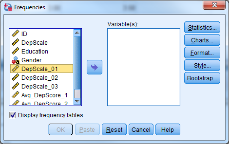
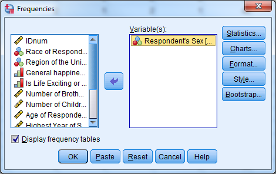
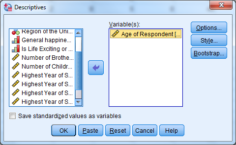
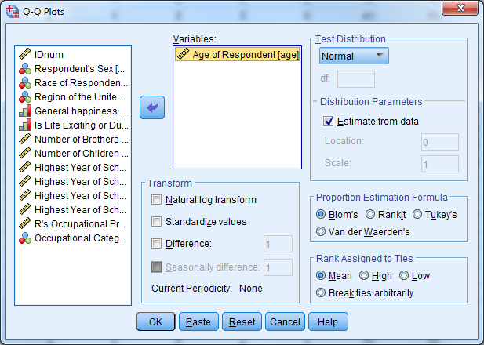
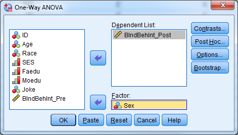

# Understanding Graphical & Statistical Procedures

Data for this section: [section5_1_data.sav](https://github.com/CSCAR/workshop-spss/raw/master/data/section5_1_data.sav), [section5_2_data.sav](https://github.com/CSCAR/workshop-spss/raw/master/data/section5_2_data.sav)

## Thinking About Statistics

Statistics is in a sense a giant toolbox containing a collection of
graphical and statistical procedures.\
\
Each graphical or statistical procedure is good for a particular
situation we may run into while doing data analysis. The main purpose of
any graphical and statistical procedure is to investigate a variable or
the relationships between variables. That is a very important concept!

**THE MAIN PURPOSE OF ANY GRAPHICAL OR STATISTICAL PROCEDURE IS TO
INVESTIGATE A VARIABLE OR THE RELATIONSHIPS BETWEEN VARIABLES.**

Keep in mind that graphical procedures can be more valuable to you than
statistical procedures. You should try to express your results in graphs
whenever you can.

It is not hard to implement or interpret any graphical or statistical
procedure once you understand and can explain the procedure. SPSS is
very helpful in both regards. The biggest challenge facing any
researcher is to know the most appropriate procedure to apply in any
particular situation.\
\
The types of the independent and dependent variables (predictors and
outcome) will guide your choice for the appropriate graphical and
statistical procedure.

Just like in many things in life, the 80/20 rule somewhat applies to
statistics. There are a small number of procedures that you will use
more repeatedly than others. Here, we will divide those essential
procedures, graphical and statistical, into 4 major classifications:

-   One Variable Only Procedures

-   One-on-One Procedures investigating two variables at a time

-   Many-on-One Procedures

-   Repeated, Longitudinal, Clustered, Multilevel, and Mixed Procedures

## Correlation vs. Causation

The presence of a correlation between two variables DOES NOT imply that
there is causation between them. Any of the three scenarios below could
explain the correlation between two variables A and B. We can't tell
using statistics alone which scenario it is.

-   A causes B

-   B causes A

-   C causes both A and B

## Everything On One Page Handout

The chart below lays out the essential graphical and
statistical procedures by type and classification.

[{width="5in" height="4in"}](./media/procedures_handout.pdf){target="_blank"}

## Parametric vs. Non-parametric Tests

There are varying assumptions that underlie the validity of each
statistical procedure. A common assumption for statistical procedures is
that the samples being analyzed should come from an underlying normal
distribution. If this is not a reasonable assumption, you can use
non-parametric tests. Non-parametric tests do not have this
distributional assumption, and generally use ranks in the place of the
raw scores. The table below gives non-parametric tests that are
equivalent to common parametric tests.

## Basic Summary Statistics (Investigate One Variable at a Time)

As the name implies, One-Variable-Only Procedures help us investigate a
single variable at a time. They can tell us about the frequency
distribution of a categorical variable (Frequency Table, Mode, Bar
Graph, Pie Chart, etc.). They can give us insight into the central
tendency of a continuous variable (Mean, Median, Mode, etc.). They can
help us test a hypothesis about the mean of a variable (One Sample
t-test). They can give us insight into the dispersion of a variable
(Standard Deviation, Range, Inter-Quartile Range, Boxplots, Error Bar
Plots, etc.). They can also give us insight into the relative position
of any data point with respect to the other data points in a variable
(Percentiles, Quartiles, Boxplots, etc.).

In SPSS, there are two procedures which provide simple descriptive
statistics. You can find both procedures under Analyze - Descriptive
Statistics.

[{width="4.5in" height="2.4583333333333335in"} ](./media/spss-image55.png){target="_blank"}

[{width="4.5in" height="2.2395833333333335in"} ](./media/spss-image56.png){target="_blank"}

**Frequencies** procedure provides the number and % of cases which have
each value of a variable (e.g., 46% male, 54% female). You can request
other output by clicking Statistics. Frequencies are most useful for
categorical variables.

**Try it: Use [section5_1_data.sav](https://github.com/CSCAR/workshop-spss/raw/master/data/section5_1_data.sav). Obtain the frequency (descriptive)
statistics for the variable Sex.**

[{width="4.895833333333333in" height="3.0833333333333335in"}](./media/spss-image57.png){target="_blank"}

[{width="4.895833333333333in" height="3.0833333333333335in"}](./media/Desc_stats.png){target="_blank"}

**Descriptives** provides the mean, standard deviation, minimum, maximum
and non-missing sample size by default. Other statistics are available
by clicking Options. Descriptives are most useful for continuous
variables, and sometimes useful for ordinal data (categorical data with
ordering, e.g., small, medium, large) alongside the frequencies.

**Try it: Use [section5_1_data.sav](https://github.com/CSCAR/workshop-spss/raw/master/data/section5_1_data.sav). Obtain the descriptive statistics
for the variable Age.**

[{width="6.5in" height="3.2291666666666665in"} ](./media/spss-image58.png){target="_blank"}

[{width="4.416666666666667in" height="2.0in"} ](./media/spss-image59.png){target="_blank"}

[{width="4.895833333333333in" height="1.5in"}](./media/Desc_stats2.png){target="_blank"}

As a first step in data analysis, one might run frequencies on all
categorical variables and descriptives on all continuous variables.
Obtaining descriptive statistics is an important step to detect possible
data entry errors.

Visualizations
--------------

There are two methods for creating charts in SPSS, Chart Builder and
Legacy Dialogs. (There is a third method, in which other analysis
methods create their own graphics, but we're covering only direct
creation of graphics here.)

The newer approach is Chart Builder, which is a more free-form approach.
It has a steeper learning curve but is ultimately more powerful.

The classic approach is legacy dialogs which are much easier to use, but
more restrictive in the types of plots they can create.

### Chart Builder

To create a graph in "Chart Builder", first select the type of graph
that you would like to create by dragging and dropping the appropriate
graph image to the "Chart Preview" area. Once you select a chart, the
Element Properties window will appear. The Element Properties window
allows you to modify what is displayed in the graph

[{width="6.5in" height="4.488888888888889in"} ](./media/spss-image60.png){target="_blank"}

**Try it: Use [section5_1_data.sav](https://github.com/CSCAR/workshop-spss/raw/master/data/section5_1_data.sav). Create a simple bar chart for
"Region". **

[{width="5.05625in" height="4.614583333333333in"}](./media/spss-image61.png){target="_blank"}

[{width="5.18125in" height="3.8229166666666665in"}](./media/spss-image62.png){target="_blank"}

### Legacy Dialogs

The "Legacy Dialogs" interface requires that you determine the type of
graph you would like to create before providing a dialog box, which is
similar to other procedures in SPSS. After you select the general type
of graph or chart, SPSS will then prompt you to be more specific. If the
general form is a scatter plot, for example, SPSS will ask you to then
specify which type of scatter plot you would like to create. The
software will present you with the graphing dialogue box once you
specify the specific form for the graph.

[{width="3.6875in" height="1.6041666666666667in"} ](./media/spss-image63.png){target="_blank"}

[{width="4.552083333333333in" height="4.71875in"} ](./media/spss-image64.png){target="_blank"}

**Try it: Use [section5_1_data.sav](https://github.com/CSCAR/workshop-spss/raw/master/data/section5_1_data.sav). Create a simple bar chart for
"Region". **

[{width="3.5377318460192475in" height="4.020833333333333in"}](./media/spss-image65.png){target="_blank"}

[{width="5.18125in" height="4.177083333333333in"}](./media/spss-image62.png){target="_blank"}

Normality
---------

Many statistical procedures assume "normality", which means the
population which the data is from follows the Normal Distribution. You
may know this as the "bell curve".

[{width="5.05625in"height="3.159650043744532in"}](https://upload.wikimedia.org/wikipedia/commons/d/df/Bellcurve.svg){target="_blank"}

Many real-life variables follow a normal distribution such as height. If
you were to collect a random sample of heights, most people would fall
near the mean height for the population. Some people would be much
taller or shorter, and a very limited number of people would be
extremely short or extremely tall.

The normality assumption as written is usually quite strict; in practice
we often loosen it. Rather than "The data comes from a normal
population", you can think of it as "The data comes from a population
that's not too badly non-normal." Essentially, you're looking for major
violations of normality, rather than trying to determine whether the
bell curve perfectly fits your data.

Finally, a large sample size oftens "protects" you from normality
violations; the larger the sample size, the more extreme a normality
violation needs to be to be a concern.

While there are formal tests of normality, typically assessment is done
with a histogram (looking for that bell shape) or a QQ-plot, which looks
for its values to fall along the 90° line. The histogram can be created
from the Histogram Legacy Dialog, the QQ-plot is created under Analyze
- Descriptive Statistics - QQPlot.

**Try it: Use [section5_1_data.sav](https://github.com/CSCAR/workshop-spss/raw/master/data/section5_1_data.sav). Obtain a histogram for the variable
"Age" and display the normal curve. Obtain a QQ plot for the variable
"Age". Hint: Analyze - Descriptive Statistics - QQPlot.**

[{width="4.0625in" height="2.7527777777777778in"} ](./media/spss-image67.png){target="_blank"}

[{width="4.5729166666666665in" height="2.8314818460192477in"}](./media/spss-image68.png){target="_blank"}

[{width="4.6979166666666665in" height="2.7043985126859145in"}](./media/spss-image69.png){target="_blank"}

[{width="4.5625in" height="2.82245406824147in"}](./media/spss-image70.png){target="_blank"}

## Exercise 8 -- Data Exploration and Visualization

Open [exercise8_data.sav](https://github.com/CSCAR/workshop-spss/raw/master/data/exercise8/exercise8_data.sav)

**Part 1**: Investigate the variable attributes. Determine which
variables are categorical variables (nominal and ordinal), and which
variables are continuous (scale).

Obtain the appropriate descriptive statistics for each variable.
Remember, continuous variables should be investigated with descriptives
and categorical variables should be investigated with frequency tables.

\*Hint: Select more than one variable in the "Analyze","Descriptive
Statistics","Descriptives", or "Frequencies" dialog boxes.

**Part 2**: Assess the distribution of the Occupational Prestige Score
("prestg80") with both a histogram (normal curve displayed) and a Q-Q
plot. Is the assumption that the population of Occupational Prestige
Scores is normally distributed reasonable?

**Part 3**: Compare the average highest year of school completed
("educ") for males and females.

\*Hint: First split the file by "sex" (Data - Split File), then
calculate the descriptive statistics. Be sure to return to the Split
File menu when you are done with this question and return the dialog
box to "Analyze all cases".

**Part 4**: Produce a pie chart for the variable "region". (We didn't
cover this, you can use either Chart Builder or Legacy Dialogs.)

## Investigating Two Variables at a Time

The main purpose of any graphical and statistical procedure is to
investigate a variable or the relationships between variables. We start
by examining the relationship between variables using simple
two-variable procedures. The type of independent and dependent variables
that you would like to investigate determines the appropriate
statistical or graphical procedure. Remember that the presence of a
correlation between two variables DOES NOT imply that there is causation
between them.

### Pearson Correlation Coefficient & Scatterplots

The Pearson Correlation Coefficient measures the linear association of
two continuous variables. A scatterplot is an easy way to visually
explore the association between two variables. When you plot the
variables together, you obtain a clear sense of the overall relationship
between the two variables.

The Pearson Correlation Coefficient (Pearson's r) varies from -1 to +1.
A value of zero indicates that there is no linear relationship between
the two variables, a value of +1 indicates that there is a perfect
positive linear relationship, and a value of -1 indicates that there is
a perfect negative relationship. Positive relationships imply that
variable 2 increases when variable 1 increases, and vice versa, while
negative relationships imply variable 2 increases when variable 1
decreases, and vice versa.

The statistical significance of a correlation is the chance that you
would observe a correlation that high or higher if there really was
no correlation between the variables.

For the Pearson Correlation Coefficient in SPSS, select Analyze -
Correlate - Bivariate.

[{width="3.8541666666666665in" height="3.0in"} ](./media/spss-image71.png){target="_blank"}

For the Scatterplot in SPSS, select Graphs - Legacy Dialogs
- Scatter/Dot, choose "Simple Scatter", and click "Define".

[{width="3.880323709536308in" height="3.9676115485564303in"}](./media/spss-image64.png){target="_blank"}

[{width="3.18125in" height="1.6041666666666667in"}](./media/spss-image63.png){target="_blank"}

**Try it: Use [section5_2_data.sav](https://github.com/CSCAR/workshop-spss/raw/master/data/section5_2_data.sav) Investigate the correlation between
the individual behavior intention scales. Select Analyze - Correlate -
Bivariate. Select "BIndBehInt\_Pre" and "BIndBehInt\_Post". Select
"OK".**

[{width="3.7256in" height="3.25in"}](./media/spss-image72.png){target="_blank"}

[{width="5in" height="3.25in"}](./media/Correl.png){target="_blank"}

The table indicates that there is a significant correlation between the
pre intervention and post intervention behavior scale scores. Our
p-value (Sig (2-tailed)) is less than our predetermined 0.05 level of
significance, so we reject the null hypothesis that there is not an
association between these two variables. The correlation coefficient is
positive, indicating that high scores for one variable correspond to
high scores for the other variable. Conversely, low scores for one
variable correspond to low scores for the other variable. Individuals
who scored high on the pre-test also tended to score high on the post
test.

To visually investigate this relationship, use a scatterplot:

Select Graphs - Legacy Dialogs - Scatter/Dot.

Select "Simple Scatter" and "Define".

Select "BIndBehInt\_Post" for the Y Axis.

Select "BIndBehInt\_Pre" for the X Axis.

Select "OK".

[{width="4.30625in" height="4.572916666666667in"} ](./media/spss-image73.png){target="_blank"}

[{width="6.5in" height="5.197916666666667in"} ](./media/spss-image74.png){target="_blank"}

The scatterplot indicates a linear relationship between the two
variables.

### Pearson Chi-Square Crosstabs and Test of Independence

The Chi-square test is very common way to explore the relationship
between two categorical variables. This tests the null hypothesis that
there is no relationship between the two variables, and rejecting the
null hypothesis allows us to conclude that the variables have a
statistically significant relationship with each other.

Suppose that we're interested in determining if there is a significant
relationship between smoking status and lung cancer status. Our
variables are:

1. Smoking Status (1=Yes, 0=No) , and
2. Lung Cancer Status (1=Diagnosed, 2=Not Diagnosed).

We can summarize these variables in a 2x2 table called a **crosstab**
where the cell values represent the counts in our data that fall in
those particular categories. We can perform a Chi-square test to
determine if there is a relationship between smoking and lung cancer.

Select Analyze - Descriptive Statistics - Crosstabs for the Chi-square
test of independence and make sure to check the box "Chi-Square" under
"Statistics". You can produce a clustered bar chart to visualize this
table by checking the box for "Display Clustered Bar Chart" in the
"Crosstab" dialog box.

**Try it: Use [section5_2_data.sav](https://github.com/CSCAR/workshop-spss/raw/master/data/section5_2_data.sav). Are females more likely to
participate in jokes that are derogatory to any racial group?
Investigate the data to see what types of variables we have to answer
this question. We have the categorical variable "Sex" and the
categorical variable "Joke". Since we are comparing two categorical
variables, we will use a Chi-square test. Select "Analyze" "Descriptive
Statistics" "Crosstabs". Select "Sex" for rows, "Joke" for column, check
the box to "Display clustered bar charts". Select "Statistics" and check
the box for "Chi-Square". Select "Continue" and the select "OK".**

[{width="4.0in" height="3.7395833333333335in"} ](./media/spss-image78.png){target="_blank"}

[{width="2.6145833333333335in" height="2.8777777777777778in"}](./media/spss-image79.png){target="_blank"}

[{width="5in" height="5in"} ](./media/Chi_sq.png){target="_blank"}

[{width="4.40625in" height="2.75in"} ](./media/spss-image80.png){target="_blank"}

The results above indicate that there is not a significant difference
between how females and males answered the question "Would you
participate in jokes that are derogatory to any racial group?"
(p-value=0.397).

***Two-Sample T-Test and One-Way ANOVA***

The purpose of the two-sample t-test, also known as the independent
samples t-test, is to determine if mean values of a particular
continuous variable are significantly different for two groups. The
one-way analysis of variance (ANOVA) is mathematically equivalent to the
two-sample t-test, and is appropriate when there are two or more groups.

There are 3 assumptions that must be met in order to perform these
tests:

1. Normality
2. Homogeneity of variance for ANOVA
3. Independence of groups and observations

You can investigate normality with Q-Q plots or histograms and use
Levene's test to assess homogeneity of variance. You can also
side-by-side box plots to investigate the relationship between a
continuous dependent variable and a categorical predictor.

In SPSS, select Analyze - Compare Means to find the two-sample t-test
and one-way ANOVA

[{width="4.229166666666667in" height="2.3645833333333335in"}](./media/spss-image81.png){target="_blank"}

[{width="4.90625in" height="2.7916666666666665in"}](./media/spss-image82.png){target="_blank"}

For the side-by-side box plots, select Graphs- Legacy Dialogs - Boxplot,
choose "Simple" and "Summaries for groups of cases", and click "Define."
In the next dialog, move the continuous variable and the grouping variable
from the left-hand list of variables to the "Variable" and "Category Axis" boxes.

[{width="2.0104166666666665in" height="2.2916666666666665in"}](./media/spss-image83.png){target="_blank"}

[{width="4.114583333333333in" height="3.5833333333333335in"}](./media/spss-image84.png){target="_blank"}

**Try it: Use [section5_2_data.sav](https://github.com/CSCAR/workshop-spss/raw/master/data/section5_2_data.sav). Is there a relationship between sex
and the post intervention intension scale score? Sex is a categorical
variable, the intension scale is continuous. We can use either an
independent samples t-test or one-way ANOVA. Select Analyze - Compare
Means - Independent Samples T Test. Select "BIndBehInt\_Post" for Test
Variable(s). Select "Sex" for Grouping Variable. Select "Define
Groups..." and let group 1=1, group 2=2. Select "Continue" and
"OK".**

[{width="4.895833333333333in" height="3.0416666666666665in"}](./media/spss-image85.png){target="_blank"}

[{width="2.4791666666666665in" height="2.0416666666666665in"}](./media/spss-image86.png){target="_blank"}

[{width="7in" height="3.5in"} ](./media/Compare_means1.png){target="_blank"}

The tables above indicate that the males and females have similar
average intension scale scores (males=5.3, females=5.59). We fail to
reject the null hypothesis for Levene's test, so we will report the
information for "Equal variances assumed". Our p-value is .631, so we
fail to reject the null hypothesis that males and females have similar
average intention scale scores.

Select Analyze - Compare Means - One-Way ANOVA". Select
"BIndBehInt\_Post" for the dependent list. Select "Sex" for the factor.
Select "OK"

[{width="4.78in" height="1.75in"} ](./media/spss-image87.png){target="_blank"}

[{width="4in" height="2in"} ](./media/Compare_means2.png){target="_blank"}

The ANOVA table above yields the same p-value and conclusion as using
the two-sample t-test.

Select Graphs - Legacy Dialogs - Boxplot. Select "Simple" and "Summaries
for groups of cases" and click "Define". Select the continuous dependent variable
for "Variable" and the grouping variable for "Category Axis". Select "OK".

[{width="4.2604166666666665in" height="3.1979166666666665in"}](./media/spss-image88.png){target="_blank"}

[{width="5.5625in" height="4.083333333333333in"} ](./media/spss-image89.png){target="_blank"}

***Paired T-Test***

A paired t-test, also known as a repeated measures t-test or dependent
samples t-test, is appropriate when there are two related observations
(variables) and we want to determine if the average values of these
variables differ from one another. The purpose of the paired t-test is
to test the same units of observation under different treatment
conditions to see if a treatment effect exists. The test compares the
pre-treatment value to the post-treatment value for each case.

The null hypothesis is that the mean value of the differences for these
two related variables is 0. If we reject this hypothesis, then we conclude
that the difference is significantly different from 0. This test assumes
that the sample mean of the differences is normally distributed. The test
only considers cases with both pre-treatment and post-treatment values.

In SPSS, select Analyze - Compare Means - Paired Samples T-Test.

[{width="6.05625in" height="3.3645833333333335in"}](./media/spss-image90.png){target="_blank"}

**Try it: Use [section5_2_data.sav](https://github.com/CSCAR/workshop-spss/raw/master/data/section5_2_data.sav). Investigate whether or not the
average intention scores are statistically different from each other.
Since these variables are pre and post variables, it would be
interesting to see if the intervention was successful in increasing the
scores of participants. To investigate this, we will use a paired
t-test. Select Analyze - Compare Means - Paired Samples T-Test. Select
"BIndBehInt\_Pre" for Variable 1. Select "BIndBehInt\_Post" for Variable
2. Select "OK".**

[{width="6.18125in" height="3.3645833333333335in"}](./media/spss-image91.png){target="_blank"}

[{width="7in" height="5in"}](./media/Paired.png){target="_blank"}

The tables above indicate that there is a significant increase in
average behavior intention score after the intervention (p-value\<.001).

## Investigating Many Variables at a Time

It is often useful to investigate the relationship between one outcome
variable and multiple predictor variables. The type of the outcome
variable determines the appropriate model; general linear models are
appropriate for continuous outcomes and generalized linear models are
appropriate for categorical outcomes. General linear models include
simple linear regression and multiple linear regression while
generalized linear models include binary logistic regression and ordinal
logistic regression. Linear regression and binary linear regression will
be covered through **EXERCISES** in this workshop, time permitting.

## Repeated Measures, Longitudinal, Clustered, Multilevel, Mixed Procedures

It is very common in many studies to take multiple measurements on a
unit of analysis, typically a subject. These multiple measures may be
occurring over time, conditions, regions, or the levels of any other
variable. Depending on what the measurements are taking place over,
there are many names we give these studies. It is also very common in
many studies to have the units of analysis be clustered (i.e. grouped)
into higher level clusters (i.e. groups). Sometimes the clusters
themselves are further clustered into even higher level clusters, and so
on.

In all of these studies, we must use more advanced statistical
procedures that take into consideration the possible correlation of
observations that are coming from the same unit of analysis. While using
advanced procedures to analyze such data sets is beyond the scope of
this workshop, you should be able to identify these multilevel data sets
and discuss them with your statistician.

## Other Procedures in SPSS

Here is a non-exhaustive list of other procedures in SPSS that you may
use:

- Tests for checking the assumptions of normality
- Intraclass correlation coefficient
- Partial correlations
- General linear models
- Generalized linear models
- Categorical data analysis
- Randomized clinical trials
- Case-control clinical trials
- Matching and propensity scores
- Survival analysis
- Cox regression
- Two-stage least squares regression
- Probit regression
- Cluster analysis
- Discriminant analysis
- Factor analysis
- Principal components analysis
- Reliability analysis
- Path analysis
- Structural equations modeling
- Latent class analysis
- Multidimensional scaling
- Spatial statistics
- Time series analysis
- Complex samples and survey methodology
- Missing data analysis and imputation
- Geographical information systems
- Qualitative data analysis
- Text mining
- Receiver operator characteristic (ROC) curve analysis
- Functional data analysis
- Data mining
- Classification and regression trees (CART)
- Chi-square automatic interaction detection (CHAID)
- Neural networks
