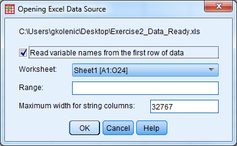
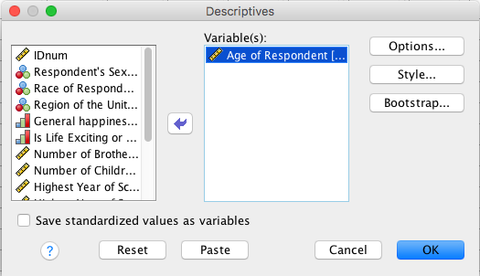
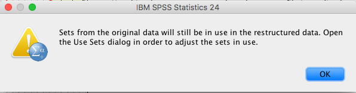
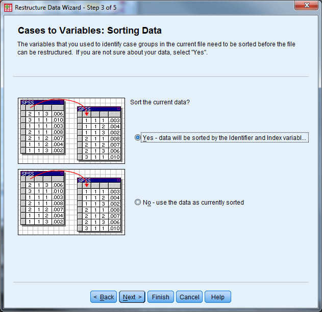
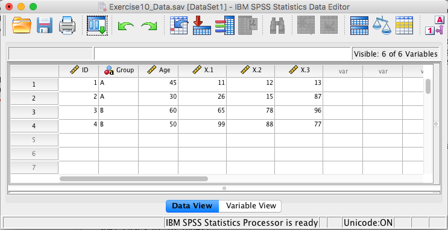
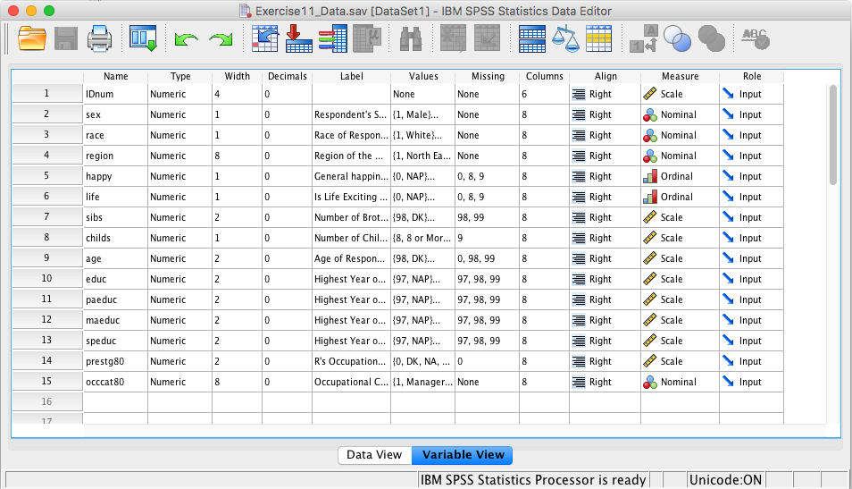
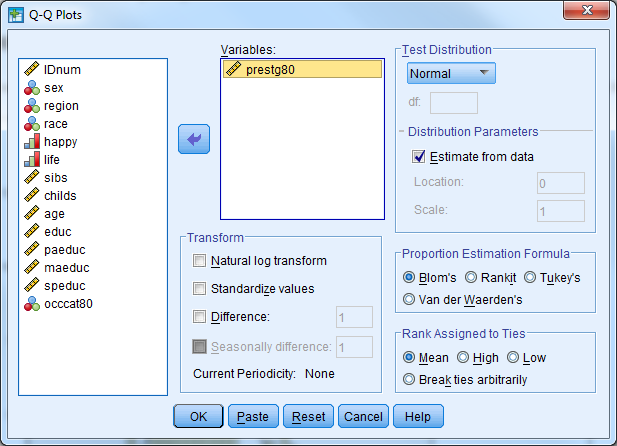
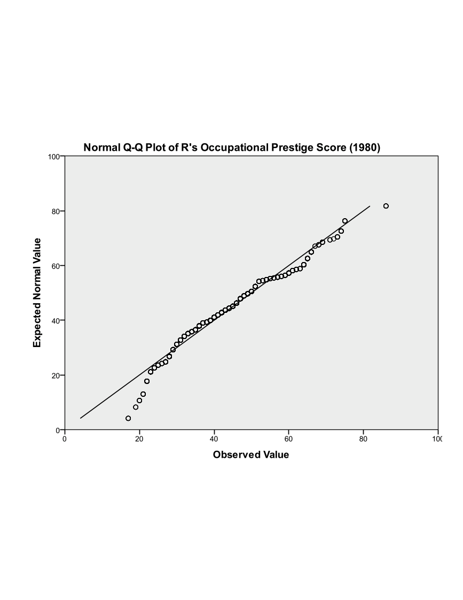

# Execise Solutions

## Exercise 1

In order to analyze data properly in SPSS, we need to follow the
guidelines set out above. Open Exercise1\_Data and see what guidelines
we have ignored.

{width="4.229166666666667in"
height="3.2511712598425198in"}

Solution:

Too much information is contained in one variable
(CTSSurgTypeCatCodeDesc, LOS, SURGLOS, DCDate, etc.)

Errors can easily be found by sorting (errors in Year, AGE)

The same content is entered in differently for a single variable (SEX,
HTN, SMOKING)

Anything else?

## Exercise 2 

Open Exercise2\_Data (an Excel file). Modify this Excel file such that
it can be imported into SPSS properly. Save the file and close it. Open
the file in SPSS (import it). Export this file back into Excel, but only
save the following variables: id, salary, minority.

{width="6.5in"
height="4.440387139107612in"}

Solution:

-   Delete the first three rows of data (remove heading)

-   Remove rows 23 and 24 (contains summary information)

-   Remove the formatting (fill color)

-   Save the file as Exercise2\_Data\_Ready

-   Close Exercise2\_Data\_Ready

{width="6.5in"
height="4.440387139107612in"}

-   Open SPSS

-   Select File - Open - Data

-   Under "Files of Type" select either "All Files" or "Excel" to view
    Exercise2\_Data\_Ready, select the file, then select "Open"

-   A window appears

-   Check the box so the variable names will be imported

-   Select the sheet of the Excel file that you would like to be read
    in, then select "Ok"

-   The Excel data should now open in the Data Editor

{width="6.239583333333333in"
height="3.3229166666666665in"}

{width="4.041666666666667in"
height="2.5in"}

-   Delete any "blank" rows of data or columns of data (indicated by
    ".") by highlighting, right click, select "cut"

-   Select File - Save As

-   Let the file name be Exercise2\_Data\_Ready\_short

-   Change the file type to Excel 97 through 2003 (\*.xls)

-   Select the "Variables..." button

-   Select the "Drop All" button

-   Under the "Keep" column, check the box for id, salary, minority

-   Select "Continue"

-   Select "Save"

-   Open the new file (Exercise2\_Data\_Ready\_short) to investigate the
    results

{width="4.550594925634296in"
height="3.4982699037620297in"}

{width="3.7843613298337706in"
height="2.914981408573928in"}

## Exercise 3

Open Exercise3\_Data and go to Variable View. Practice defining the
correct attributes to each variable by following the code book.

{width="6.0625in"
height="3.320896762904637in"}

Solution:

-   In Variable View, the first four columns do not need to be modified

-   To modify the variable label, click in the cell that you wish to
    edit and start tying in the label

-   To modify the value labels, click the cell that you wish to edit and
    then select the box with three small dots. The following window will
    appear:

{width="4.854166666666667in"
height="3.125in"}

-   Ender the value and label, then select "Add". Once all possible
    value labels are added, select "OK"

-   When value labels (or other attributes such as label or missing)
    repeat for a variable, you can copy and paste the attribute values.
    Right click on the cell you want to copy, select copy. Then right
    click on the cell that you would like to paste in, and select paste.

{width="6.5in"
height="3.5605489938757655in"}

-   Enter in missing values in a similar fashion---here we have discrete
    missing values

-   Use the drop down menu for "Measure" to specify the correct
    measurement type

-   Save this file as Exercise3\_Data\_Cleaned

{width="3.3541666666666665in"
height="2.4895833333333335in"}

## Exercise 4

Open Exercise4\_Data.

Compute a new variable that is the change from beginning salary to
current salary for each employee.

Solution:

-   Transform - Compute Variable

-   Select "Reset"

-   Enter the following information

-   Target Variable: salchange

-   Double click (or use the arrow) to move salary to the Numeric
    Expression window

-   Use the calculator box below the numeric expression box to enter a
    minus sign (alternatively, you could type a minus sign) then select
    salbegin

-   Select OK, and the new variable will appear in the data set

{width="6.459686132983377in"
height="5.278486439195101in"}

Recode the education variable according to the following

1=High School or Less (educ\<=12)

2=Some College (12\<educ\<=15)

3=Bachelor's Degree or Higher (educ\>=16)

Solution:

-   Transform- Recode into different variables

-   Move education (educ) into the Input Variable Output Variable window
    by double clicking on it or using the arrow

-   Name: EducRecode

-   Label: Leave Blank

-   Click the change button

-   Under old value, select the radio dial for Range, LOWEST through
    value: enter 12

-   Under new value, select the radio dial for Value: enter 1

-   Select Add

-   Under old value, select the radio dial for Range: enter 13 through
    15

-   Under new value, select the radio dial for Value: enter 2

-   Select Add

-   Under old value, select the radio dial for Range, value through
    HIGHEST: enter 16

-   Under new value, select the radio dial for Value: enter 3

-   Select Add

-   Select Continue

-   Select OK

-   Check the dataset in Data View

{width="6.5in" height="3.7894663167104112in"}

## Exercise 5 

Open Exercise5\_Data.

Select male managers. What is their average age?

**Solution:**

-   Check Values for sex and occat80 to see what values correspond to
    "male" and "manager" (it's 1 and 1).

-   Data - Select Cases

-   Under Select: Select the If Condition is Satisfied radio dial and
    select the If button

{width="4.327660761154855in"
height="4.396551837270342in"}

-   Enter the following information

    -   Open box should read as follows: sex=1 & occcat80=1

    -   Continue

{width="4.5in"
height="3.0317311898512687in"}

-   Under Output: Select Filter Out Unselected Cases

-   Select OK

-   Inspect the data in Data View

-   Analyze - Descriptive Statistics - Descriptives

{width="4.387911198600175in"
height="2.52586176727909in"}

-   Select the age variable, select OK

-   Turn off the filter!

{width="4in"
height="1in"}

Part 2

Use the "split file" procedure to get the mean current age for each job
category.

**Solution:**

-   Data - Split File

-   Select Compare Groups

-   Select occat80 (Occupational Category) and move it into the Groups
    Based On window by double clicking (or using the arrow)

-   Select Sort the File by Grouping Variables

-   Select Ok

{width="4.004309930008749in"
height="2.963445975503062in"}

-   Analyze - Descriptive Statistics - Descriptives

-   Select the age variable and OK

{width="4.387911198600175in"
height="2.52586176727909in"}

-   Turn off the split file!

{width="6in"
height="4in"}

## Exercise 6

Convert Exercise6\_Data from "Wide" format to "Long" format

**Solution: **

-   Open Exercise6\_Data

-   Select Data - Restructure to open the Wizard

-   Select "Restructure selected variables into cases" then "Next"

{width="5.472672790901138in"
height="5.316558398950131in"}

-   How many variable groups to you want to restructure? Select "One"
    then "Next"

{width="6.5in"
height="6.314580052493438in"}

-   Case Group Identification should be changed to "Use selected
    variable" and the variable should be the ID variable

-   Variables to be transposed: Move the X variables over (X1, X2, X3)

-   Fixed Variable(s): Move Group and Age over

-   Select "Next"

{width="6.5in"
height="6.314580052493438in"}

-   How many index variables do you want to create? Select "one" then
    "Next"

{width="6.5in"
height="6.314580052493438in"}

-   What kind of index values? Select "Sequential Numbers" then select
    "Next"

{width="6.5in"
height="6.314580052493438in"}

-   Handling of Variables not Selected: Select "Keep and treat as fixed
    variable(s)"

-   System Missing or Blank Values in All Transposed Variables: Select
    "Create a case in the new file"

-   Leave "Case Count Variable" unchecked

-   Select "Next"

{width="6.5in" height="6.314580052493438in"}

-   What do you want to do? Select "Restructure the data now". In the
    future you may want to keep the syntax.

-   Select "Finish"

-   The following message appears, click "OK"

{width="5.375in" height="1.4115113735783027in"}

-   Inspect the data (and change "trans1" to "X")

{width="5.207962598425197in" height="4.987069116360455in"}

## Exercise 7

Convert Exercise7\_Data from "Long" format to "Wide" format

**Solution: **

-   Open Exercise7\_Data

-   Select Data - Restructure to open the Wizard

{width="5.521132983377078in"
height="5.363636264216973in"}

-   Identifier Variable(s): ID

-   Index Variable(s): Index1

-   Select "Next"

{width="6.5in"
height="6.314580052493438in"}

-   Sort the current data? Yes

-   Select "Next"

{width="6.5in"
height="6.314580052493438in"}

-   Order of New Variable Groups: Group by original variable

-   Leave the other options unchecked

-   Select "Next"

{width="6.5in"
height="6.314580052493438in"}

-   Select "Restructure the Data Now" and "Finish"

{width="6.375in"
height="6.193145231846019in"}

-   The following message will appear, select "OK". Inspect the data and
    save!

{width="5.375in" height="1.4115113735783027in"}

{width="6.482638888888889in" height="3.345138888888889in"}

## Exercise 8 

Open Exercise8\_Data.sav

**Part 1**: Investigate the variable attributes. Determine which
variables are categorical variables (nominal and ordinal), and which
variables are continuous (scale).

Solution:

Open the dataset (Exercise8\_Data)

Select the "Variable View" tab

Investigate the labels and measure of each variable

{width="6.637844488188977in" height="3.8053280839895014in"}

Obtain the appropriate descriptive statistics for each variable in the
dataset. Remember, continuous variables should be investigated with
5-point summary descriptives and categorical variables should be
investigated with frequency tables.

Solution:

Descriptives:

-   Select Analyze - Descriptive Statistics - Descriptives

<!-- -->

-   Select the following variables: sibs, childs, age, educ, paeduc,
    maeduc, speduc, prestg80

-   Select "OK"

-   Notice there are only 519 respondents that have valid data points
    for all of the continuous variables.

{width="4.870138888888889in"
height="3.077777777777778in"}

  ------------------------ ------ --------- --------- ------- ----------------
  Descriptive Statistics
                           N      Minimum   Maximum   Mean    Std. Deviation
  sibs                     1505   0         26        3.93    3.047
  childs                   1509   0         8         1.90    1.765
  age                      1514   18        89        45.63   17.808
  educ                     1510   0         20        12.88   2.984
  paeduc                   1069   0         20        10.88   4.129
  maeduc                   1233   0         20        10.79   3.463
  speduc                   790    0         20        12.89   3.059
  prestg80                 1418   17        86        42.93   13.067
  Valid N (listwise)       519
  ------------------------ ------ --------- --------- ------- ----------------

Frequency Tables:

-   Select Analyze - Descriptive Statistics - Frequencies

-   Select the following variables: sex, region, race, happy, life,
    occcat80

{width="4.870138888888889in"
height="3.077777777777778in"}

-   Investigate the output

**Part 3**: Assess the distribution of the Occupational Prestige Score
("prestg80") with both a histogram (normal curve displayed) and a Q-Q
plot. Is the assumption that the population of Occupational Prestige
Scores is normally distributed reasonable?

Solution:

-   Histogram in Legacy Dialogs

-   Select Graphs - Legacy Dialogs - Histogram

-   Variable: prestg80

-   Check box to display normal curve

-   Select OK

{width="4.979166666666667in"
height="4.484458661417323in"}

Investigate the output

{width="3.9791666666666665in"
height="3.177302055993001in"}

-   Q-Q Plot

-   Select Analyze - Descriptive Statistics - Q-Q Plots

-   Select the variable prestg80

-   Select OK

{width="4.135010936132983in"
height="2.990590551181102in"}

-   Investigate the output

-   Look to see how well the plotted points follow the solid diagonal
    line

-   It is particularly important to pay attention to the "tails", or the
    left most and right most points to see if they follow the line

{width="4.264880796150481in"
height="3.40544072615923in"}

**Part 3**: Compare the average highest year of school completed
("educ") for males and females.

Solution:

-   Set up the dataset such that the output is split by groups based on
    sex

-   Select Data - Split File

-   Select "Compare Groups"

-   Select the variable sex for "Groups Based on:"

-   Select "OK"

{width="4.628517060367454in"
height="3.5987948381452317in"}

-   Compute the 5-Point Summary Descriptives for "educ"

-   Select Analyze - Descriptive Statistics - Descriptives

-   Select the variable "educ"

-   Select "OK"

{width="4.664867672790901in"
height="2.9480522747156606in"}

-   Investigate the output

-   Males have an average of 13.23 years of education

-   Females have an average of 12.63 years of education

{width="5in"
height="2in"}

-   Turn the split file feature off

-   Select Data - Split File

-   Select "Analyze all cases, do not create groups" (Alternatively,
    "Reset" can be selected)

-   Select "OK"

**Part 4**: Produce a pie chart for the variable "region". Use "Legacy
Dialogs".

Solution:

-   Select Graphs - Legacy Dialogs - Pie

-   Under "Data in Chare Are" select "Summaries for groups of cases"

-   Select "Define"

{width="2.5505949256342957in"
height="1.8178455818022747in"}

-   Select the variable "region" for "Define Slices by:"

-   The default for "Slices Represent" is "N of cases", and leave this
    at the default

-   Select "OK"

{width="4.602543744531934in"
height="4.990481189851269in"}

-   Investigate the output

{width="4.5in"
height="4.5in"}
