# Additional Exercises

## Exercise A1 -- Categorical Data Analysis

**Question 1 **

Open ExerciseA1\_Data. What percent of respondents said they were "Very
Happy"? What about "Not too happy"? "Pretty happy"? Use a graph to
display the variable.

**Question 2**

Do women appear to be more or less happy than men? Would you say this
apparent relationship is statistically significant?

**Question 3**

Create a scatter plot of respondent's education vs. their spouses'
education. Does this relationship appear to be linear? Add a linear
regression line to the plot. Inspect the correlation between the
respondent's education and their spouses' education. Is this correlation
positive or negative? Is it statistically significant.

## Exercise A1 Solution

**Question 1 **

Open Exercise12\_Data. What percent of respondents said they were "Very
Happy"? What about "Not too happy"? "Pretty happy"? Use a graph to
display the variable.

**Solution: **

-   We have one categorical variable that we would like to
    investigate...check the all on one page handout!

-   Analyze - Descriptive Statistics - Frequencies

{width="4.864583333333333in"
height="3.0833333333333335in"}

-   Enter the following information

    -   Select happy

    -   Select Charts

        -   Under Chart Type, select Bar Chart

        -   Under Chart Values, select Percentages

        -   Select Continue

    -   Select the box for Display Frequency Tables

    -   Select OK

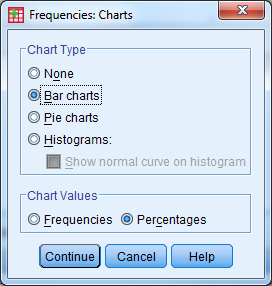{width="2.8333333333333335in"
height="2.9791666666666665in"}

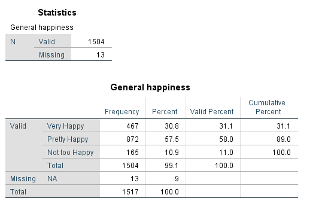{width="4in"
height="3in"}

{width="6.5in"
height="5.197916666666667in"}

**Question 2**

Do women appear to be more or less happy than men? Would you say this
apparent relationship is statistically significant?

**Solution: **

-   We are going to compare two categorical variables. From out handout,
    we will use Pearson Chi-Square crosstabs to do this!

-   Analyze - Descriptive Statistics - Crosstabs

<!-- -->

-   Enter the following information

    -   Rows: sex

    -   Columns: happy

{width="4.628517060367454in"
height="3.82830271216098in"}

-   Select the Statistics button

    -   Check the box for Chi-Square

    -   Select Continue

{width="3.0051410761154855in"
height="3.3971161417322833in"}

-   Select the Cells button

    -   Check the box for Row under Percentages (leave the rest as
        default)

    -   Check the box for Adjusted Standardized Residuals under
        Residuals (leave the rest as default)

    -   Select Continue

-   Select the box for Display Clustered Bar Charts

-   Select OK

{width="3.4375in"
height="3.8125in"}

-   The Pearson Chi-Square statistic indicates that the differences
    between men and women are statistically significant
    (pvalue/asymptotic significance\<.05).

-   The residuals, clustered bar chart, and row percentages can tell us
    where these differences arise

    -   An adjusted standardized residual (absolute value) greater than
        two shows us where the differences between groups occur. Here,
        we see that "not too happy" for males and females has a residual
        greater than 2.

    -   The row proportions indicate that there is a higher proportion
        of females that responded "not too happy" when compared to
        males.

    -   The clustered bar chart also shows that there are greater
        numbers of women that indicate that they are "not too happy".

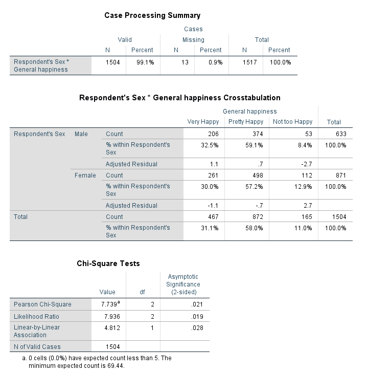{width="6in"
height="5.33in"}

{width="4.507012248468941in"
height="3.6041666666666665in"}

**Question 3**

Create a scatter plot of respondent's education vs. their spouses'
education. Does this relationship appear to be linear? Add a linear
regression line to the plot. Inspect the correlation between the
respondent's education and their spouses' education. Is this correlation
positive or negative? Is it statistically significant.

**Solution: **

-   Graphs - Legacy Dialogues - Scatter/Dot

-   Simple Scatter and Define

<!-- -->

-   Enter the following information

    -   Y Axis: speduc

    -   X Axis: educ

    -   Select OK

-   Check the output for the scatter plot

-   Double click the plot in the Output Viewer to open Chart Editor

-   Select the button for Add Fit Line at Total (first bar above the
    plot, axis with straight line plot)

-   Select Linear Fit, Apply, Close

-   Close out of chart editor (red X in the upper right corner) and the
    updated chart will appear in the Output Viewer.

<!-- -->

-   "Analyze" "Correlate" "Bivariate"

-   Enter the following information

    -   Variables: educ, speduc

    -   Correlation coefficients: Pearson, Spearman

    -   Significance: Two Tailed

    -   Check the box for Flag significant correlations

    -   Select OK

-   The output indicates that the correlation between education and
    spouses' education is positive and statistically significant.

-   Save this data set as Exercise11\_Data\_Updated

{width="3.53125in"
height="2.0625in"}

{width="5.625in"
height="6.114583333333333in"}

{width="3.6666666666666665in"
height="5.270833333333333in"}

{width="3.966178915135608in"
height="4.2551870078740155in"}

{width="4.316828521434821in"
height="3.45207895888014in"}

{width="3.992153324584427in"
height="3.5929374453193352in"}

{width="6in" height="7in"}

## Exercise A2 -- Continuous Data Analysis

Open ExerciseA2\_Data.sav

**Research Question 1:** Is there a relationship between a student's
socio-economic status and whether or not the student would participate
in a racially insensitive joke?

What techniques would you use to investigate the relationship between
SES and whether or not a student would participate in a racially
insensitive joke?

Investigate this relationship graphically and statistically. What did
you find?

**Research Question 2:** Is there a relationship between a student's
race and their post intervention behavior intention scale?

What techniques would you use to investigate a student's race and their
post intervention behavior intention scale?

Investigate this relationship graphically and statistically. What did
you find?

**Research Question 3:** Is there a relationship between the race of a
student and their socio-economic status?

What techniques would you use to investigate the relationship between
race and SES?

Investigate this relationship graphically and statistically. What did
you find?

## Exercise A2 Solution

**Research Question 1:** Is there a relationship between a student's
socio-economic status and whether or not the student would participate
in a racially insensitive joke?

What techniques would you use to investigate the relationship between
SES and whether or not a student would participate in a racially
insensitive joke?

**ANSWER:** SES is an ordinal variable with 4 levels that should be
treated as a categorical variable. Whether or not a student would
participate in a derogatory joke is measured with the "Joke" variable
and it is a categorical variable. The appropriate statistical procedure
to use to compare two categorical variables is the Chi-Square Test of
Independence (crosstabs). The appropriate graphical procedure is a
clustered bar chart.

Investigate this relationship graphically and statistically. What did
you find?

**ANSWER:** There is not a statistically significant relationship
between "SES" and "Joke". We do not have enough evidence to say that
there is a relationship between a student's socio-economic status and
whether or not the student would participate in a racially insensitive
joke.

{width="8in"
height="8in"}

{width="8in"
height="6in"}

**Research Question 2:** Is there a relationship between a student's
race and their post intervention behavior intention scale? What
techniques would you use to investigate a student's race and their post
intervention behavior intention scale?

**ANSWER:** "Race" is a categorical variable that can take on up to 9
values and a student's post intervention behavior intention scale
("BIndBehint\_post") is a continuous variable. The appropriate
statistical procedure is a one-way ANOVA. The appropriate graphical
procedure is a side-by-side box plot.

Investigate this relationship graphically and statistically. What did
you find?

**ANSWER:** There is not a statistically significant relationship
between "Race" and "BIndBehint\_Post". We do not have enough evidence to
say that there is a relationship between a student's race and their post
intervention behavior intention score.

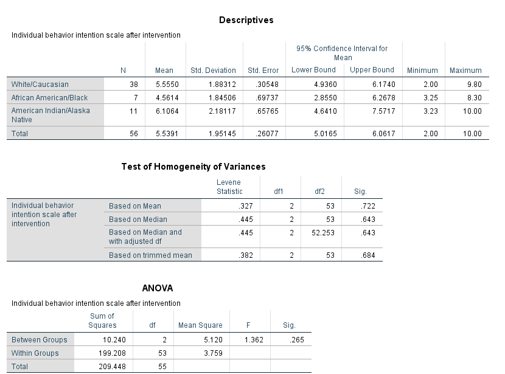{width="8in"
height="6in"}

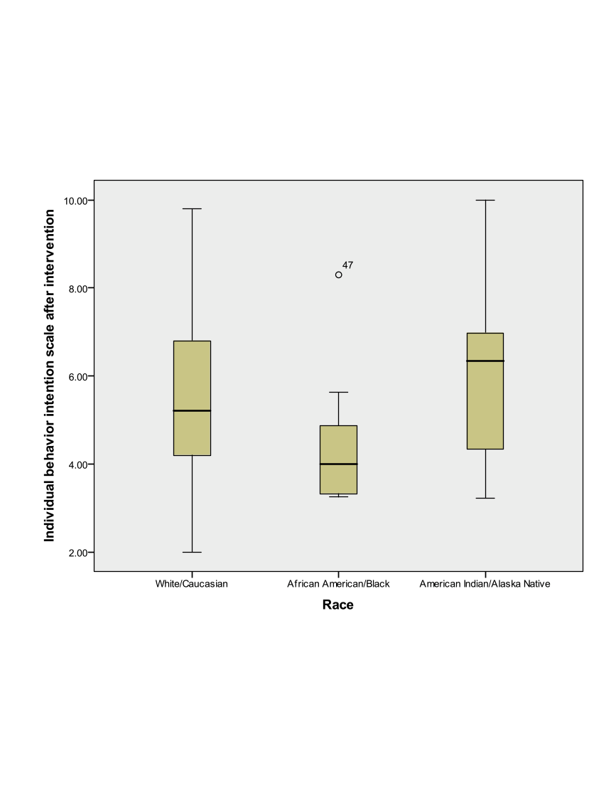{width="7.6in"
height="7in"}

**Research Question 3:** Is there a relationship between the race of a
student and their socio-economic status? What techniques would you use
to investigate the relationship between race and SES?

**ANSWER:** "Race" and "SES" are both categorical predictors. The
appropriate statistical procedure to use to compare two categorical
variables is the Chi-Square Test of Independence (crosstabs). The
appropriate graphical procedure is a clustered bar chart.

Investigate this relationship graphically and statistically. What did
you find?

**ANSWER:** There is a statistically significant relationship between
"Race" and "SES". There is a significant relationship between a
student's SES and race. Notice the error message under the Chi-Square
results table---in this case, we need to verify our statistically
significant results with Fisher's Exact Test (pvalue=.025).

{width="8in"
height="6in"}

{width="6in"
height="8in"}

## Exercise A3 -- Methodology Choice Practice

In the below questions first determine what the appropriate analysis
method is based on the variables of interest and carry out these methods
within SPSS.

**A. From ExerciseA3\_Data\_A**

1.  Is there a relationship between sex (gender) and job category
    (jobcat)?

2.  Is there a relationship between job category (jobcat) and minority
    status (minority)?

3.  Is there a relationship between job category (jobcat) and salary
    (salary)?

4.  Is there a relationship between experience (jobtime) and salary
    (salary)?

**B. From ExerciseA3\_Data\_B**

1.  Is there a relationship between general happiness (happy) and
    occupational prestige score (prestg80)?

2.  Is there a relationship between age (age) and occupational prestige
    score (prestg80)?

3.  Is there a relationship between general happiness (happy) and
    perception of life being exciting or dull (life)?

**Exercise A3 Hints! **

A1. Two Categorical VariablesClustered Bar Charts, Pearson Chi-Square
Crosstabs

A2. Two Categorical VariablesClustered Bar Charts, Pearson Chi-Square
Crosstabs

A3. Categorical DV (3+Groups) & Continuous DVOne Way ANOVA, Side-by-Side
Boxplot

A4. Two Continuous VariablesPearson Correlation Coefficient, Scatterplot

B1. Categorical DV (3+Groups) & Continuous DVOne Way ANOVA, Side-by-Side
Boxplot

B2. Two Continuous VariablesPearson Correlation Coefficient, Scatterplot

B3. Two Categorical VariablesClustered Bar Charts, Pearson Chi-Square
Crosstabs

## Exercise A4 -- Case Study I: Salary (Regression)

Open ExerciseA4\_Data.sav

**Background**

This data set contains information on faculty from Bowling Green State
University for the 1993 to 1994 (DeMaris 2004). The purpose of the
exercises below is to investigate whether there was any evidence of
gender inequality in faculty salaries at BGSU.

**Activity 1: Describing the Dataset**

Investigate the 'Faculty' data set using descriptive statistics, one
variable graphing procedures, and bivariate procedures.

**Investigate 'Salary' with descriptive statistics, box plot, and
histogram**

{width="4.870138888888889in"
height="3.077777777777778in"}

{width="6.16875in"
height="1.0777777777777777in"}

{width="5.49375in"
height="4.947916666666667in"}

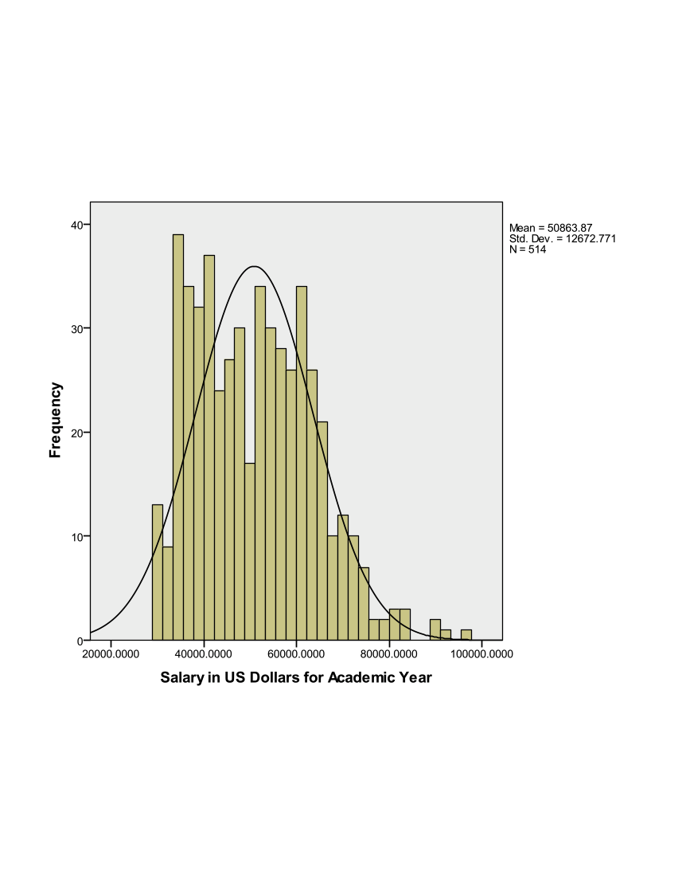{width="4.277867454068241in"
height="3.415810367454068in"}

{width="4.329816272965879in"
height="4.666395450568679in"}

{width="4.316828521434821in"
height="3.446920384951881in"}

**Investigate 'Gender' with a frequency table and bar chart**

{width="4.870138888888889in"
height="3.077777777777778in"}

{width="2.83125in"
height="2.9743055555555555in"}

{width="6in"
height="3in"}

{width="4.576569335083114in"
height="3.6653280839895013in"}

**Investigate the average salary for males and females separately
(descriptive statistics, histogram, side-by-side box plot)**

Remember to split the file by the gender variable ('male').

{width="4.610416666666667in"
height="3.584722222222222in"}

{width="4.870138888888889in"
height="3.077777777777778in"}

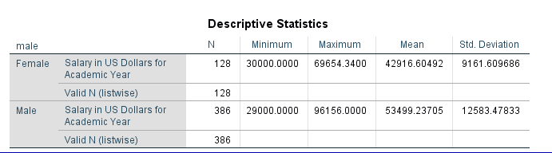{width="6.5in"
height="2in"}

The descriptive statistics table above indicates that males earn more
than females on average.

{width="6.498647200349956in"
height="6.051683070866142in"}

{width="8in"
height="6.5in"}

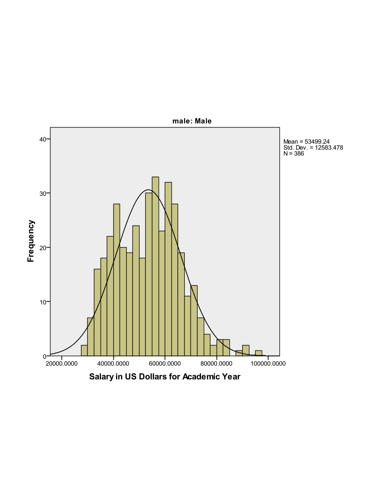{width="8in"
height="6.5in"}

Also remember to remove the 'Split File' option.

{width="4.610416666666667in"
height="3.584722222222222in"}

{width="4.628517060367454in"
height="3.8586220472440944in"}

The Boxplot below indicates that males have a higher median salary than
females, and both males and females have outliers (observation 148 and
58 respectively).

{width="8in"
height="7in"}

**Perform an independent samples t-test **

Remember that the dialogue box for the independent samples t-test is
located under 'Analyze' then 'Compare Means'.

{width="3.654491469816273in"
height="2.3173534558180227in"}

{width="2.4805555555555556in"
height="2.0388888888888888in"}

{width="8in"
height="3in"}

The table above indicates that we cannot assume equal variances between
males and females (Levene's Test pvalue\<.05). Regardless, we see that
the differences between average male and female salaries are large
enough to be considered statistically significant (t=10.250, df=297.227,
pvalue\<.001). The confidence interval for the mean difference between
genders is [8550.79, 12614.47]. This is the plausible range of values
for the difference between males and females.

**Activity 2: Simple Linear Regression**

The independent samples t-test is one way to model the relationship
between the faculty salary (dependent variable of interest) and gender
(independent variable). Faculty salary may also be a function of the
marketability of the discipline the faculty member is in.

**Investigate the correlation between 'salary' and 'market' and
investigate a scatter plot of the two variables**

In SPSS, select Analyze - Correlate - Bivariate

{width="4.0181277340332455in"
height="3.6152088801399827in"}

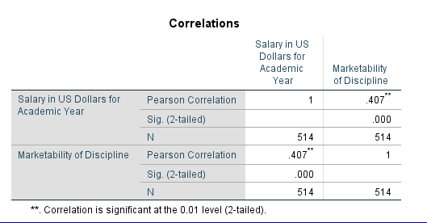{width="5.090972222222222in"
height="2.441666666666667in"}

We see from the table above that there is a statistically significant
correlation between faculty salary and marketability of the discipline
(r=.407, pvalue\<.001).

{width="3.532638888888889in"
height="2.0652777777777778in"}

{width="4.459686132983377in"
height="4.850693350831146in"}

{width="8in"
height="6.5in"}

**Perform a simple linear regression where 'salary' is the
dependent/outcome variable and 'market' is the independent/predictor
variable**

This can be done multiple ways in SPSS. The first way uses the
regression menu from 'Analyze' while the second uses the 'General Linear
Model' menu.

Select Analyze - Regression - Linear

{width="4.36877624671916in"
height="3.584650043744532in"}

{width="3.8958333333333335in"
height="3.49375in"}

Notice that the regression menu provides the correlation between the
variables included in the model.

The table below provides the R Square value and adjusted R Square value.
The proportion of variance in faculty salary explained by marketability
of discipline is 16.6%.

The table below indicates that the model fitted is significantly better
than what we would expect by chance (F=101.771, pvalue\<.001). The null
hypothesis is that there is no linear relationship between faculty
salary and marketability, and we reject this hypothesis.

{width="6in"
height="8in"}

{width="8in"}

The table above provides the parameter estimates for our model. For
every one unit increase in marketability, faculty salary increases by an
average of \$34,545. We could also interpret the beta coefficient for
marketability the following way: the effect of a .1 point increase in
marketability is associated with an estimated increase in mean salary of
\$3,454. The constant (intercept) for the model is interpreted as the
estimated mean salary when marketability is equal to zero.

Remember that the confidence intervals give us a range of reasonable
values for an estimate. The 95% confidence interval for our estimate of
market discipline is [$27817, $41272].

The hypothesis tests provided with the 't' statistic and 'Sig.' columns
help us decide if a particular value (usually zero) is a reasonable
estimate. If our estimated beta coefficient for market discipline was
zero, then market discipline would not have an effect/relationship with
faculty salary. This is our null hypothesis, and we would like to reject
this hypothesis. Here we find a significant relationship between market
discipline and faculty salary (t=10.088, pvalue\<.001).

The second method for generating results for a simple linear regression
is described below. Keep in mind that this method for performing a
linear regression is preferred when there are categorical
predictor/independent variables or interaction terms between independent
variables.

Select Analyze - General Linear Model - Univariate

{width="4.909027777777778in"
height="4.1819444444444445in"}

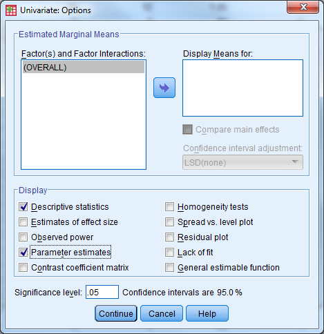{width="4.005139982502187in"
height="4.132720909886264in"}

The table below provides the descriptive statistics for faculty salary.

{width="6in"
height="6in"}

The table above indicates that the overall regression model is
significant (F=101.771, pvalue\<.001). This is indicated by the line for
'Corrected Model'. The R Squared value is also listed in footnote a. for
the table.

The parameter estimates table above provides the same information as the
previous coefficients table.

Notice that the results are the same between the two methods that can be
used in SPSS to perform a regression. For the remainder of the workshop
we will use the second method to obtain our regression results
(Analyze - General Linear Model - Univariate).

**Activity 3: Simple Linear Regression Diagnostics**

Perform the necessary regression diagnostics for the regression from
exercise 2.

{width="3.4330172790901137in"
height="4.0135225284339455in"}

{width="3.4986472003499562in"
height="3.610094050743657in"}

**Check the linearity and homogeneity of variance assumptions**

Plot the residuals against the predicted values from the model. The
residuals should be randomly scattered around zero, and the variability
should be constant in the plot.

{width="3.532638888888889in"
height="2.0652777777777778in"}

{width="6.5in"
height="4.652742782152231in"}

The scatter plot below does not indicate that either assumption has been
violated.

{width="7.2in"
height="6in"}

**Check for influential points**

The scatter plot from exercise 2 did not indicate that there were points
of interest.

{width="7.2in"
height="6in"}

A leverage point is an unusual point that has the potential to influence
the fit of the model. Sort the data set by Leverage in descending order.
A rule of thumb is a point is considered to have large leverage when the
leverage value is greater than 2p/n where p equals the number of
parameters in the model. Here we estimate the intercept and slope for
market, so p=2. This means that high leverage values are greater than
2\*2/514=4/514=.0078. There are 53 points with high leverage.

{width="6.042713254593176in"
height="4.830773184601925in"}

An influential point is one whose removal from the dataset would cause a
large change in the fit of the regression model. An influential point
may or may not be an outlier. Also, and influential point may or may not
have large leverage. Usually an influential point will be an outlier and
or may have large leverage. Sort the data set by the Cook's distance
variable in descending order. This will list the observations with the
largest Cook's distance first. Remember a distance greater than 1 or
4/n=4/514=.0078 is considered large. The first 16 observations have
large Cook's distances, but we do not have cause to remove them from the
data set.

{width="6in"
height="4.8in"}

**Check the normality assumption for the residuals**

{width="6in"
height="5.3in"}

The plot below indicates that the normality assumption is reasonable.

{width="8in"
height="6.7in"}

A QQ plot can also be investigated (Analyze - Descriptive Statistics - QQ Plot)

{width="6in"
height="4.4in"}

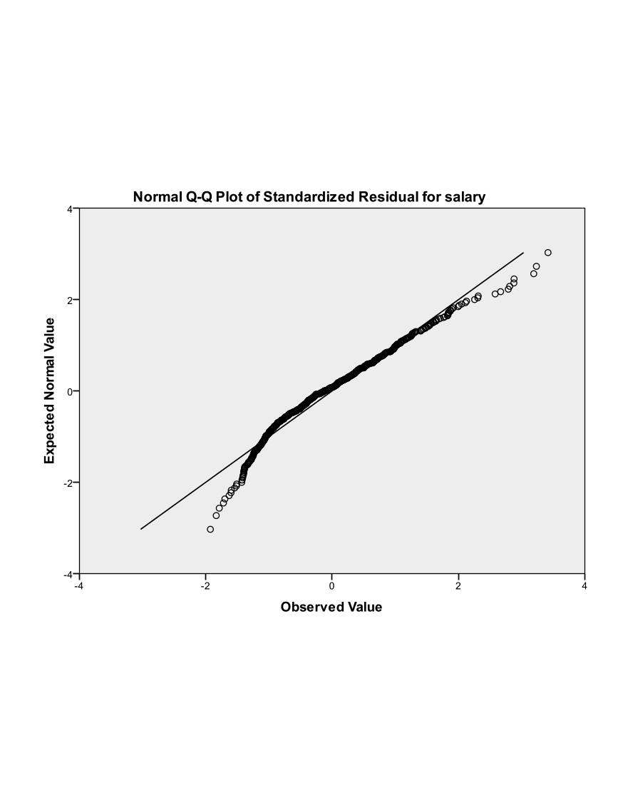{width="8in"
height="6.5in"}

**Activity 4: Multiple Regression with a Categorical Predictor**

Faculty salary appears to be a function of the marketability of the
discipline the faculty member is in, but it also may be a function of
gender.

**Create a multiple regression model where salary is the dependent
variable, and both marketability and gender are the predictors. **

Select Analyze - General Linear Model - Univariate

Select 'salary' as the dependent variable, male as the fixed factor, and
market as the covariate. Remember that any categorical predictor in a
basic regression model should be entered in as a 'fixed factor', while
any continuous prediction is considered a 'covariate'.

{width="4.725941601049869in"
height="4.025974409448819in"}

Under 'Options', select 'Descriptive Statistics', 'Parameter Estimates',
'Residual Plot'

{width="4.883333333333334in"
height="5.038888888888889in"}

The table below indicates the number of Males and Females in the data
set, along with the code that denotes the genders.

{width="8in"
height="8in"}

The table above indicates that the average salary for males is greater
than the average salary for females (\$53,499.24 compared to
\$42,916.60).

The table above indicates that the model fitted is significantly better
than what we would expect by chance (F=85.799, pvalue\<.001). The null
hypothesis is that there is no linear relationship between faculty
salary and the model predictors, and we reject this hypothesis. This is
indicated by the line for 'Corrected Model'. The R Squared value is also
listed in footnote a. for the table. The proportion of variance in
faculty salary explained jointly by marketability of discipline and
gender is 25.1%. Notice that this is an increase from the previous model.

{width="8in"
height="8in"}

The table above provides the parameter estimates for the regression
model. The difference in population mean salaries between men and women,
when controlling for marketability is estimated to be \$8,708.42.

Remember that Dummy variables are always interpreted in relationship to
the reference category. The reference category is denoted with a
coefficient value of 0 and footnote a. Here, we interpret male=0
(Female) compared to male=1 (Males). Another interpretation of the
gender variable: When controlling for marketability, faculty salaries
are on average \$8,708.42 less for females when compared to males.

The marketability coefficient now is interpreted as the effect of
marketability after accounting gender. For every one unit
increase in marketability, faculty salary increases by an average of
\$29,972.60 holding gender constant. We could also interpret the beta
coefficient for marketability the following way: the effect of a .1
point increase in marketability is associated with an estimated increase
in mean salary of \$2,997 holding gender constant.

Notice that all of the predictor variables in the model are highly
significant.

Note that the model fit above is also sometimes referred to as an
analysis of covariance (ANCOVA) model. The inclusion of a continuous
predictor (marketability) in addition to the factor gender makes this an
ANCOVA model.

**Create a multiple regression model where salary is the dependent
variable, and marketability, time since degree (yearsdg), and gender are
the predictors. Investigate the coefficients and R-squared. **

First investigate a scatter plot between salary and time since degree.

{width="6.8in"
height="5.4in"}

Select Analyze - General Linear Model - Univariate

Select 'salary' as the dependent variable, male as the fixed factor, and
market and yearsdg as the covariates. Remember that any categorical
predictor in a basic regression model should be entered in as a 'fixed
factor', while any continuous prediction is considered a 'covariate'.

{width="4.90625in"
height="4.1875in"}

Under 'Options', select 'Descriptive Statistics', 'Parameter Estimates',
'Residual Plot'

{width="3.3687773403324583in"
height="3.476522309711286in"}

The table below indicates that the R-squared value has increased from
the last model to .684, and the model is significant (F=367.562,
pvalue\<.001).

{width="8in"
height="8in"}

The estimated population mean salary for women is \$2,040.21 less than
men for a given marketability and time since degree. The estimated
effect of time since degree is \$949 more in mean salary per year (\*a
one unit increase is a year!) since degree when comparing faculty
members of the same gender from disciplines with the same marketability.
For a given time since degree and gender, a one unit increase in
marketability is estimated to increase average salary by \$38,402.

Notice that all of the predictor variables in the model are highly
significant.

{width="8in"
height="8in"}

**Activity 5: Multiple Regression with an Interaction**

Faculty salary appears to be a function of the marketability of the
discipline, time since last degree, and gender. Starting salaries could
be similar for men and women, but men might receive larger increases
over time. An interaction between gender and time since last degree may
capture this relationship. Remember, a significant interaction implies
that the effect of each variable depends on the value of the other
variable---that is to say the effect of time since degree depends on
gender and the effect of gender depends on time since degree.

**Create a multiple regression model where salary is the dependent
variable, marketability, gender, time since degree, and the interaction
between gender and time since degree are the predictors. **

Create a scatter plot: Select Graphs - Legacy Dialogs - Scatter/Dot
and choose 'Simple' and 'Define'. Let the y-axis be 'salary',
the x-axis be 'yearsdg', and set markers by 'male'. Select the graph
in chart editor and click the box for 'Add fit line at subgroups'.
The lines for males and females are not parallel, and this is what
we are investigating with the proposed interaction term.

{width="8in"
height="6.5in"}

Select Analyze - General Linear Model - Univariate

{width="3.7454002624671916in"
height="3.1967115048118986in"}

Select 'salary' as the dependent variable, 'male' as the fixed factor,
and 'market' and 'yearsdg' as the covariates. Remember that any
categorical predictor in a basic regression model should be entered in
as a 'fixed factor', while any continuous prediction is considered a
'covariate'.

Under 'Model', select 'Custom'. Under 'Build Terms' select 'Main Effect'
and enter the variables male, market, yearsdg. Under 'Build Terms'
select 'Interaction' and select both male and yearsdg to create the
interaction term. Select 'Continue'. Remember that main effects must
always be included in a model that contains interaction terms.

{width="5.343488626421697in"
height="3.7395833333333335in"}

Under 'Options', select 'Descriptive Statistics', 'Parameter Estimates',
'Residual Plot'

{width="4.199945319335083in"
height="4.334270559930009in"}

The table below indicates that the model is significant (F=279.95,
pvalue\<.001) and the R-squared has increased from the last model to
.688.

{width="8in"
height="8in"}

In the presence of interaction terms, the main effect terms have
different interpretations. The estimated gender gap when time since
degree is zero is not significant. When time since degree is 0 years,
the population mean salary for women after adjusting for the other
covariates in the model is estimated to be \$593 more than men. Notice
the confidence intervals range from negative values (women earn less at
time since degree=0) to positive values (women earn more at time since
degree=0).

The interaction between gender and years since degree (the change in
gender gap with years since degree) is significant. For every additional
year since degree completion, we see the gender gap between males and
females grows by \$227.153 on average when adjusting for the other
covariates in the model.

{width="8in"
height="8in"}

**Activity 6: Multiple Regression with Diagnostics**

This exercise builds on the previous model. Add faculty rank (a three
level categorical predictor) to the model and run the regression with
diagnostics.

**Create a multiple regression model where salary is the dependent
variable, marketability, gender, time since degree, faculty rank, and
the interaction between gender and time since degree are the predictors.
**

Create a side-by-side box plot for salary by rank.

{width="5.361036745406824in"
height="4.46753280839895in"}

{width="7.2in"
height="5.8in"}

Select Analyze - General Linear Model - Univariate

Select 'salary' as the dependent variable, 'male' and 'rank' as the
fixed factors, and 'market' and 'yearsdg' as the covariates. Remember
that any categorical predictor in a basic regression model should be
entered in as a 'fixed factor', while any continuous prediction is
considered a 'covariate'.

{width="4.90625in"
height="4.1875in"}

Under 'Model', select 'Custom'. Under 'Build Terms' select 'Main Effect'
and enter the variables male, market, yearsdg, rank. Under 'Build Terms'
select 'Interaction' and select both male and yearsdg to create the
interaction term. Select 'Continue'. Remember that main effects must
always be included in a model that contains interaction terms.

{width="6.489583333333333in"
height="4.541666666666667in"}

Under 'Save' select 'Unstandardized Predicted Values' and 'Standardized
Residuals'. Under 'Options', select 'Descriptive Statistics', 'Parameter
Estimates', 'Residual Plot'

The table below displays the coding scheme used for the categorical
predictors (factors).

{width="2.6458333333333335in"
height="1.625in"}

The table below provides the descriptive statistics for salary broken
out by gender and rank.

{width="4.03125in"
height="3.3854166666666665in"}

The table below indicates the model is significant (F=242.32,
pvalue\<.001) and the R-squared value is .741 (an increase from the last
model).

{width="5.25in"
height="3.2916666666666665in"}

We can see from the table below that faculty rank is a significant
predictor of salary. The table above indicates that rank=1=Assistant
Professor, rank=2=Associate Professor, rank=3=Full Professor. The
estimated difference in population mean salary between Assistant
Professors and Full Professors is \$11,168 after adjusting for the other
covariates in the model. Put another way: Assistant professors earn on
average \$11,168 less than Full Professors, all else equal. The
estimated difference in population mean salary between Associate
Professors and Full professors is \$7,819 after adjusting for the other
covariates in the model. Put another way: Associate professors earn on
average \$7,819 less than Full Professors, all else equal.

{width="6.395255905511811in"
height="3.4583333333333335in"}

The residual plot below is given from the output. First investigate the
predicted (x axis) vs. std. residual plot to check for the constant
variance assumption. There is not strong evidence that the assumption of
constant variance has been violated. Linearity can also be assessed with
this plot. Next investigate the plot of observed (x axis) and predicted
values (y axis) to check the linearity assumption. The points should be
symmetrically distributed on a diagonal (45 degree) line if the
linearity assumption is not violated (this is approximately what we see
here). Note that these plots could be made manually by creating scatter
plots from the saved variables (predicted, residuals).

{width="7in"
height="5.6in"}

The GLM approach to regression doesn't allow for VIF's to be calculated
directly. Multicollinearity can attempt to be assessed through
investigating the correlations or calculating the VIF manually. Note
that pair wise correlations do not fully capture multicollinearity.

{width="3.4895833333333335in"
height="3.1406255468066493in"}

{width="6.09375in"
height="3.1145833333333335in"}

Select 'Analyze' 'Descriptive Statistics' 'QQ Plot' and select the
residual variable. The plot below indicates that the distribution of the
error terms is approximately normal. This can also be confirmed with a
histogram.

{width="7in"
height="5.7in"}

{width="7in"
height="5.4in"}

## Exercise A5 -- Case Study II: AIDS (Logistic Regression)

Open ExerciseA5\_Data.sav

**Background**

The data set for this exercise contains information on 109 countries
with a number of characteristics measured for each country. The goal of
the exercise is to identify whether there may be characteristics of a
country that are related to AIDS rate classification. Countries are
divided into one of two AIDS rate groupings: 0 = Less than 1 in 100,000
or 1 = More than 1 in 100,000. The variable in the data which holds this
information is called aidscat2.

We will fit several models with AIDS rate category as our outcome to
identify potential significant predictors of AIDS rate classification.
Because the model outcome is no longer a continuous measure, but instead
binary, a logistic regression model will be used. The outcome for this
type of model isn't actually the values of the variable (0 or 1) but
instead a calculation of the probability of having the value of one of
the two categories of the outcome. The model has the form:

$$\ln\left( \frac{p}{1 - p} \right) = \beta_{0} + \beta_{1}x_{1} + \beta_{2}x_{x} + \ldots + \beta_{p}x_{p}\ $$

where p is the probability of the outcome variable being equal to 1. The
$$\ln\left( \frac{p}{1 - p} \right)$$ outcome is known as the log-odds.

*Note: It is possible to change which level of the outcome variable the
probability references, so you can model the probability that y=0
instead of y=1 if desired.*

In all models for this exercise we will consider predicting the
probability that a given country will have the higher AIDS rate
classification (aidscat2=1). The objective of the models is to see
whether the included predictors are significantly associated with the
probability of having the higher AIDS rate classification.

**Activity 1: Logistic Regression with a Continuous Predictor**

For the first example, we will look at a simple example of fitting
logistic regression with a continuous predictor. We will consider a
single continuous predictor (log base 10 of the gross domestic product
per capita, LOG\_GDP).

*Perform a simple logistic regression where 'aidscat2' is the outcome
variable and 'log\_gdp' is the independent/predictor variable.*

Select Analyze - Regression - Binary Logistic' to open the logistic
regression dialogue box.

Select AIDSCAT2 as the binary dependent variable. Note that the category
whose probability we want to model, "high" AIDS rate, is coded as a 1,
and the other category, "low" AIDS rate, is coded as 0. SPSS
automatically fits the highest valued category probability. If the
opposite is desired the outcome variable should be recoded so the
opposite category has a higher value. Select LOG\_GDP as the only
covariate, and click OK to fit the model. Results from fitting this
model are included below.

{width="5.610416666666667in"
height="4.129861111111111in"}

The first table rovides some information regarding the cases (rows) used
to fit that data. Note that three cases were lost in the analysis, due
to missing data on the AIDSCAT2 variable. The final analysis sample size
was 106.

{width="4.285416666666666in"
height="1.9743055555555555in"}

The coding of the dependent variable is critical to understand. SPSS
will model the probability that the "internal value" of the dependent
variable is equal to 1. The "internal value" is the value that SPSS
recodes the outcome to be to fit the model behind the scenes. **This
will not always match up to your original coding so check this table
carefully.** In our case the 0/1 internal coding that SPSS performs
matches up with our original 0=less than 1 in 100,000 and 1=more than 1
in 100,000 coding so we will be modeling the probability of being in the
"high" AIDS rate.

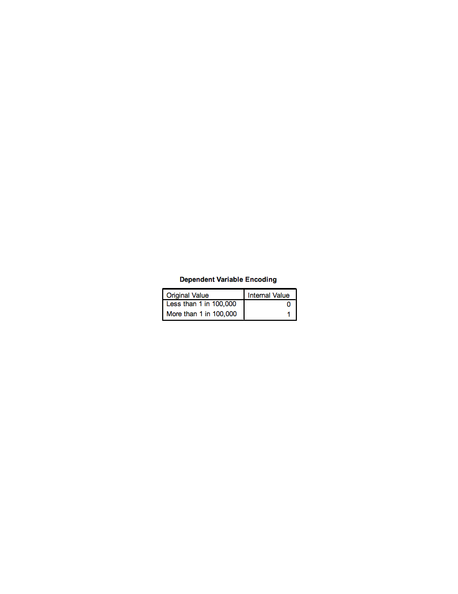{width="2.6625in"
height="1.0256944444444445in"}

This initial classification table, located in "Block 0" of the output,
shows how well we would do predicting by chance what the outcome will be
(i.e., not using any covariates to predict the outcome). Because more
countries have the higher classification, we would predict that
classification for all of the countries, and we would be correct 64.2%
of the time. This table isn't all that informative by itself, we will
compare it to a similar table in the next portion of the output.

{width="6.285416666666666in"
height="2.3506944444444446in"}

This table, also in the "Block 0" portion of the output, shows the
maximum likelihood estimate of the intercept term in a logistic
regression model without any covariates. This is simply the computed
log-odds of the dependent variable being equal to 1.

{width="5.961111111111111in"
height="0.8444444444444444in"}

We'll scroll down to the "Block 1" portion of the output, which will
contain the maximum likelihood estimates of the parameters in our model.
These estimates describe the relationship of LOG\_GDP to the dependent
variable (aidscat2). First, we examine the classification table for our
outcome given that we are now considering the LOG\_GDP variable as a
predictor. This table is similar to predicted values in linear
regression. For each country in the data set the predicted probability
is computed using the fitted model and values of the country's
covariate. If the predicted probability is greater than 0.5 the country
is classified into the 'high' AIDS rate group and if it is less than 0.5
it is classified into the 'low' AIDS rate group. These classifications
are then compared with the actual observed classifications of the
countries.

{width="6.285416666666666in"
height="2.1430555555555557in"}

Note that we are actually doing a *worse* job of predicting the AIDS
rate when using LOG\_GDP as a predictor (63.2% correct vs. 64.2% correct
when we don't consider any covariates). The predicted probabilities can
be ***saved*** in the SPSS data set as an option if desired.

Now, we examine the maximum likelihood estimate of the coefficient for
LOG\_GDP in the logistic regression model:

{width="5.909027777777778in"
height="1.2465277777777777in"}

The estimate of the parameter that represents the coefficient for
LOG\_GDP in the model is equal to 0.491, with a standard error of 0.329.
The **Wald statistic** reported by SPSS is the ***squared version*** of
the T statistic (the coefficient divided by its standard error,
squared), and is referred to a chi-square distribution with 1 degree of
freedom. This Wald statistic has a p-value of 0.135, which suggests that
we would **not** reject a null hypothesis that the coefficient for
LOG\_GDP is equal to 0. We really don't have evidence of a significant
relationship of LOG\_GDP with the AIDS rate outcome.

However, if the relationship were significant, we would conclude that a
one-unit increase in LOG\_GDP results in an expected increase of 0.491
in the ***log-odds*** of being in the higher AIDS rate category. The
parameter estimates represent additive changes to the log-odds. If
exponentiated we get the more common **odds ratio**, which is the
*multiplicative* change to the odds. Here the Exp(B) column holds the
exponentiated esimates, for log\_gdp the odds ratio is equal to 1.634.
This value has the meaning that the ***odds*** of being in the higher
AIDS rate category are ***multiplied*** by 1.63 with every one-unit
increase in LOG\_GDP.

**Activity 2: Logistic Regression with a Categorical Predictor**

Now, we'll consider an example of analyzing a single categorical
predictor with two levels, whether or not the country is predominantly
muslim (MUSLIM). MUSLIM is coded as 1 = yes and 0 = no, which we would
recommend for any two-level predictors.

Select 'Analyze'-\>'Regression'-\>'Binary Logistic' to re-enter the
logistic regression dialogue box. Replace the log\_gdp covariate with
muslim. We need to identify the predictor as categorical so select the
categorical button. Move the MUSLIM covariate into the 'Categorical
Covariates' list.

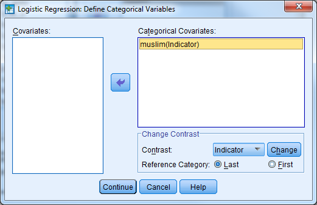{width="5.428472222222222in"
height="3.50625in"}

Fit the logistic regression model by clicking on OK.

{width="5.2077602799650045in"
height="3.844155730533683in"}

Let's jump down to Block 1 in the output and first examine the
classification table based on the model including the MUSLIM variable:

{width="6.285416666666666in"
height="2.1430555555555557in"}

Note the substantial improvement in prediction accuracy by considering
Muslim status! Now, we investigate the maximum likelihood estimate of
the coefficient for MUSLIM:

{width="5.909027777777778in"
height="1.2465277777777777in"}

The maximum likelihood estimate of the coefficient is -2.335, with a
standard error of 0.537. The Wald statistic based on that estimate is
18.934, and the p-value for that Wald statistic is said to be 0.000 by
SPSS (but should be reported as p \< 0.001). This p-value suggests that
we should reject the null hypothesis that the coefficient is equal to 0,
which tells us that Muslim status has a significant relationship with
the probability of being in the higher AIDS rate category. Specifically,
when MUSLIM is equal to 1 (as opposed to 0), the ***log-odds*** of being
in the higher category are expected to decrease by -2.335.

This estimate corresponds to an odds ratio of 0.097 (the exponential
version of the coefficient), which says that the odds of having a higher
AIDS classification for a Muslim country is 0.097 ***times*** the odds
of having a higher AIDS classification for a non-Muslim country. The
expected odds are multiplied by 0.097 when a country is Muslim as
opposed to non-Muslim. We can also interpret this as reducing the odds
of being in the higher AIDS rate category by 90.03% for muslim
countries. Notice here, when we see a decrease in the odds (odds ratio
less than 1) we report 1-Odds Ratio as the percentage (1-.097=.9003).

**Activity 3: Logistic Regression with Multiple Predictors**

In this analysis, we hope to find ways to categorize countries into one
of two AIDS prevalence categories, based on other data for the
countries. We will also discover which pieces of information are useful
in predicting AIDS prevalence, and which appear to be unassociated with
this prevalence.

Set up a logistic regression model to predict AIDS prevalence category
(*aidscat2*) by considering the following predictors: *muslim, log\_gdp,
babymort, urban, lit\_fema, lifeexpf, birth\_rt, tropical.* Have SPSS
report confidence intervals for the odds ratios. (This is found under
the 'Options' button in the Logistic Regression dialogue box.)

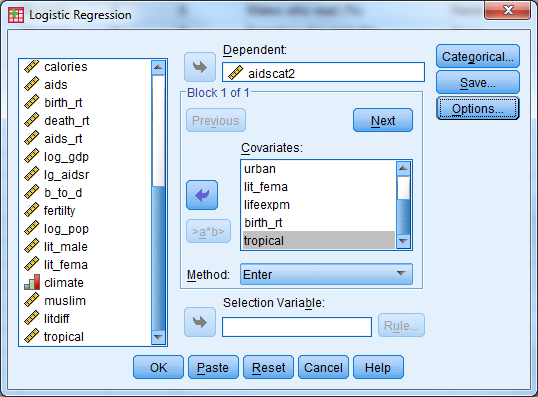{width="5.610416666666667in"
height="4.129861111111111in"}

{width="4.909027777777778in"
height="4.0in"}

Which predictors appear useful in predicting AIDS category? Do Muslim
countries still have lower odds of being in the higher AIDS prevalence
category when controlling for the relationships of the other predictors
with the outcome? How much lower are the odds of a Muslim country being
in the higher AIDS category?

The first table shows us that only 83 countries are used to fit this
model, 26 were removed from analysis due to missing data on any of the
variables used.

{width="4.285416666666666in"
height="1.9743055555555555in"}

The first classification table (Block 0: Beginning Block) in the output
shows you the result of classifying cases strictly by predicting them to
be in the category with the largest percentage in the data set (in this
case, you would predict a random case to be in the higher AIDS category,
since 64.2% of the cases with a valid AIDS category are in the higher
AIDS category). We would only be correct 59% of the time predicting by
chance.

{width="5.870138888888889in"
height="1.8701388888888888in"}

The 'Model Summary' table shows the --2 log-likelihood statistic for our
model, as well as two analogs of R^2^ in the multiple regression context
for a logistic regression model. **These are approximations of R-squared
in linear regression models, and should not be reported as the same
thing; they should really only be used to compare the fits of competing
models fitted using the same cases.** The Cox & Snell R Square
approximation suggests that our predictors explain about 43% of the
variation in our response (not bad). The Nagelkerke R Square is a
rescaled approximation that is constrained to fall between 0 and 1.

{width="3.285416666666667in"
height="1.0in"}

The Block 1 classification table shows an increase in the percentage
that is correctly classified (89.2% vs 59%) using the predicted
probabilities and a 'cut-off' classification probability of 0.5.

{width="5.870138888888889in"
height="2.129861111111111in"}

Let's examine the estimated coefficients for the predictors included in
our model:

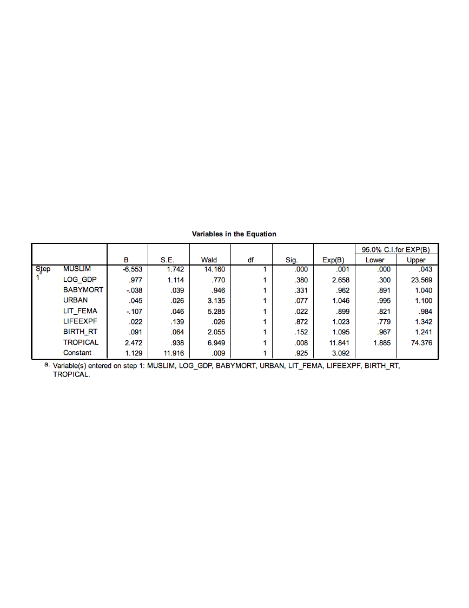{width="5.753472222222222in"
height="2.532638888888889in"}

The B column contains the estimated coefficients in the logistic
regression model, which indicate the change in the
[log-odds]{.underline} of "success" (in this case, being in the higher
AIDS category) associated with a one-unit increase in each predictor.
So, for example, a one-unit increase in *Muslim* (or being in a Muslim
country) decreases the **log-odds** of being in the higher AIDS category
by 6.553, holding all other predictors constant.

The Sig. column provides the results of a significance test for each of
the parameters (or coefficients) for the predictors in the model. This
shows that *Muslim, lit\_fema,* and *tropical* are significant
predictors of being in the higher AIDS category. If a predictor is
significant, changes in the predictor have a significant relationship
with the log odds of "success." The Exp(B) column indicates the factor
by which the odds of "success" are ***multiplied*** when the predictor
increases by one unit, holding the other predictors constant. So, for
example, a one-unit increase in Muslim will ***multiply*** the odds of
being in the higher AIDS category by 0.001, or reduce the odds of being
in the higher AIDS category by 99.9%. The Exp(B) factor is known as an
**odds ratio.** The 95% confidence interval for Exp(B) will not contain
1 if the predictor is significant. An odds ratio of 1 means that
one-unit changes in the predictor multiply the odds of "success" by 1,
or effectively do not change the odds.
