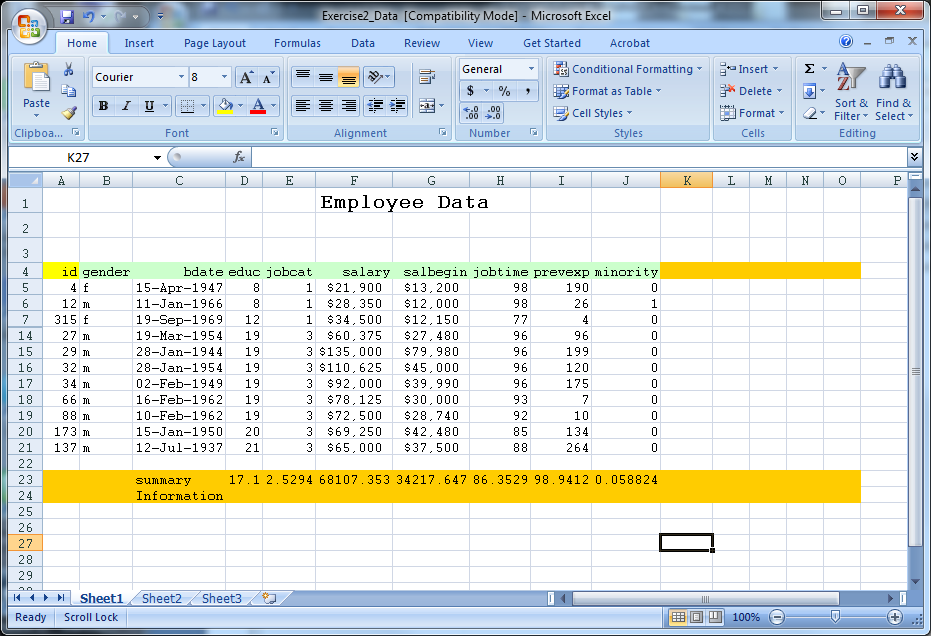
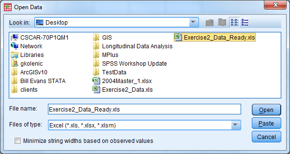
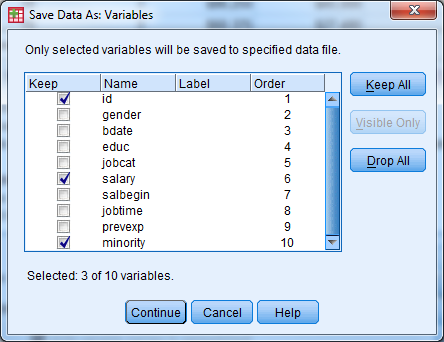

# Exercise 2 Solution
===================

Open Exercise2\_Data (an Excel file). Modify this Excel file such that
it can be imported into SPSS properly. Save the file and close it. Open
the file in SPSS (import it). Export this file back into Excel, but only
save the following variables: id, salary, minority.

{width="6.5in"
height="4.440387139107612in"}

Solution:

-   Delete the first three rows of data (remove heading)

-   Remove rows 23 and 24 (contains summary information)

-   Remove the formatting (fill color)

-   Save the file as Exercise2\_Data\_Ready

-   Close Exercise2\_Data\_Ready

{width="6.5in"
height="4.440387139107612in"}

-   Open SPSS

-   Select File - Open - Data

-   Under "Files of Type" select either "All Files" or "Excel" to view
    Exercise2\_Data\_Ready, select the file, then select "Open"

-   A window appears

-   Check the box so the variable names will be imported

-   Select the sheet of the Excel file that you would like to be read
    in, then select "Ok"

-   The Excel data should now open in the Data Editor

{width="6.239583333333333in"
height="3.3229166666666665in"}

{width="4.041666666666667in"
height="2.5in"}

-   Delete any "blank" rows of data or columns of data (indicated by
    ".") by highlighting, right click, select "cut"

-   Select File - Save As

-   Let the file name be Exercise2\_Data\_Ready\_short

-   Change the file type to Excel 97 through 2003 (\*.xls)

-   Select the "Variables..." button

-   Select the "Drop All" button

-   Under the "Keep" column, check the box for id, salary, minority

-   Select "Continue"

-   Select "Save"

-   Open the new file (Exercise2\_Data\_Ready\_short) to investigate the
    results

{width="4.550594925634296in"
height="3.4982699037620297in"}

{width="3.7843613298337706in"
height="2.914981408573928in"}
