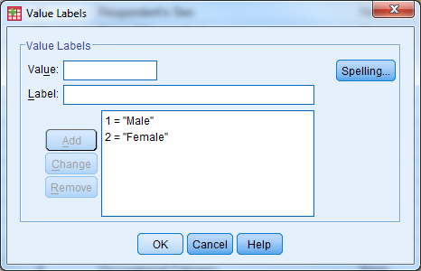
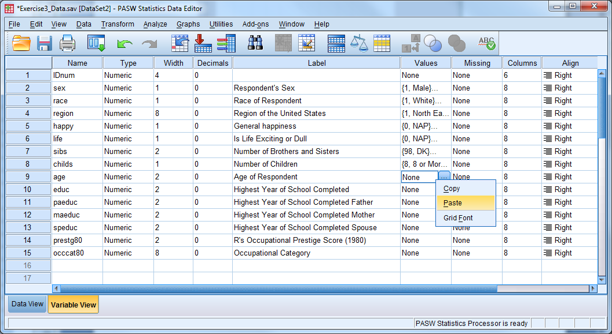

Exercise 3 Solution
===================

Open Exercise3\_Data and go to Variable View. Practice defining the
correct attributes to each variable by following the code book.

{width="6.0625in"
height="3.320896762904637in"}

Solution:

-   In Variable View, the first four columns do not need to be modified

-   To modify the variable label, click in the cell that you wish to
    edit and start tying in the label

-   To modify the value labels, click the cell that you wish to edit and
    then select the box with three small dots. The following window will
    appear:

{width="4.854166666666667in"
height="3.125in"}

-   Ender the value and label, then select "Add". Once all possible
    value labels are added, select "OK"

-   When value labels (or other attributes such as label or missing)
    repeat for a variable, you can copy and paste the attribute values.
    Right click on the cell you want to copy, select copy. Then right
    click on the cell that you would like to paste in, and select paste.

{width="6.5in"
height="3.5605489938757655in"}

-   Enter in missing values in a similar fashion---here we have discrete
    missing values

-   Use the drop down menu for "Measure" to specify the correct
    measurement type

-   Save this file as Exercise3\_Data\_Cleaned

{width="3.3541666666666665in"
height="2.4895833333333335in"}
