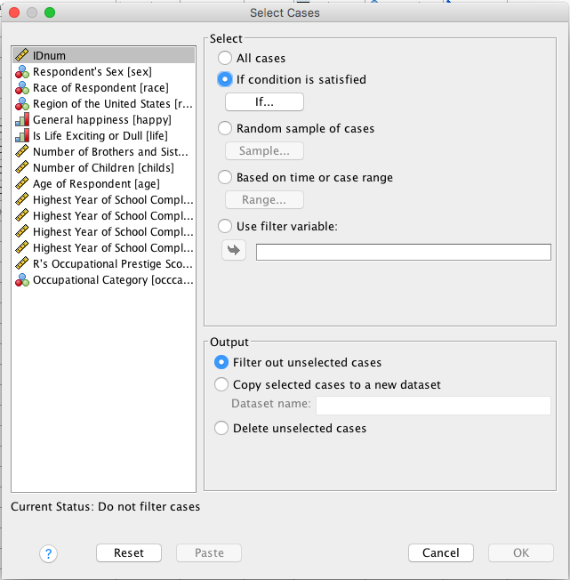
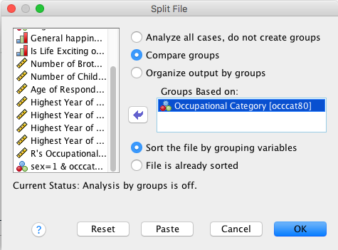

Exercise 5 Solution
===================

Open Exercise5\_Data.

Select male managers. What is their average age?

**Solution:**

-   Check Values for sex and occat80 to see what values correspond to
    "male" and "manager" (it's 1 and 1).

-   Data - Select Cases

-   Under Select: Select the If Condition is Satisfied radio dial and
    select the If button

{width="4.327660761154855in"
height="4.396551837270342in"}

-   Enter the following information

    -   Open box should read as follows: sex=1 & occcat80=1

    -   Continue

{width="4.5in"
height="3.0317311898512687in"}

-   Under Output: Select Filter Out Unselected Cases

-   Select OK

-   Inspect the data in Data View

-   Analyze - Descriptive Statistics - Descriptives

{width="4.387911198600175in"
height="2.52586176727909in"}

-   Select the age variable, select OK

-   Turn off the filter!

{width="4in"
height="1in"}

Part 2

Use the "split file" procedure to get the mean current age for each job
category.

**Solution:**

-   Data - Split File

-   Select Compare Groups

-   Select occat80 (Occupational Category) and move it into the Groups
    Based On window by double clicking (or using the arrow)

-   Select Sort the File by Grouping Variables

-   Select Ok

{width="4.004309930008749in"
height="2.963445975503062in"}

-   Analyze - Descriptive Statistics - Descriptives

-   Select the age variable and OK

{width="4.387911198600175in"
height="2.52586176727909in"}

-   Turn off the split file!

{width="6in"
height="4in"}
