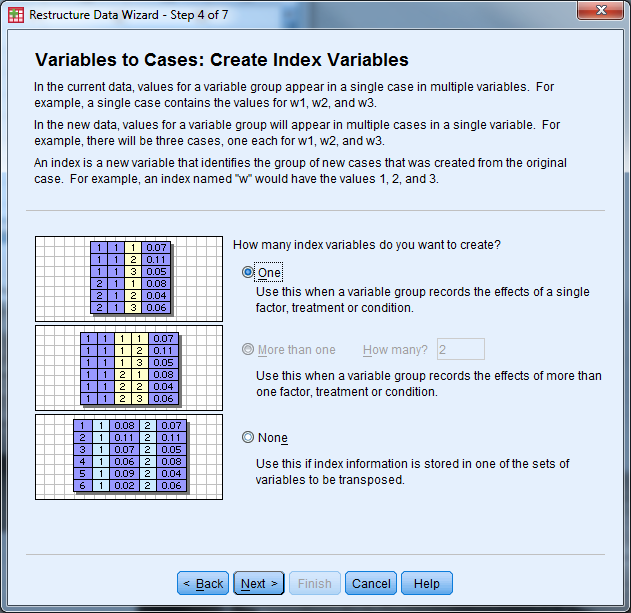

Exercise 6 Solution
===================

Convert Exercise6\_Data from "Wide" format to "Long" format

**Solution: **

-   Open Exercise6\_Data

-   Select "Data" "Restructure" to open the Wizard

-   Select "Restructure selected variables into cases" then "Next"

{width="5.472672790901138in"
height="5.316558398950131in"}

-   How many variable groups to you want to restructure? Select "One"
    then "Next"

{width="6.5in"
height="6.314580052493438in"}

-   Case Group Identification should be changed to "Use selected
    variable" and the variable should be the ID variable

-   Variables to be transposed: Move the X variables over (X1, X2, X3)

-   Fixed Variable(s): Move Group and Age over

-   Select "Next"

{width="6.5in"
height="6.314580052493438in"}

-   How many index variables do you want to create? Select "one" then
    "Next"

{width="6.5in"
height="6.314580052493438in"}

-   What kind of index values? Select "Sequential Numbers" then select
    "Next"

{width="6.5in"
height="6.314580052493438in"}

-   Handling of Variables not Selected: Select "Keep and treat as fixed
    variable(s)"

-   System Missing or Blank Values in All Transposed Variables: Select
    "Create a case in the new file"

-   Leave "Case Count Variable" unchecked

-   Select "Next"

{width="6.5in"
height="6.314580052493438in"}

-   What do you want to do? Select "Restructure the data now". In the
    future you may want to keep the syntax.

-   Select "Finish"

-   The following message appears, click "Ok"

{width="5.375in"
height="1.4115113735783027in"}

-   Inspect the data (and change "trans1" to "X")

    {width="5.207962598425197in"
    height="4.987069116360455in"}
