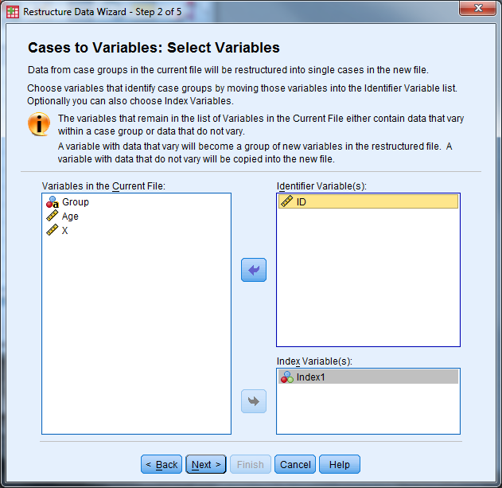

Exercise 7 Solution
===================

Convert Exercise7\_Data from "Long" format to "Wide" format

**Solution: **

-   Open Exercise7\_Data

-   Select "Data" "Restructure" to open the Wizard

{width="5.521132983377078in"
height="5.363636264216973in"}

-   Identifier Variable(s): ID

-   Index Variable(s): Index1

-   Select "Next"

{width="6.5in"
height="6.314580052493438in"}

-   Sort the current data? Yes

-   Select "Next"

{width="6.5in"
height="6.314580052493438in"}

-   Order of New Variable Groups: Group by original variable

-   Leave the other options unchecked

-   Select "Next"

{width="6.5in"
height="6.314580052493438in"}

-   Select "Restructure the Data Now" and "Finish"

{width="6.375in"
height="6.193145231846019in"}

-   The following message will appear, select "Ok". Inspect the data and
    save!

{width="5.375in"
height="1.4115113735783027in"}

{width="6.482638888888889in"
height="3.345138888888889in"}
