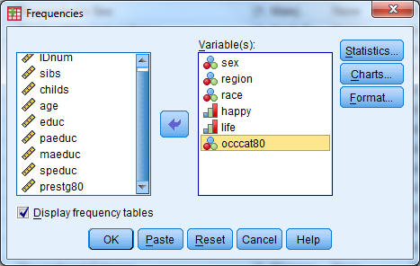
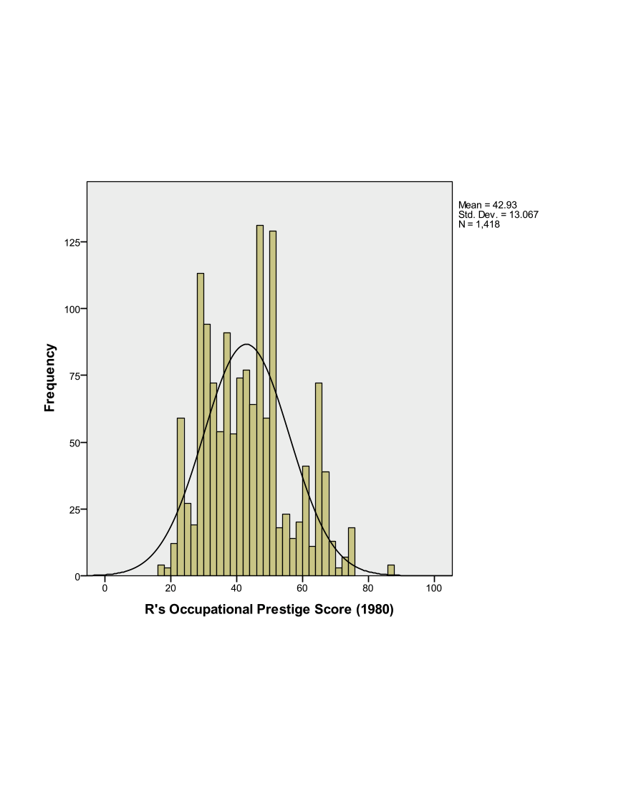

Exercise 8 Solutions
====================

Open Exercise8\_Data.sav

**Part 1**: Investigate the variable attributes. Determine which
variables are categorical variables (nominal and ordinal), and which
variables are continuous (scale).

Solution:

Open the dataset (Exercise8\_Data)

Select the "Variable View" tab

Investigate the labels and measure of each variable

{width="6.637844488188977in" height="3.8053280839895014in"}

Obtain the appropriate descriptive statistics for each variable in the
dataset. Remember, continuous variables should be investigated with
5-point summary descriptives and categorical variables should be
investigated with frequency tables.

Solution:

Descriptives:

-   Select Analyze - Descriptive Statistics - Descriptives

<!-- -->

-   Select the following variables: sibs, childs, age, educ, paeduc,
    maeduc, speduc, prestg80

-   Select "OK"

-   Notice there are only 519 respondents that have valid data points
    for all of the continuous variables.

{width="4.870138888888889in"
height="3.077777777777778in"}

  ------------------------ ------ --------- --------- ------- ----------------
  Descriptive Statistics
                           N      Minimum   Maximum   Mean    Std. Deviation
  sibs                     1505   0         26        3.93    3.047
  childs                   1509   0         8         1.90    1.765
  age                      1514   18        89        45.63   17.808
  educ                     1510   0         20        12.88   2.984
  paeduc                   1069   0         20        10.88   4.129
  maeduc                   1233   0         20        10.79   3.463
  speduc                   790    0         20        12.89   3.059
  prestg80                 1418   17        86        42.93   13.067
  Valid N (listwise)       519
  ------------------------ ------ --------- --------- ------- ----------------

Frequency Tables:

-   Select Analyze - Descriptive Statistics - Frequencies

-   Select the following variables: sex, region, race, happy, life,
    occcat80

{width="4.870138888888889in"
height="3.077777777777778in"}

-   Investigate the output

**Part 3**: Assess the distribution of the Occupational Prestige Score
("prestg80") with both a histogram (normal curve displayed) and a Q-Q
plot. Is the assumption that the population of Occupational Prestige
Scores is normally distributed reasonable?

Solution:

-   Histogram in Legacy Dialogs

-   Select Graphs - Legacy Dialogs - Histogram

-   Variable: prestg80

-   Check box to display normal curve

-   Select OK

{width="4.979166666666667in"
height="4.484458661417323in"}

Investigate the output

{width="3.9791666666666665in"
height="3.177302055993001in"}

-   Q-Q Plot

-   Select Analyze - Descriptive Statistics - Q-Q Plots

-   Select the variable prestg80

-   Select OK

{width="4.135010936132983in"
height="2.990590551181102in"}

-   Investigate the output

-   Look to see how well the plotted points follow the solid diagonal
    line

-   It is particularly important to pay attention to the "tails", or the
    left most and right most points to see if they follow the line

{width="4.264880796150481in"
height="3.40544072615923in"}

**Part 3**: Compare the average highest year of school completed
("educ") for males and females.

Solution:

-   Set up the dataset such that the output is split by groups based on
    sex

-   Select Data - Split File

-   Select "Compare Groups"

-   Select the variable sex for "Groups Based on:"

-   Select "OK"

{width="4.628517060367454in"
height="3.5987948381452317in"}

-   Compute the 5-Point Summary Descriptives for "educ"

-   Select Analyze - Descriptive Statistics - Descriptives

-   Select the variable "educ"

-   Select "OK"

{width="4.664867672790901in"
height="2.9480522747156606in"}

-   Investigate the output

-   Males have an average of 13.23 years of education

-   Females have an average of 12.63 years of education

{width="5in"
height="2in"}

-   Turn the split file feature off

-   Select Data - Split File

-   Select "Analyze all cases, do not create groups" (Alternatively,
    "Reset" can be selected)

-   Select "OK"

**Part 4**: Produce a pie chart for the variable "region". Use "Legacy
Dialogs".

Solution:

-   Select Graphs - Legacy Dialogs - Pie

-   Under "Data in Chare Are" select "Summaries for groups of cases"

-   Select "Define"

{width="2.5505949256342957in"
height="1.8178455818022747in"}

-   Select the variable "region" for "Define Slices by:"

-   The default for "Slices Represent" is "N of cases", and leave this
    at the default

-   Select "OK"

{width="4.602543744531934in"
height="4.990481189851269in"}

-   Investigate the output

{width="4.5in"
height="4.5in"}
