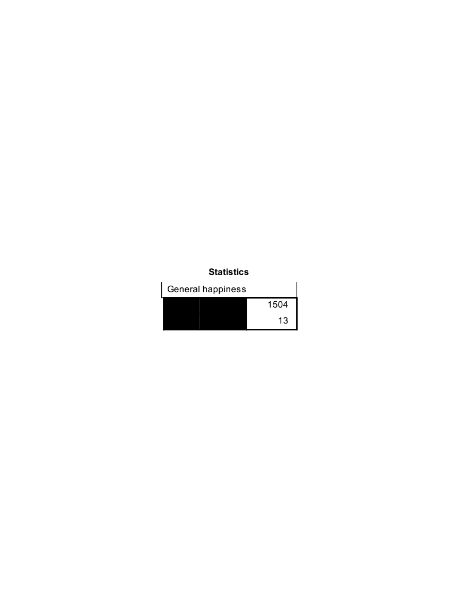
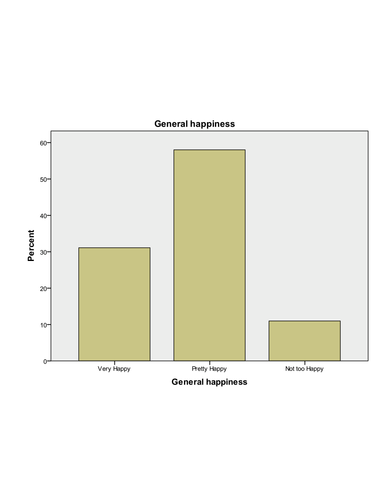
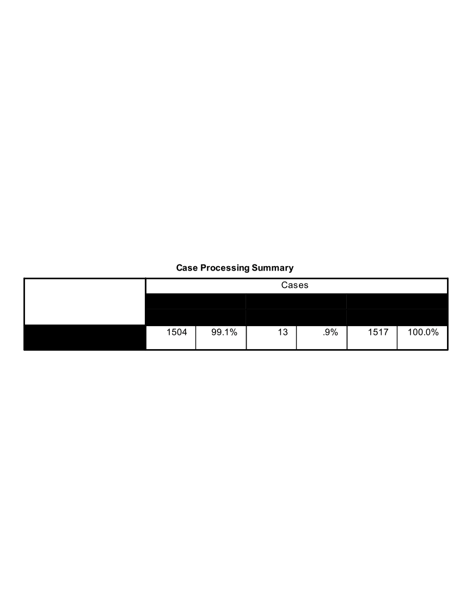
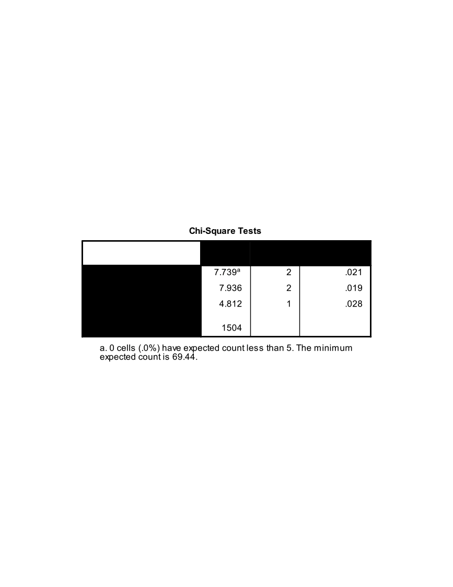
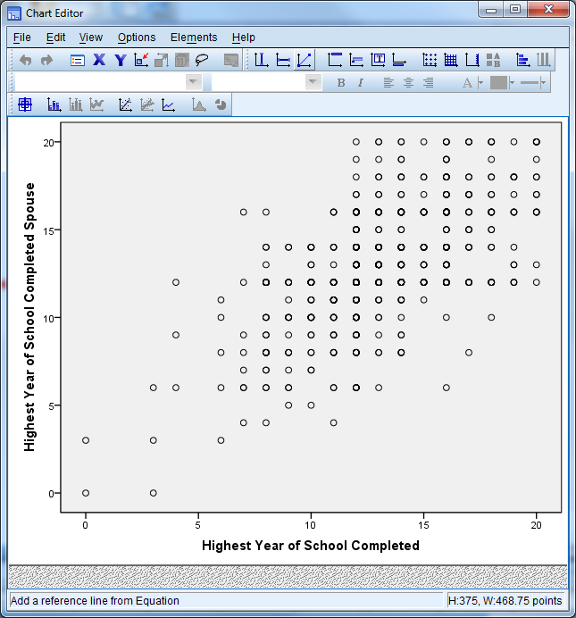
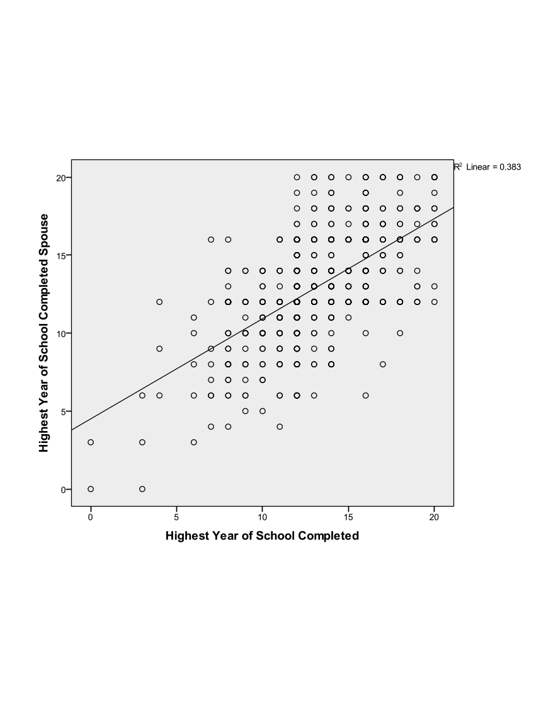
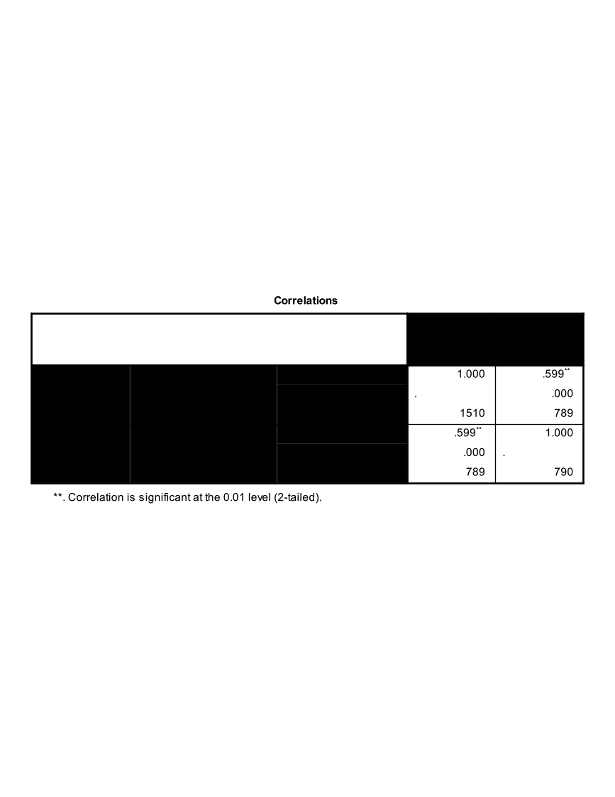

Exercise A1 -- Categorical Data Analysis
========================================

**Question 1 **

Open ExerciseA1\_Data. What percent of respondents said they were "Very
Happy"? What about "Not too happy"? "Pretty happy"? Use a graph to
display the variable.

**Question 2**

Do women appear to be more or less happy than men? Would you say this
apparent relationship is statistically significant?

**Question 3**

Create a scatter plot of respondent's education vs. their spouses'
education. Does this relationship appear to be linear? Add a linear
regression line to the plot. Inspect the correlation between the
respondent's education and their spouses' education. Is this correlation
positive or negative? Is it statistically significant.

=

Exercise A1 Solution
====================

**Question 1 **

Open Exercise12\_Data. What percent of respondents said they were "Very
Happy"? What about "Not too happy"? "Pretty happy"? Use a graph to
display the variable.

**Solution: **

-   We have one categorical variable that we would like to
    investigate...check the all on one page handout!

-   "Analyze" "Descriptive Statistics" "Frequencies"

{width="4.864583333333333in"
height="3.0833333333333335in"}

-   Enter the following information

    -   Select happy

    -   Select Charts

        -   Under Chart Type, select Bar Chart

        -   Under Chart Values, select Percentages

        -   Select Continue

    -   Select the box for Display Frequency Tables

    -   Select Ok

{width="2.8333333333333335in"
height="2.9791666666666665in"}

{width="1.90625in"
height="0.9479166666666666in"}

{width="5.15625in"
height="1.96875in"}

{width="6.5in"
height="5.197916666666667in"}

**Question 2**

Do women appear to be more or less happy than men? Would you say this
apparent relationship is statistically significant?

**Solution: **

-   We are going to compare two categorical variables. From out handout,
    we will use Pearson Chi-Square crosstabs to do this!

-   AnalyzeDescriptive StatisticsCrosstabs

<!-- -->

-   Enter the following information

    -   Rows: sex

    -   Columns: happy

{width="4.628517060367454in"
height="3.82830271216098in"}

-   Select the Statistics button

    -   Check the box for Chi-Square

    -   Select Continue

{width="3.0051410761154855in"
height="3.3971161417322833in"}

-   Select the Cells button

    -   Check the box for Row under Percentages (leave the rest as
        default)

    -   Check the box for Adjusted Standardized Residuals under
        Residuals (leave the rest as default)

    -   Select Continue

-   Select the box for Display Clustered Bar Charts

-   Select Ok

{width="3.4375in"
height="3.8125in"}

-   The Pearson Chi-Square statistic indicates that the differences
    between men and women are statistically significant
    (pvalue/asymptotic significance\<.05).

-   The residuals, clustered bar chart, and row percentages can tell us
    where these differences arise

    -   An adjusted standardized residual (absolute value) greater than
        two shows us where the differences between groups occur. Here,
        we see that "not too happy" for males and females has a residual
        greater than 2.

    -   The row proportions indicate that there is a higher proportion
        of females that responded "not too happy" when compared to
        males.

    -   The clustered bar chart also shows that there are greater
        numbers of women that indicate that they are "not too happy".

{width="5.90625in"
height="1.28125in"}

{width="6.5in"
height="2.6211231408573927in"}

{width="4.125in"
height="1.9895833333333333in"}

{width="4.507012248468941in"
height="3.6041666666666665in"}

**Question 3**

Create a scatter plot of respondent's education vs. their spouses'
education. Does this relationship appear to be linear? Add a linear
regression line to the plot. Inspect the correlation between the
respondent's education and their spouses' education. Is this correlation
positive or negative? Is it statistically significant.

**Solution: **

-   GraphsLegacy DialoguesScatter/Dot

-   Simple ScatterDefine

<!-- -->

-   Enter the following information

    -   Y Axis: speduc

    -   X Axis: educ

    -   Select Ok

-   Check the output for the scatter plot

-   Double click the plot in the Output Viewer to open Chart Editor

-   Select the button for Add Fit Line at Total (first bar above the
    plot, axis with straight line plot)

-   Select Linear Fit, Apply, Close

-   Close out of chart editor (red X in the upper right corner) and the
    updated chart will appear in the Output Viewer.

<!-- -->

-   "Analyze" "Correlate" "Bivariate"

-   Enter the following information

    -   Variables: educ, speduc

    -   Correlation coefficients: Pearson, Spearman

    -   Significance: Two Tailed

    -   Check the box for Flag significant correlations

    -   Select Ok

-   The output indicates that the correlation between education and
    spouses' education is positive and statistically significant.

-   Save this data set as Exercise11\_Data\_Updated

{width="3.53125in"
height="2.0625in"}

{width="5.625in"
height="6.114583333333333in"}

{width="3.6666666666666665in"
height="5.270833333333333in"}

{width="3.966178915135608in"
height="4.2551870078740155in"}

{width="4.316828521434821in"
height="3.45207895888014in"}

{width="3.992153324584427in"
height="3.5929374453193352in"}

{width="5.472672790901138in"
height="2.1187445319335083in"}

{width="5.563582677165354in"
height="2.153940288713911in"}
