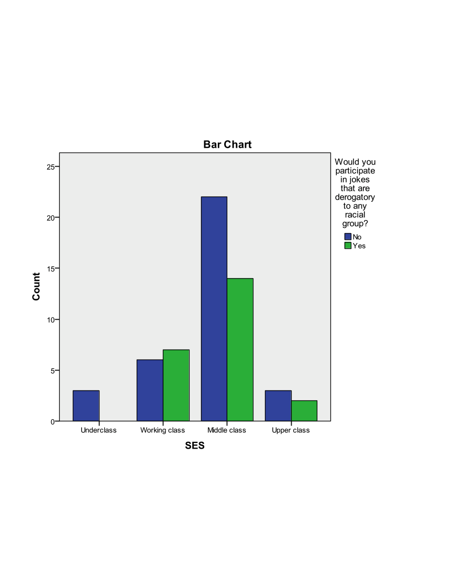

---
output:
  html_document: default
  pdf_document: default
---
Exercise A2 -- Continuous Data Analysis
=======================================

Open ExerciseA2\_Data.sav

**Research Question 1:** Is there a relationship between a student's
socio-economic status and whether or not the student would participate
in a racially insensitive joke?

What techniques would you use to investigate the relationship between
SES and whether or not a student would participate in a racially
insensitive joke?

Investigate this relationship graphically and statistically. What did
you find?

**Research Question 2:** Is there a relationship between a student's
race and their post intervention behavior intention scale?

What techniques would you use to investigate a student's race and their
post intervention behavior intention scale?

Investigate this relationship graphically and statistically. What did
you find?

**Research Question 3:** Is there a relationship between the race of a
student and their socio-economic status?

What techniques would you use to investigate the relationship between
race and SES?

Investigate this relationship graphically and statistically. What did
you find?

Exercise A2 Solution
====================

**Research Question 1:** Is there a relationship between a student's
socio-economic status and whether or not the student would participate
in a racially insensitive joke?

What techniques would you use to investigate the relationship between
SES and whether or not a student would participate in a racially
insensitive joke?

**ANSWER:** SES is an ordinal variable with 4 levels that should be
treated as a categorical variable. Whether or not a student would
participate in a derogatory joke is measured with the "Joke" variable
and it is a categorical variable. The appropriate statistical procedure
to use to compare two categorical variables is the Chi-Square Test of
Independence (crosstabs). The appropriate graphical procedure is a
clustered bar chart.

Investigate this relationship graphically and statistically. What did
you find?

**ANSWER:** There is not a statistically significant relationship
between "SES" and "Joke". We do not have enough evidence to say that
there is a relationship between a student's socio-economic status and
whether or not the student would participate in a racially insensitive
joke.

{width="8in"
height="8in"}

{width="8in"
height="6in"}

**Research Question 2:** Is there a relationship between a student's
race and their post intervention behavior intention scale? What
techniques would you use to investigate a student's race and their post
intervention behavior intention scale?

**ANSWER:** "Race" is a categorical variable that can take on up to 9
values and a student's post intervention behavior intention scale
("BIndBehint\_post") is a continuous variable. The appropriate
statistical procedure is a one-way ANOVA. The appropriate graphical
procedure is a side-by-side box plot.

Investigate this relationship graphically and statistically. What did
you find?

**ANSWER:** There is not a statistically significant relationship
between "Race" and "BIndBehint\_Post". We do not have enough evidence to
say that there is a relationship between a student's race and their post
intervention behavior intention score.

{width="8in"
height="6in"}

{width="7.6in"
height="7in"}

**Research Question 3:** Is there a relationship between the race of a
student and their socio-economic status? What techniques would you use
to investigate the relationship between race and SES?

**ANSWER:** "Race" and "SES" are both categorical predictors. The
appropriate statistical procedure to use to compare two categorical
variables is the Chi-Square Test of Independence (crosstabs). The
appropriate graphical procedure is a clustered bar chart.

Investigate this relationship graphically and statistically. What did
you find?

**ANSWER:** There is a statistically significant relationship between
"Race" and "SES". There is a significant relationship between a
student's SES and race. Notice the error message under the Chi-Square
results table---in this case, we need to verify our statistically
significant results with Fisher's Exact Test (pvalue=.025).

{width="8in"
height="6in"}

{width="6in"
height="8in"}
