Exercise A4 -- Case Study I: Salary (Regression)
================================================

Open ExerciseA4\_Data.sav

**Background**

This data set contains information on faculty from Bowling Green State
University for the 1993 to 1994 (DeMaris 2004). The purpose of the
exercises below is to investigate whether there was any evidence of
gender inequality in faculty salaries at BGSU.

**Activity 1: Describing the Dataset**

Investigate the 'Faculty' data set using descriptive statistics, one
variable graphing procedures, and bivariate procedures.

**Investigate 'Salary' with descriptive statistics, box plot, and
histogram**

{width="4.870138888888889in"
height="3.077777777777778in"}

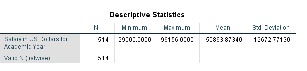{width="6.16875in"
height="1.0777777777777777in"}

{width="5.49375in"
height="4.947916666666667in"}

{width="4.277867454068241in"
height="3.415810367454068in"}

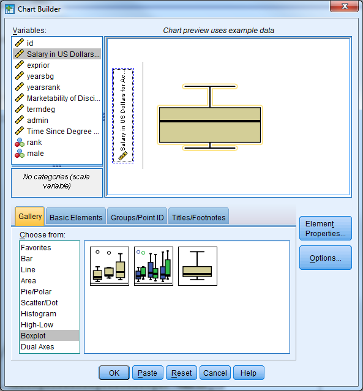{width="4.329816272965879in"
height="4.666395450568679in"}

{width="4.316828521434821in"
height="3.446920384951881in"}

**Investigate 'Gender' with a frequency table and bar chart**

{width="4.870138888888889in"
height="3.077777777777778in"}

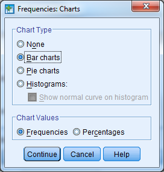{width="2.83125in"
height="2.9743055555555555in"}

{width="6in"
height="3in"}

{width="4.576569335083114in"
height="3.6653280839895013in"}

**Investigate the average salary for males and females separately
(descriptive statistics, histogram, side-by-side box plot)**

Remember to split the file by the gender variable ('male').

{width="4.610416666666667in"
height="3.584722222222222in"}

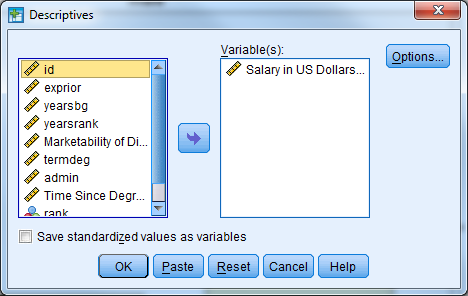{width="4.870138888888889in"
height="3.077777777777778in"}

{width="6.5in"
height="2in"}

The descriptive statistics table above indicates that males earn more
than females on average.

{width="6.498647200349956in"
height="6.051683070866142in"}

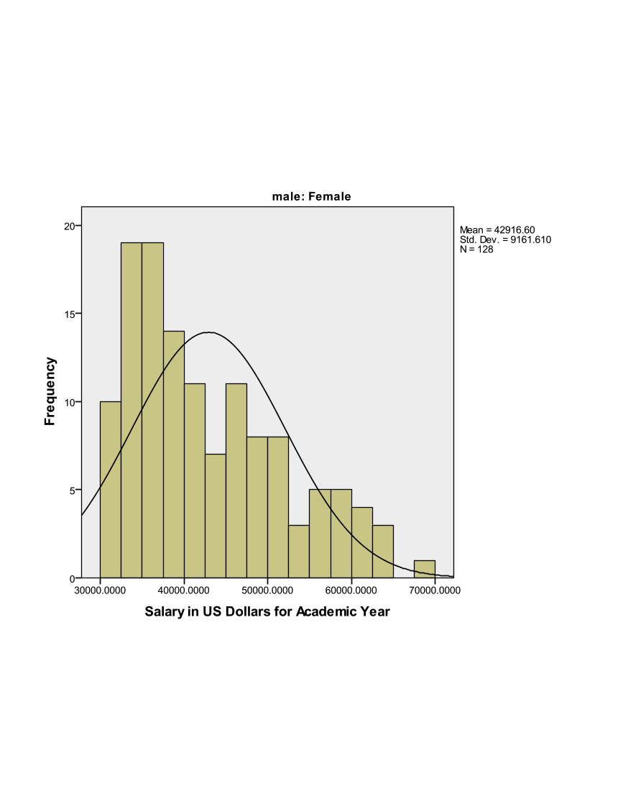{width="8in"
height="6.5in"}

{width="8in"
height="6.5in"}

Also remember to remove the 'Split File' option.

{width="4.610416666666667in"
height="3.584722222222222in"}

{width="4.628517060367454in"
height="3.8586220472440944in"}

The Boxplot below indicates that males have a higher median salary than
females, and both males and females have outliers (observation 148 and
58 respectively).

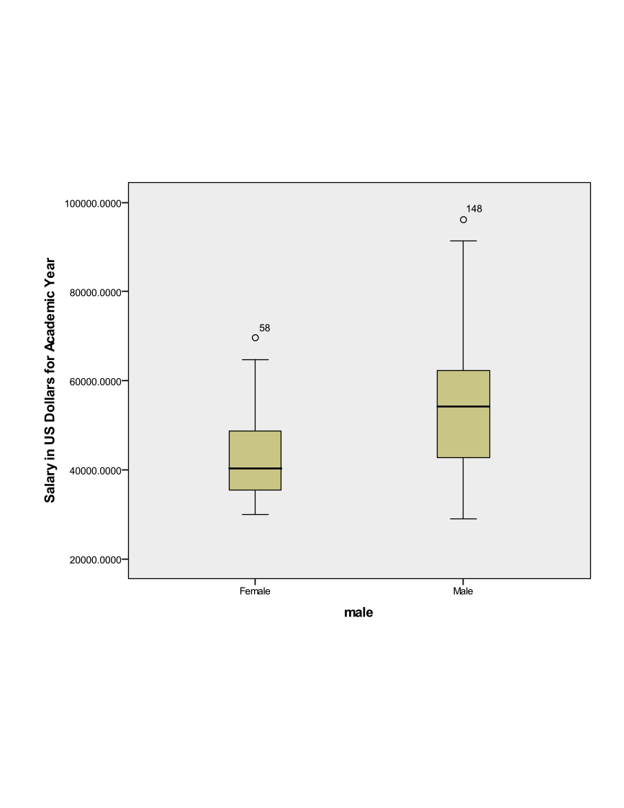{width="8in"
height="7in"}

**Perform an independent samples t-test **

Remember that the dialogue box for the independent samples t-test is
located under 'Analyze' then 'Compare Means'.

{width="3.654491469816273in"
height="2.3173534558180227in"}

{width="2.4805555555555556in"
height="2.0388888888888888in"}

{width="8in"
height="3in"}

The table above indicates that we cannot assume equal variances between
males and females (Levene's Test pvalue\<.05). Regardless, we see that
the differences between average male and female salaries are large
enough to be considered statistically significant (t=10.250, df=297.227,
pvalue\<.001). The confidence interval for the mean difference between
genders is [8550.79, 12614.47]. This is the plausible range of values
for the difference between males and females.

**Activity 2: Simple Linear Regression**

The independent samples t-test is one way to model the relationship
between the faculty salary (dependent variable of interest) and gender
(independent variable). Faculty salary may also be a function of the
marketability of the discipline the faculty member is in.

**Investigate the correlation between 'salary' and 'market' and
investigate a scatter plot of the two variables**

In SPSS, select Analyze - Correlate - Bivariate

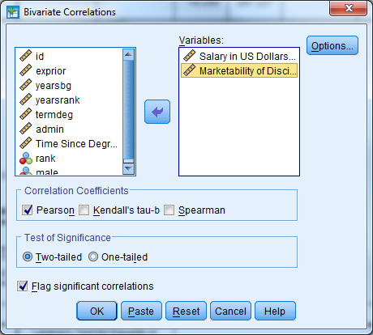{width="4.0181277340332455in"
height="3.6152088801399827in"}

{width="5.090972222222222in"
height="2.441666666666667in"}

We see from the table above that there is a statistically significant
correlation between faculty salary and marketability of the discipline
(r=.407, pvalue\<.001).

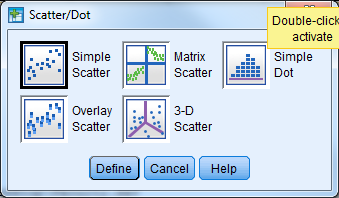{width="3.532638888888889in"
height="2.0652777777777778in"}

{width="4.459686132983377in"
height="4.850693350831146in"}

{width="8in"
height="6.5in"}

**Perform a simple linear regression where 'salary' is the
dependent/outcome variable and 'market' is the independent/predictor
variable**

This can be done multiple ways in SPSS. The first way uses the
regression menu from 'Analyze' while the second uses the 'General Linear
Model' menu.

Select Analyze - Regression - Linear

{width="4.36877624671916in"
height="3.584650043744532in"}

{width="3.8958333333333335in"
height="3.49375in"}

Notice that the regression menu provides the correlation between the
variables included in the model.

The table below provides the R Square value and adjusted R Square value.
The proportion of variance in faculty salary explained by marketability
of discipline is 16.6%.

The table below indicates that the model fitted is significantly better
than what we would expect by chance (F=101.771, pvalue\<.001). The null
hypothesis is that there is no linear relationship between faculty
salary and marketability, and we reject this hypothesis.

{width="6in"
height="8in"}

{width="8in"}

The table above provides the parameter estimates for our model. For
every one unit increase in marketability, faculty salary increases by an
average of \$34,545. We could also interpret the beta coefficient for
marketability the following way: the effect of a .1 point increase in
marketability is associated with an estimated increase in mean salary of
\$3,454. The constant (intercept) for the model is interpreted as the
estimated mean salary when marketability is equal to zero.

Remember that the confidence intervals give us a range of reasonable
values for an estimate. The 95% confidence interval for our estimate of
market discipline is [$27817, $41272].

The hypothesis tests provided with the 't' statistic and 'Sig.' columns
help us decide if a particular value (usually zero) is a reasonable
estimate. If our estimated beta coefficient for market discipline was
zero, then market discipline would not have an effect/relationship with
faculty salary. This is our null hypothesis, and we would like to reject
this hypothesis. Here we find a significant relationship between market
discipline and faculty salary (t=10.088, pvalue\<.001).

The second method for generating results for a simple linear regression
is described below. Keep in mind that this method for performing a
linear regression is preferred when there are categorical
predictor/independent variables or interaction terms between independent
variables.

Select Analyze - General Linear Model - Univariate

{width="4.909027777777778in"
height="4.1819444444444445in"}

{width="4.005139982502187in"
height="4.132720909886264in"}

The table below provides the descriptive statistics for faculty salary.

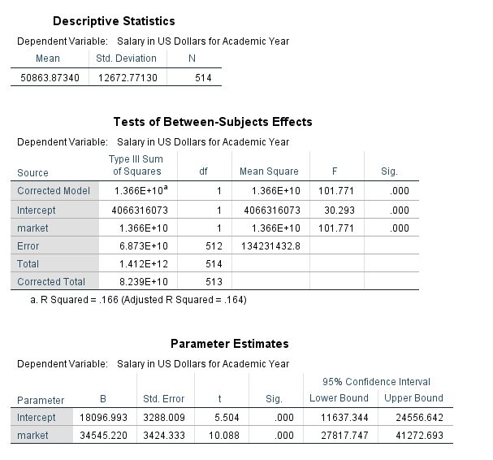{width="6in"
height="6in"}

The table above indicates that the overall regression model is
significant (F=101.771, pvalue\<.001). This is indicated by the line for
'Corrected Model'. The R Squared value is also listed in footnote a. for
the table.

The parameter estimates table above provides the same information as the
previous coefficients table.

Notice that the results are the same between the two methods that can be
used in SPSS to perform a regression. For the remainder of the workshop
we will use the second method to obtain our regression results
(Analyze - General Linear Model - Univariate).

**Activity 3: Simple Linear Regression Diagnostics**

Perform the necessary regression diagnostics for the regression from
exercise 2.

{width="3.4330172790901137in"
height="4.0135225284339455in"}

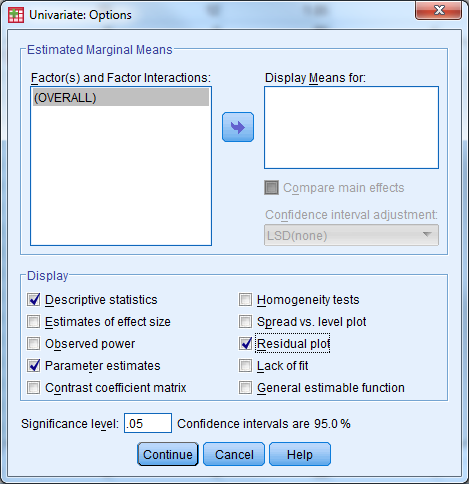{width="3.4986472003499562in"
height="3.610094050743657in"}

**Check the linearity and homogeneity of variance assumptions**

Plot the residuals against the predicted values from the model. The
residuals should be randomly scattered around zero, and the variability
should be constant in the plot.

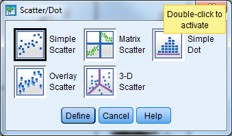{width="3.532638888888889in"
height="2.0652777777777778in"}

{width="6.5in"
height="4.652742782152231in"}

The scatter plot below does not indicate that either assumption has been
violated.

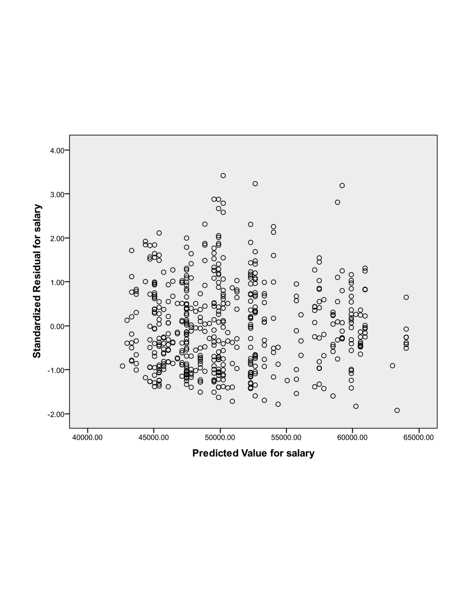{width="7.2in"
height="6in"}

**Check for influential points**

The scatter plot from exercise 2 did not indicate that there were points
of interest.

{width="7.2in"
height="6in"}

A leverage point is an unusual point that has the potential to influence
the fit of the model. Sort the data set by Leverage in descending order.
A rule of thumb is a point is considered to have large leverage when the
leverage value is greater than 2p/n where p equals the number of
parameters in the model. Here we estimate the intercept and slope for
market, so p=2. This means that high leverage values are greater than
2\*2/514=4/514=.0078. There are 53 points with high leverage.

{width="6.042713254593176in"
height="4.830773184601925in"}

An influential point is one whose removal from the dataset would cause a
large change in the fit of the regression model. An influential point
may or may not be an outlier. Also, and influential point may or may not
have large leverage. Usually an influential point will be an outlier and
or may have large leverage. Sort the data set by the Cook's distance
variable in descending order. This will list the observations with the
largest Cook's distance first. Remember a distance greater than 1 or
4/n=4/514=.0078 is considered large. The first 16 observations have
large Cook's distances, but we do not have cause to remove them from the
data set.

{width="6in"
height="4.8in"}

**Check the normality assumption for the residuals**

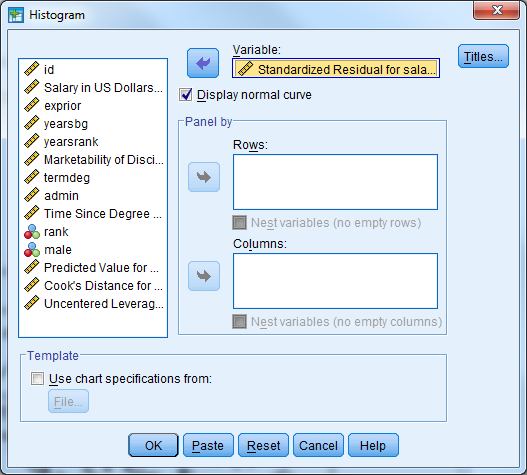{width="6in"
height="5.3in"}

The plot below indicates that the normality assumption is reasonable.

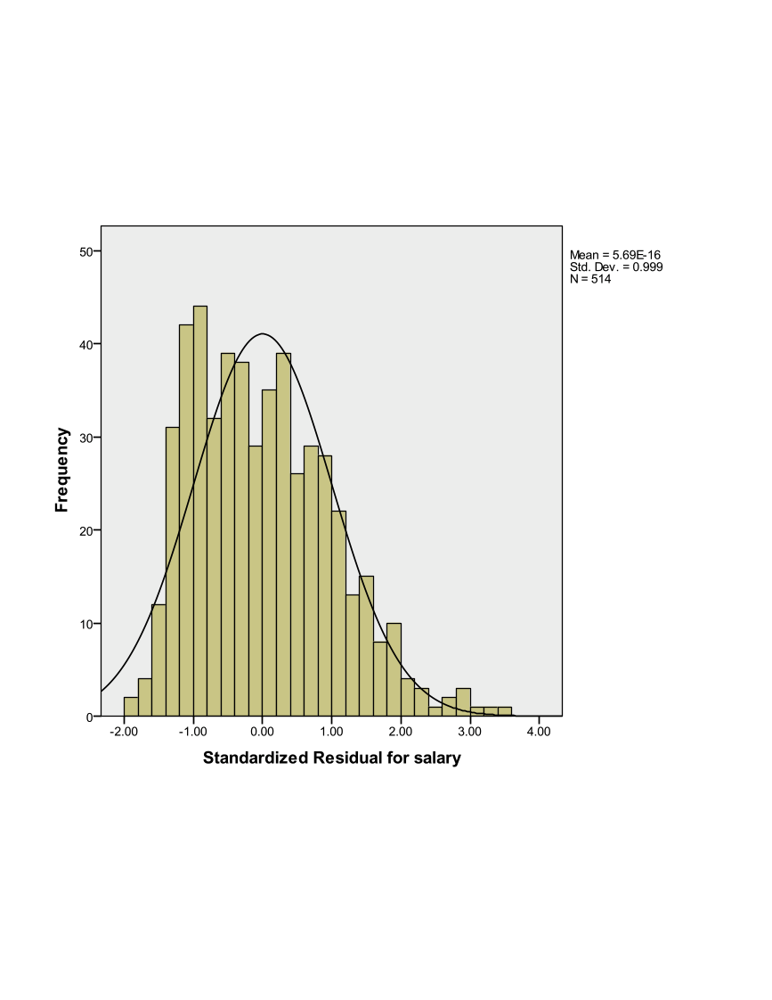{width="8in"
height="6.7in"}

A QQ plot can also be investigated (Analyze - Descriptive Statistics - QQ Plot)

{width="6in"
height="4.4in"}

{width="8in"
height="6.5in"}

**Activity 4: Multiple Regression with a Categorical Predictor**

Faculty salary appears to be a function of the marketability of the
discipline the faculty member is in, but it also may be a function of
gender.

**Create a multiple regression model where salary is the dependent
variable, and both marketability and gender are the predictors. **

Select Analyze - General Linear Model - Univariate

Select 'salary' as the dependent variable, male as the fixed factor, and
market as the covariate. Remember that any categorical predictor in a
basic regression model should be entered in as a 'fixed factor', while
any continuous prediction is considered a 'covariate'.

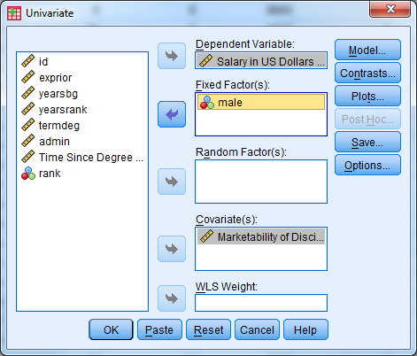{width="4.725941601049869in"
height="4.025974409448819in"}

Under 'Options', select 'Descriptive Statistics', 'Parameter Estimates',
'Residual Plot'

{width="4.883333333333334in"
height="5.038888888888889in"}

The table below indicates the number of Males and Females in the data
set, along with the code that denotes the genders.

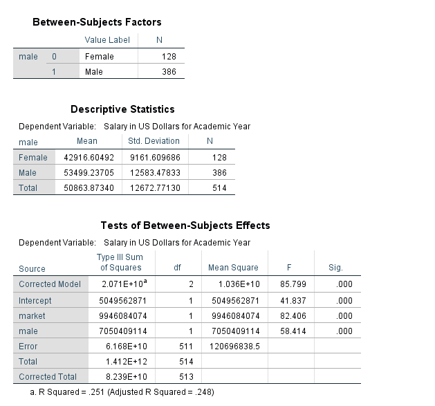{width="8in"
height="8in"}

The table above indicates that the average salary for males is greater
than the average salary for females (\$53,499.24 compared to
\$42,916.60).

The table above indicates that the model fitted is significantly better
than what we would expect by chance (F=85.799, pvalue\<.001). The null
hypothesis is that there is no linear relationship between faculty
salary and the model predictors, and we reject this hypothesis. This is
indicated by the line for 'Corrected Model'. The R Squared value is also
listed in footnote a. for the table. The proportion of variance in
faculty salary explained jointly by marketability of discipline and
gender is 25.1%. Notice that this is an increase from the previous model.

{width="8in"
height="8in"}

The table above provides the parameter estimates for the regression
model. The difference in population mean salaries between men and women,
when controlling for marketability is estimated to be \$8,708.42.

Remember that Dummy variables are always interpreted in relationship to
the reference category. The reference category is denoted with a
coefficient value of 0 and footnote a. Here, we interpret male=0
(Female) compared to male=1 (Males). Another interpretation of the
gender variable: When controlling for marketability, faculty salaries
are on average \$8,708.42 less for females when compared to males.

The marketability coefficient now is interpreted as the effect of
marketability after accounting gender. For every one unit
increase in marketability, faculty salary increases by an average of
\$29,972.60 holding gender constant. We could also interpret the beta
coefficient for marketability the following way: the effect of a .1
point increase in marketability is associated with an estimated increase
in mean salary of \$2,997 holding gender constant.

Notice that all of the predictor variables in the model are highly
significant.

Note that the model fit above is also sometimes referred to as an
analysis of covariance (ANCOVA) model. The inclusion of a continuous
predictor (marketability) in addition to the factor gender makes this an
ANCOVA model.

**Create a multiple regression model where salary is the dependent
variable, and marketability, time since degree (yearsdg), and gender are
the predictors. Investigate the coefficients and R-squared. **

First investigate a scatter plot between salary and time since degree.

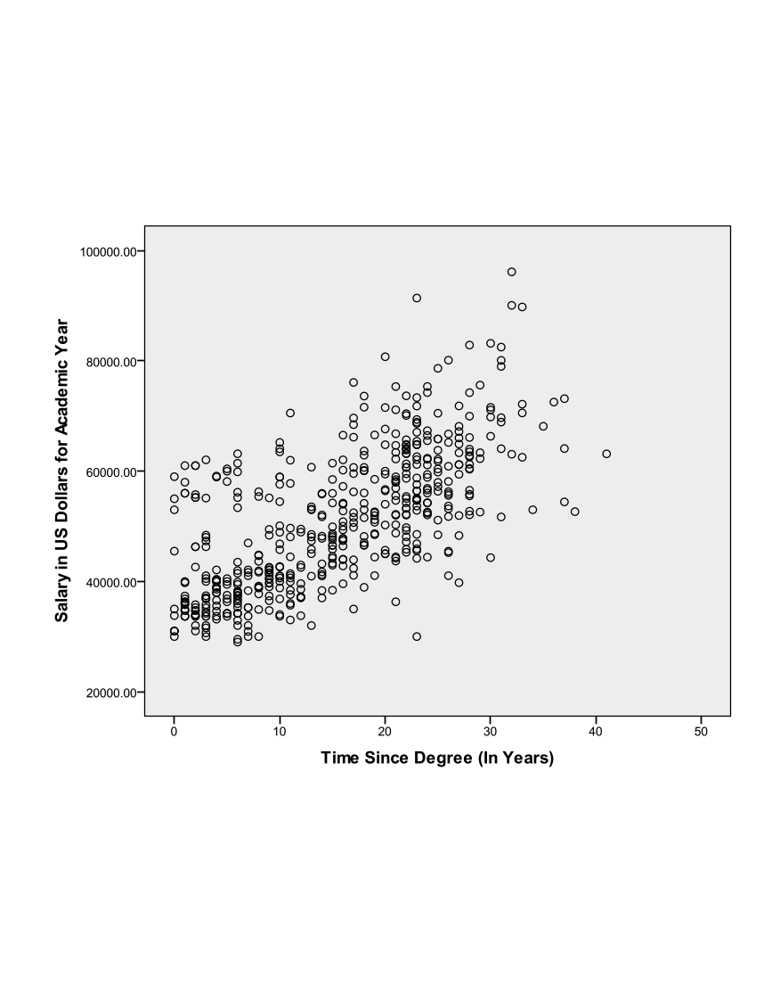{width="6.8in"
height="5.4in"}

Select Analyze - General Linear Model - Univariate

Select 'salary' as the dependent variable, male as the fixed factor, and
market and yearsdg as the covariates. Remember that any categorical
predictor in a basic regression model should be entered in as a 'fixed
factor', while any continuous prediction is considered a 'covariate'.

{width="4.90625in"
height="4.1875in"}

Under 'Options', select 'Descriptive Statistics', 'Parameter Estimates',
'Residual Plot'

{width="3.3687773403324583in"
height="3.476522309711286in"}

The table below indicates that the R-squared value has increased from
the last model to .684, and the model is significant (F=367.562,
pvalue\<.001).

{width="8in"
height="8in"}

The estimated population mean salary for women is \$2,040.21 less than
men for a given marketability and time since degree. The estimated
effect of time since degree is \$949 more in mean salary per year (\*a
one unit increase is a year!) since degree when comparing faculty
members of the same gender from disciplines with the same marketability.
For a given time since degree and gender, a one unit increase in
marketability is estimated to increase average salary by \$38,402.

Notice that all of the predictor variables in the model are highly
significant.

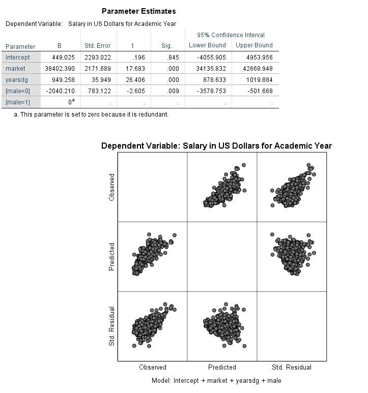{width="8in"
height="8in"}

**Activity 5: Multiple Regression with an Interaction**

Faculty salary appears to be a function of the marketability of the
discipline, time since last degree, and gender. Starting salaries could
be similar for men and women, but men might receive larger increases
over time. An interaction between gender and time since last degree may
capture this relationship. Remember, a significant interaction implies
that the effect of each variable depends on the value of the other
variable---that is to say the effect of time since degree depends on
gender and the effect of gender depends on time since degree.

**Create a multiple regression model where salary is the dependent
variable, marketability, gender, time since degree, and the interaction
between gender and time since degree are the predictors. **

Create a scatter plot: Select Graphs - Legacy Dialogs - Scatter/Dot
and choose 'Simple' and 'Define'. Let the y-axis be 'salary',
the x-axis be 'yearsdg', and set markers by 'male'. Select the graph
in chart editor and click the box for 'Add fit line at subgroups'.
The lines for males and females are not parallel, and this is what
we are investigating with the proposed interaction term.

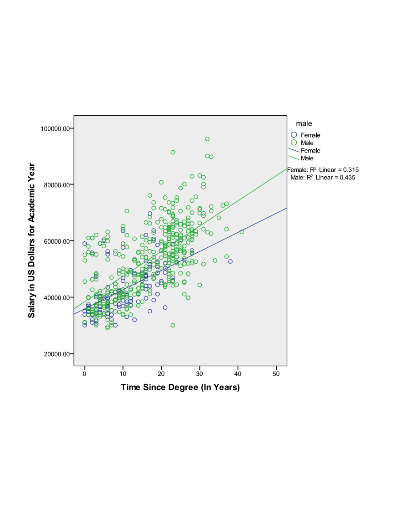{width="8in"
height="6.5in"}

Select Analyze - General Linear Model - Univariate

{width="3.7454002624671916in"
height="3.1967115048118986in"}

Select 'salary' as the dependent variable, 'male' as the fixed factor,
and 'market' and 'yearsdg' as the covariates. Remember that any
categorical predictor in a basic regression model should be entered in
as a 'fixed factor', while any continuous prediction is considered a
'covariate'.

Under 'Model', select 'Custom'. Under 'Build Terms' select 'Main Effect'
and enter the variables male, market, yearsdg. Under 'Build Terms'
select 'Interaction' and select both male and yearsdg to create the
interaction term. Select 'Continue'. Remember that main effects must
always be included in a model that contains interaction terms.

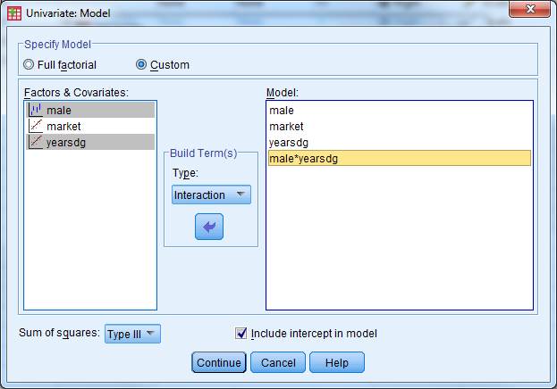{width="5.343488626421697in"
height="3.7395833333333335in"}

Under 'Options', select 'Descriptive Statistics', 'Parameter Estimates',
'Residual Plot'

{width="4.199945319335083in"
height="4.334270559930009in"}

The table below indicates that the model is significant (F=279.95,
pvalue\<.001) and the R-squared has increased from the last model to
.688.

{width="8in"
height="8in"}

In the presence of interaction terms, the main effect terms have
different interpretations. The estimated gender gap when time since
degree is zero is not significant. When time since degree is 0 years,
the population mean salary for women after adjusting for the other
covariates in the model is estimated to be \$593 more than men. Notice
the confidence intervals range from negative values (women earn less at
time since degree=0) to positive values (women earn more at time since
degree=0).

The interaction between gender and years since degree (the change in
gender gap with years since degree) is significant. For every additional
year since degree completion, we see the gender gap between males and
females grows by \$227.153 on average when adjusting for the other
covariates in the model.

{width="8in"
height="8in"}

**Activity 6: Multiple Regression with Diagnostics**

This exercise builds on the previous model. Add faculty rank (a three
level categorical predictor) to the model and run the regression with
diagnostics.

**Create a multiple regression model where salary is the dependent
variable, marketability, gender, time since degree, faculty rank, and
the interaction between gender and time since degree are the predictors.
**

Create a side-by-side box plot for salary by rank.

{width="5.361036745406824in"
height="4.46753280839895in"}

{width="7.2in"
height="5.8in"}

Select Analyze - General Linear Model - Univariate

Select 'salary' as the dependent variable, 'male' and 'rank' as the
fixed factors, and 'market' and 'yearsdg' as the covariates. Remember
that any categorical predictor in a basic regression model should be
entered in as a 'fixed factor', while any continuous prediction is
considered a 'covariate'.

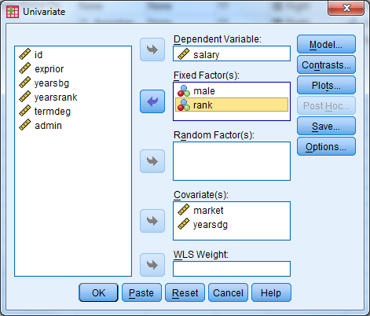{width="4.90625in"
height="4.1875in"}

Under 'Model', select 'Custom'. Under 'Build Terms' select 'Main Effect'
and enter the variables male, market, yearsdg, rank. Under 'Build Terms'
select 'Interaction' and select both male and yearsdg to create the
interaction term. Select 'Continue'. Remember that main effects must
always be included in a model that contains interaction terms.

{width="6.489583333333333in"
height="4.541666666666667in"}

Under 'Save' select 'Unstandardized Predicted Values' and 'Standardized
Residuals'. Under 'Options', select 'Descriptive Statistics', 'Parameter
Estimates', 'Residual Plot'

The table below displays the coding scheme used for the categorical
predictors (factors).

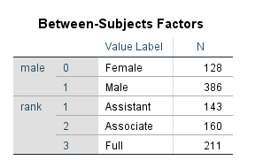{width="2.6458333333333335in"
height="1.625in"}

The table below provides the descriptive statistics for salary broken
out by gender and rank.

{width="4.03125in"
height="3.3854166666666665in"}

The table below indicates the model is significant (F=242.32,
pvalue\<.001) and the R-squared value is .741 (an increase from the last
model).

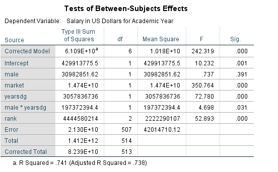{width="5.25in"
height="3.2916666666666665in"}

We can see from the table below that faculty rank is a significant
predictor of salary. The table above indicates that rank=1=Assistant
Professor, rank=2=Associate Professor, rank=3=Full Professor. The
estimated difference in population mean salary between Assistant
Professors and Full Professors is \$11,168 after adjusting for the other
covariates in the model. Put another way: Assistant professors earn on
average \$11,168 less than Full Professors, all else equal. The
estimated difference in population mean salary between Associate
Professors and Full professors is \$7,819 after adjusting for the other
covariates in the model. Put another way: Associate professors earn on
average \$7,819 less than Full Professors, all else equal.

{width="6.395255905511811in"
height="3.4583333333333335in"}

The residual plot below is given from the output. First investigate the
predicted (x axis) vs. std. residual plot to check for the constant
variance assumption. There is not strong evidence that the assumption of
constant variance has been violated. Linearity can also be assessed with
this plot. Next investigate the plot of observed (x axis) and predicted
values (y axis) to check the linearity assumption. The points should be
symmetrically distributed on a diagonal (45 degree) line if the
linearity assumption is not violated (this is approximately what we see
here). Note that these plots could be made manually by creating scatter
plots from the saved variables (predicted, residuals).

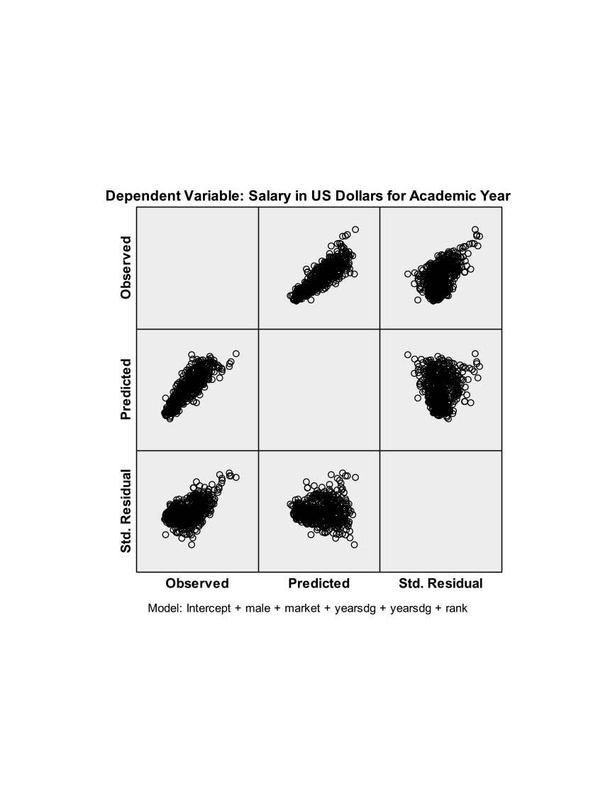{width="7in"
height="5.6in"}

The GLM approach to regression doesn't allow for VIF's to be calculated
directly. Multicollinearity can attempt to be assessed through
investigating the correlations or calculating the VIF manually. Note
that pair wise correlations do not fully capture multicollinearity.

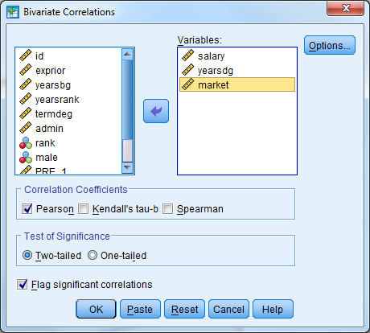{width="3.4895833333333335in"
height="3.1406255468066493in"}

{width="6.09375in"
height="3.1145833333333335in"}

Select 'Analyze' 'Descriptive Statistics' 'QQ Plot' and select the
residual variable. The plot below indicates that the distribution of the
error terms is approximately normal. This can also be confirmed with a
histogram.

{width="7in"
height="5.7in"}

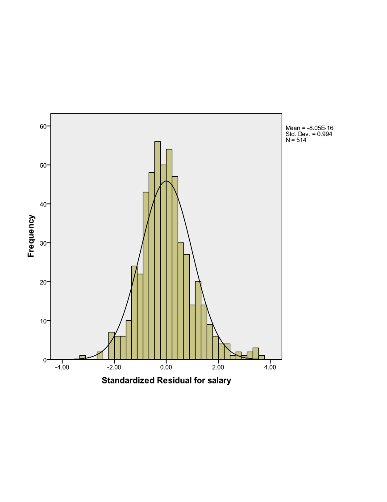{width="7in"
height="5.4in"}
