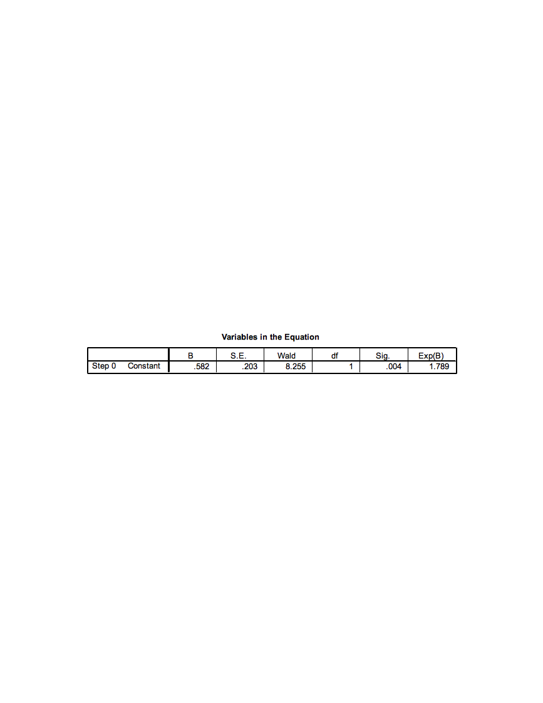
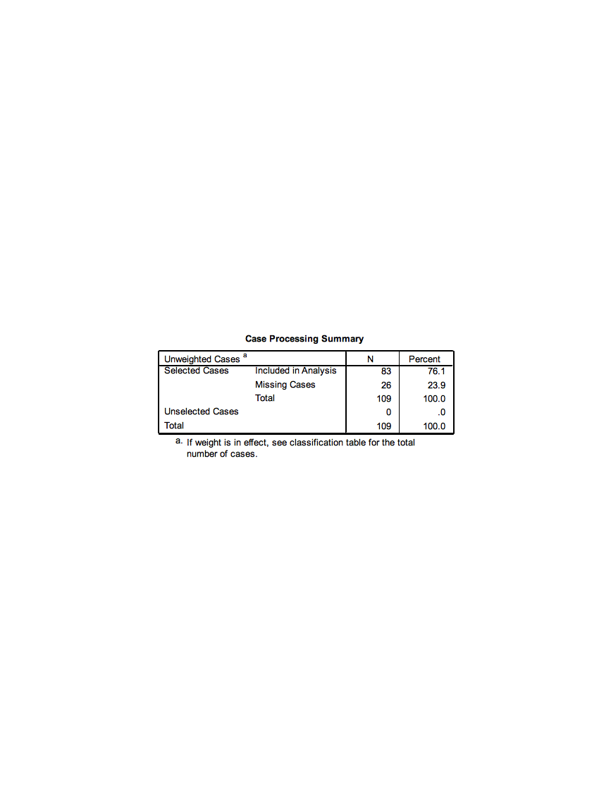
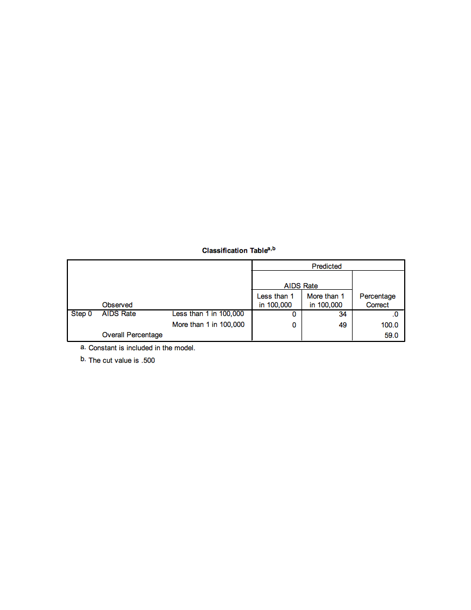
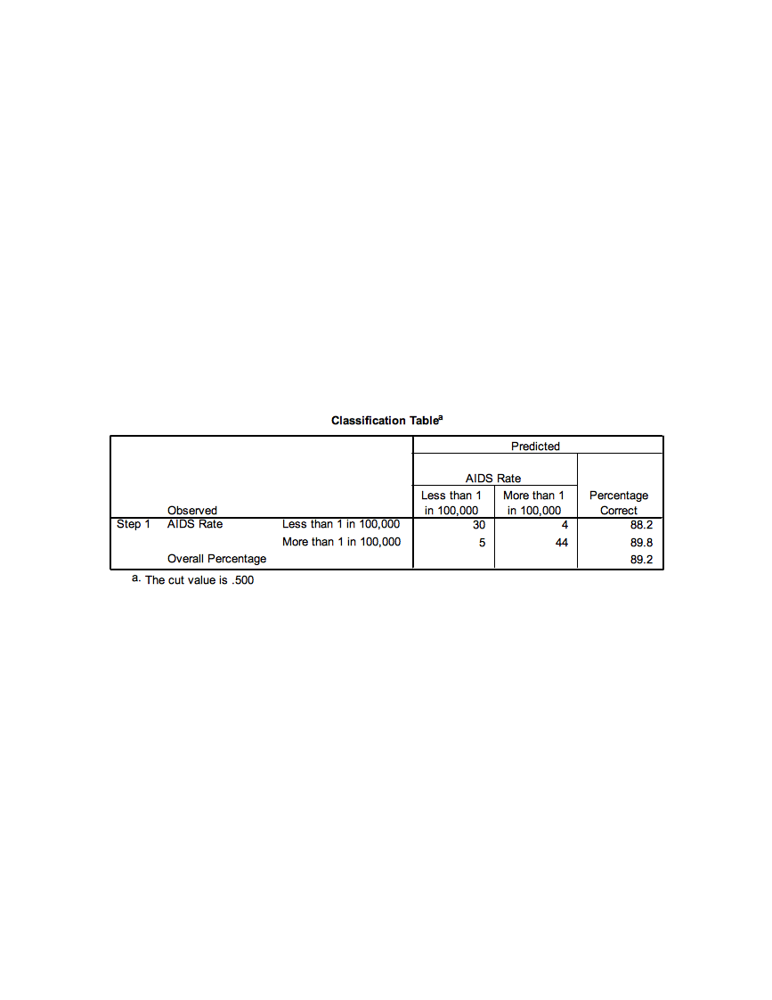

Exercise A5 -- Case Study II: AIDS (Logistic Regression)
========================================================

Open ExerciseA5\_Data.sav

**Background**

The data set for this exercise contains information on 109 countries
with a number of characteristics measured for each country. The goal of
the exercise is to identify whether there may be characteristics of a
country that are related to AIDS rate classification. Countries are
divided into one of two AIDS rate groupings: 0 = Less than 1 in 100,000
or 1 = More than 1 in 100,000. The variable in the data which holds this
information is called aidscat2.

We will fit several models with AIDS rate category as our outcome to
identify potential significant predictors of AIDS rate classification.
Because the model outcome is no longer a continuous measure, but instead
binary, a logistic regression model will be used. The outcome for this
type of model isn't actually the values of the variable (0 or 1) but
instead a calculation of the probability of having the value of one of
the two categories of the outcome. The model has the form:

$$\ln\left( \frac{p}{1 - p} \right) = \beta_{0} + \beta_{1}x_{1} + \beta_{2}x_{x} + \ldots + \beta_{p}x_{p}\ $$

where p is the probability of the outcome variable being equal to 1. The
$\ln\left( \frac{p}{1 - p} \right)$ outcome is known as the log-odds.

*Note: It is possible to change which level of the outcome variable the
probability references, so you can model the probability that y=0
instead of y=1 if desired.*

In all models for this exercise we will consider predicting the
probability that a given country will have the higher AIDS rate
classification (aidscat2=1). The objective of the models is to see
whether the included predictors are significantly associated with the
probability of having the higher AIDS rate classification.

**Activity 1: Logistic Regression with a Continuous Predictor**

For the first example, we will look at a simple example of fitting
logistic regression with a continuous predictor. We will consider a
single continuous predictor (log base 10 of the gross domestic product
per capita, LOG\_GDP).

*Perform a simple logistic regression where 'aidscat2' is the outcome
variable and 'log\_gdp' is the independent/predictor variable.*

Select 'Analyze'-\>'Regression'-\>'Binary Logistic' to open the logistic
regression dialogue box.

Select AIDSCAT2 as the binary dependent variable. Note that the category
whose probability we want to model, "high" AIDS rate, is coded as a 1,
and the other category, "low" AIDS rate, is coded as 0. SPSS
automatically fits the highest valued category probability. If the
opposite is desired the outcome variable should be recoded so the
opposite category has a higher value. Select LOG\_GDP as the only
covariate, and click OK to fit the model. Results from fitting this
model are included below.

{width="5.610416666666667in"
height="4.129861111111111in"}

The first table rovides some information regarding the cases (rows) used
to fit that data. Note that three cases were lost in the analysis, due
to missing data on the AIDSCAT2 variable. The final analysis sample size
was 106.

{width="4.285416666666666in"
height="1.9743055555555555in"}

The coding of the dependent variable is critical to understand. SPSS
will model the probability that the "internal value" of the dependent
variable is equal to 1. The "internal value" is the value that SPSS
recodes the outcome to be to fit the model behind the scenes. **This
will not always match up to your original coding so check this table
carefully.** In our case the 0/1 internal coding that SPSS performs
matches up with our original 0=less than 1 in 100,000 and 1=more than 1
in 100,000 coding so we will be modeling the probability of being in the
"high" AIDS rate.

{width="2.6625in"
height="1.0256944444444445in"}

This initial classification table, located in "Block 0" of the output,
shows how well we would do predicting by chance what the outcome will be
(i.e., not using any covariates to predict the outcome). Because more
countries have the higher classification, we would predict that
classification for all of the countries, and we would be correct 64.2%
of the time. This table isn't all that informative by itself, we will
compare it to a similar table in the next portion of the output.

{width="6.285416666666666in"
height="2.3506944444444446in"}

This table, also in the "Block 0" portion of the output, shows the
maximum likelihood estimate of the intercept term in a logistic
regression model without any covariates. This is simply the computed
log-odds of the dependent variable being equal to 1.

{width="5.961111111111111in"
height="0.8444444444444444in"}

We'll scroll down to the "Block 1" portion of the output, which will
contain the maximum likelihood estimates of the parameters in our model.
These estimates describe the relationship of LOG\_GDP to the dependent
variable (aidscat2). First, we examine the classification table for our
outcome given that we are now considering the LOG\_GDP variable as a
predictor. This table is similar to predicted values in linear
regression. For each country in the data set the predicted probability
is computed using the fitted model and values of the country's
covariate. If the predicted probability is greater than 0.5 the country
is classified into the 'high' AIDS rate group and if it is less than 0.5
it is classified into the 'low' AIDS rate group. These classifications
are then compared with the actual observed classifications of the
countries.

{width="6.285416666666666in"
height="2.1430555555555557in"}

Note that we are actually doing a *worse* job of predicting the AIDS
rate when using LOG\_GDP as a predictor (63.2% correct vs. 64.2% correct
when we don't consider any covariates). The predicted probabilities can
be ***saved*** in the SPSS data set as an option if desired.

Now, we examine the maximum likelihood estimate of the coefficient for
LOG\_GDP in the logistic regression model:

{width="5.909027777777778in"
height="1.2465277777777777in"}

The estimate of the parameter that represents the coefficient for
LOG\_GDP in the model is equal to 0.491, with a standard error of 0.329.
The **Wald statistic** reported by SPSS is the ***squared version*** of
the T statistic (the coefficient divided by its standard error,
squared), and is referred to a chi-square distribution with 1 degree of
freedom. This Wald statistic has a p-value of 0.135, which suggests that
we would **not** reject a null hypothesis that the coefficient for
LOG\_GDP is equal to 0. We really don't have evidence of a significant
relationship of LOG\_GDP with the AIDS rate outcome.

However, if the relationship were significant, we would conclude that a
one-unit increase in LOG\_GDP results in an expected increase of 0.491
in the ***log-odds*** of being in the higher AIDS rate category. The
parameter estimates represent additive changes to the log-odds. If
exponentiated we get the more common **odds ratio**, which is the
*multiplicative* change to the odds. Here the Exp(B) column holds the
exponentiated esimates, for log\_gdp the odds ratio is equal to 1.634.
This value has the meaning that the ***odds*** of being in the higher
AIDS rate category are ***multiplied*** by 1.63 with every one-unit
increase in LOG\_GDP.

**Activity 2: Logistic Regression with a Categorical Predictor**

Now, we'll consider an example of analyzing a single categorical
predictor with two levels, whether or not the country is predominantly
muslim (MUSLIM). MUSLIM is coded as 1 = yes and 0 = no, which we would
recommend for any two-level predictors.

Select 'Analyze'-\>'Regression'-\>'Binary Logistic' to re-enter the
logistic regression dialogue box. Replace the log\_gdp covariate with
muslim. We need to identify the predictor as categorical so select the
categorical button. Move the MUSLIM covariate into the 'Categorical
Covariates' list.

{width="5.428472222222222in"
height="3.50625in"}

Fit the logistic regression model by clicking on OK.

{width="5.2077602799650045in"
height="3.844155730533683in"}

Let's jump down to Block 1 in the output and first examine the
classification table based on the model including the MUSLIM variable:

{width="6.285416666666666in"
height="2.1430555555555557in"}

Note the substantial improvement in prediction accuracy by considering
Muslim status! Now, we investigate the maximum likelihood estimate of
the coefficient for MUSLIM:

{width="5.909027777777778in"
height="1.2465277777777777in"}

The maximum likelihood estimate of the coefficient is -2.335, with a
standard error of 0.537. The Wald statistic based on that estimate is
18.934, and the p-value for that Wald statistic is said to be 0.000 by
SPSS (but should be reported as p \< 0.001). This p-value suggests that
we should reject the null hypothesis that the coefficient is equal to 0,
which tells us that Muslim status has a significant relationship with
the probability of being in the higher AIDS rate category. Specifically,
when MUSLIM is equal to 1 (as opposed to 0), the ***log-odds*** of being
in the higher category are expected to decrease by -2.335.

This estimate corresponds to an odds ratio of 0.097 (the exponential
version of the coefficient), which says that the odds of having a higher
AIDS classification for a Muslim country is 0.097 ***times*** the odds
of having a higher AIDS classification for a non-Muslim country. The
expected odds are multiplied by 0.097 when a country is Muslim as
opposed to non-Muslim. We can also interpret this as reducing the odds
of being in the higher AIDS rate category by 90.03% for muslim
countries. Notice here, when we see a decrease in the odds (odds ratio
less than 1) we report 1-Odds Ratio as the percentage (1-.097=.9003).

**Activity 3: Logistic Regression with Multiple Predictors**

In this analysis, we hope to find ways to categorize countries into one
of two AIDS prevalence categories, based on other data for the
countries. We will also discover which pieces of information are useful
in predicting AIDS prevalence, and which appear to be unassociated with
this prevalence.

Set up a logistic regression model to predict AIDS prevalence category
(*aidscat2*) by considering the following predictors: *muslim, log\_gdp,
babymort, urban, lit\_fema, lifeexpf, birth\_rt, tropical.* Have SPSS
report confidence intervals for the odds ratios. (This is found under
the 'Options' button in the Logistic Regression dialogue box.)

{width="5.610416666666667in"
height="4.129861111111111in"}

{width="4.909027777777778in"
height="4.0in"}

Which predictors appear useful in predicting AIDS category? Do Muslim
countries still have lower odds of being in the higher AIDS prevalence
category when controlling for the relationships of the other predictors
with the outcome? How much lower are the odds of a Muslim country being
in the higher AIDS category?

The first table shows us that only 83 countries are used to fit this
model, 26 were removed from analysis due to missing data on any of the
variables used.

{width="4.285416666666666in"
height="1.9743055555555555in"}

The first classification table (Block 0: Beginning Block) in the output
shows you the result of classifying cases strictly by predicting them to
be in the category with the largest percentage in the data set (in this
case, you would predict a random case to be in the higher AIDS category,
since 64.2% of the cases with a valid AIDS category are in the higher
AIDS category). We would only be correct 59% of the time predicting by
chance.

{width="5.870138888888889in"
height="1.8701388888888888in"}

The 'Model Summary' table shows the --2 log-likelihood statistic for our
model, as well as two analogs of R^2^ in the multiple regression context
for a logistic regression model. **These are approximations of R-squared
in linear regression models, and should not be reported as the same
thing; they should really only be used to compare the fits of competing
models fitted using the same cases.** The Cox & Snell R Square
approximation suggests that our predictors explain about 43% of the
variation in our response (not bad). The Nagelkerke R Square is a
rescaled approximation that is constrained to fall between 0 and 1.

{width="3.285416666666667in"
height="1.0in"}

The Block 1 classification table shows an increase in the percentage
that is correctly classified (89.2% vs 59%) using the predicted
probabilities and a 'cut-off' classification probability of 0.5.

{width="5.870138888888889in"
height="2.129861111111111in"}

Let's examine the estimated coefficients for the predictors included in
our model:

{width="5.753472222222222in"
height="2.532638888888889in"}

The B column contains the estimated coefficients in the logistic
regression model, which indicate the change in the
[log-odds]{.underline} of "success" (in this case, being in the higher
AIDS category) associated with a one-unit increase in each predictor.
So, for example, a one-unit increase in *Muslim* (or being in a Muslim
country) decreases the **log-odds** of being in the higher AIDS category
by 6.553, holding all other predictors constant.

The Sig. column provides the results of a significance test for each of
the parameters (or coefficients) for the predictors in the model. This
shows that *Muslim, lit\_fema,* and *tropical* are significant
predictors of being in the higher AIDS category. If a predictor is
significant, changes in the predictor have a significant relationship
with the log odds of "success." The Exp(B) column indicates the factor
by which the odds of "success" are ***multiplied*** when the predictor
increases by one unit, holding the other predictors constant. So, for
example, a one-unit increase in Muslim will ***multiply*** the odds of
being in the higher AIDS category by 0.001, or reduce the odds of being
in the higher AIDS category by 99.9%. The Exp(B) factor is known as an
**odds ratio.** The 95% confidence interval for Exp(B) will not contain
1 if the predictor is significant. An odds ratio of 1 means that
one-unit changes in the predictor multiply the odds of "success" by 1,
or effectively do not change the odds.
