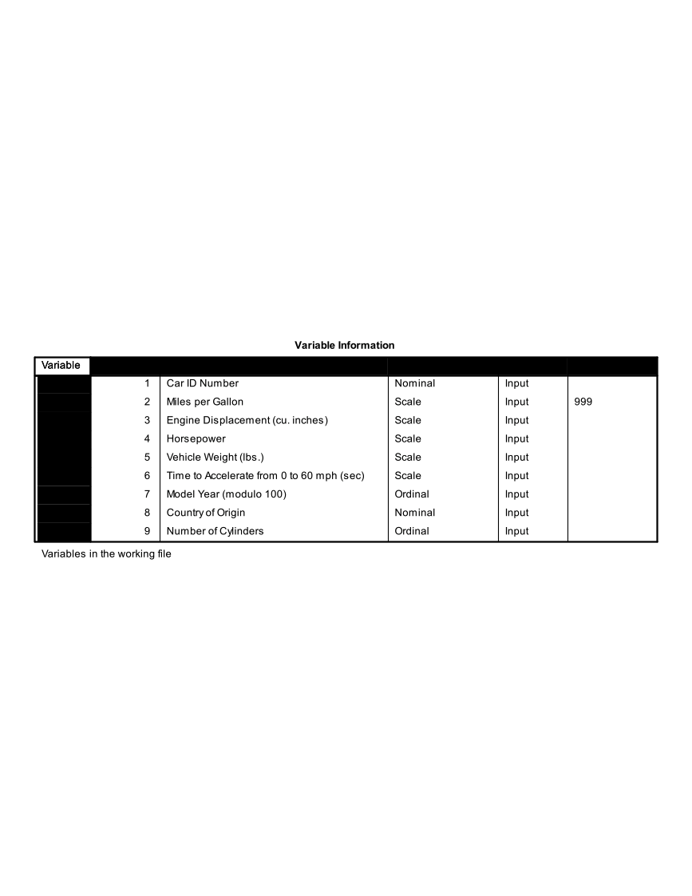
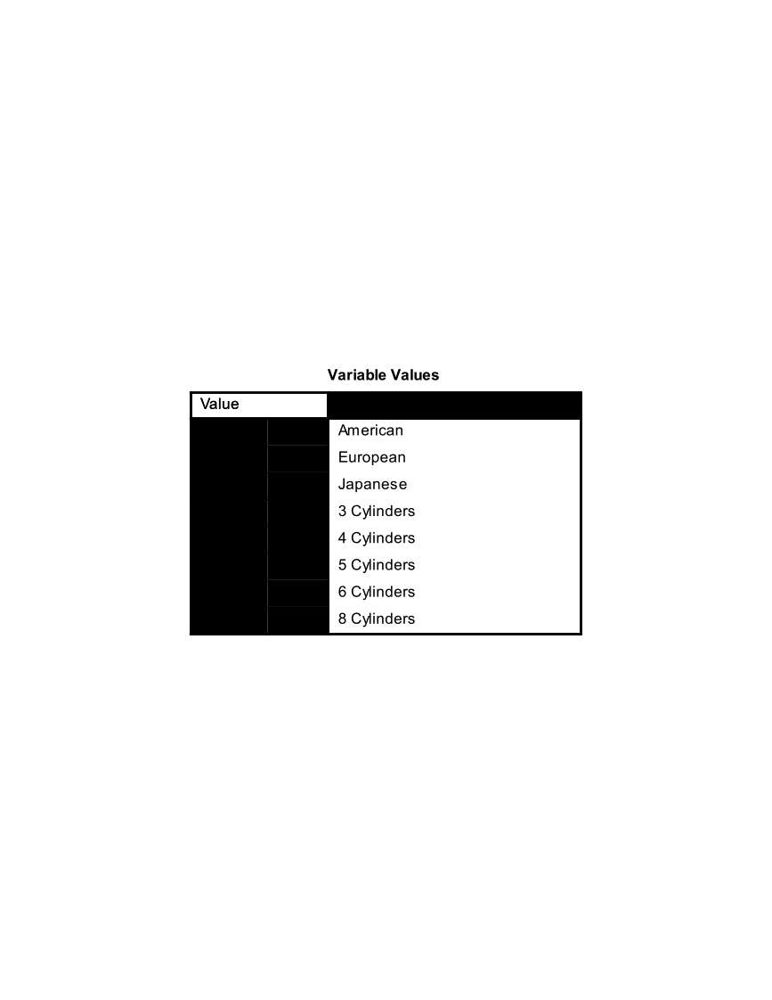
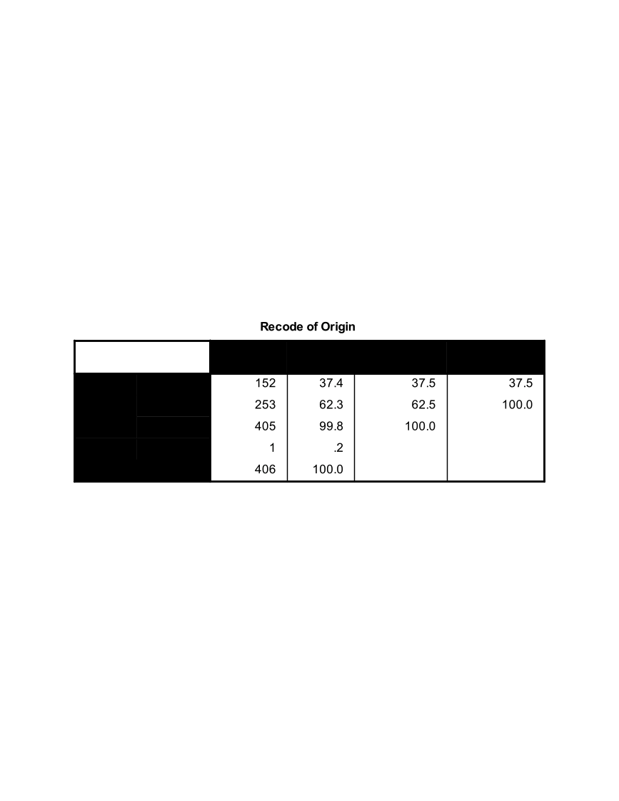
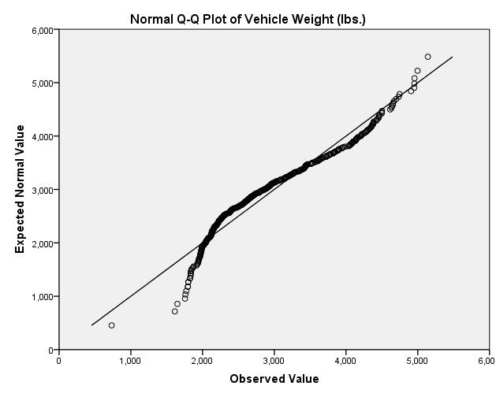
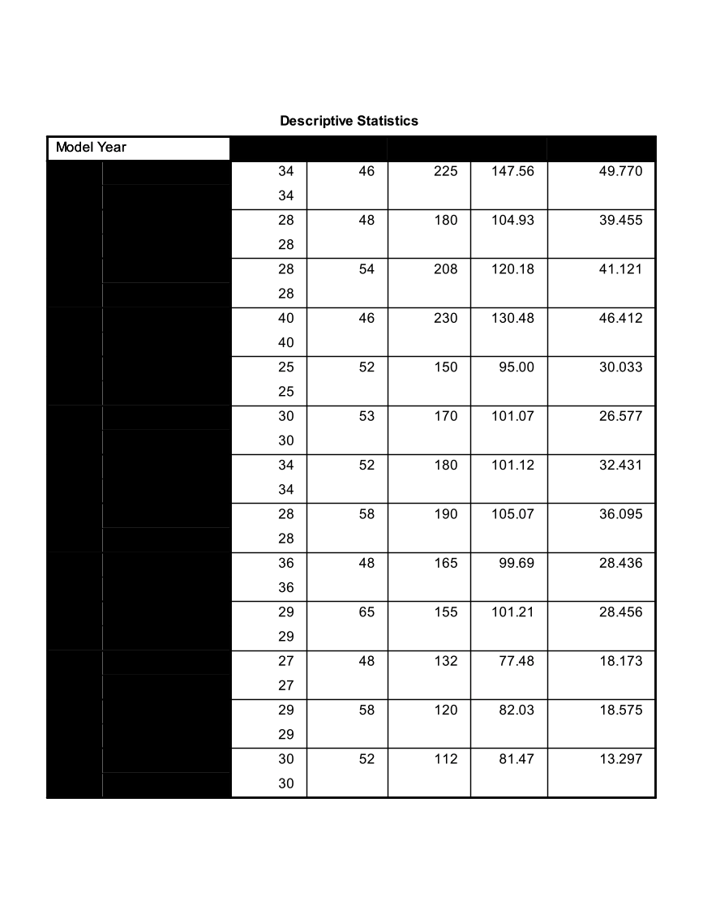
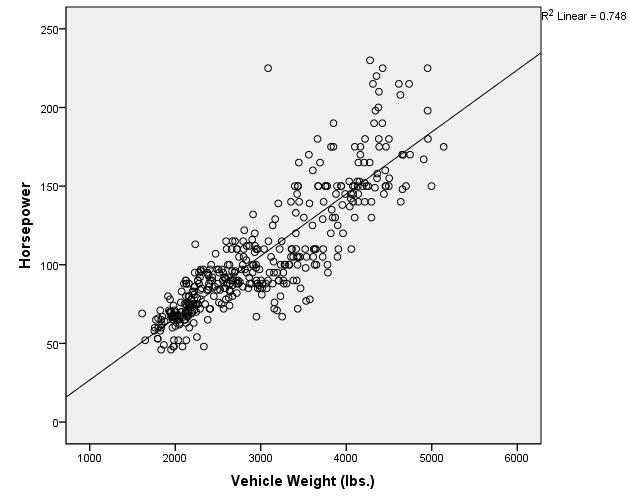
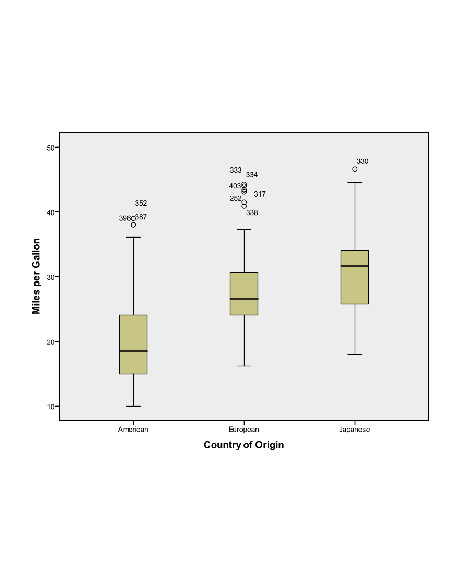

Final Project
=============

**The Data (Refer to Final Project Folder)**

The cars data sets contain data on specifications of 406 vehicles from
1970 to 1982. Among the variables in the data set are information on
fuel consumption (mpg), horsepower, weight, acceleration, origin
(Europe, Japan, U.S.), and number of cylinders.

The data set contains categorical variables (such as origin), numerical
discrete variables (such as number of cylinders), and continuous
variables (such as weight, and acceleration).

**Getting Started**

1)  Investigate cars\_wave1.xls and cars\_wave2.xls and prepare the data
    for SPSS

2)  Open SPSS and import cars\_wave1.xls and cars\_wave2.xls from
    Microsoft Excel.

3)  Merge cars\_wave1 and cars\_wave2 (add cases).

4)  Save this new SPSS file!

5)  Using the codebook below, define the proper attributes in Variable
    View

{width="6.5in"
height="2.324293525809274in"}

{width="3.295138888888889in"
height="2.295138888888889in"}

**Working with Variables**

1)  Recode Origin such that 1=Domestic, 0=Foreign. Remember to recode
    into a different variable. Give this new variable the proper
    attributes in variable view.

2)  Convert Miles Per Gallon (MPG) to Liters Per 100 Kilometers

    a.  Use the Compute function

    b.  The formula to use: LP100K=(100\*3.785)/(1.609\*MPG)

3)  Export this SPSS data set to Microsoft Excel (it's always good to
    have a back up!). Export all of the variables.

**One Variable Procedures**

1)  Get descriptive statistics for all scale variables in the data set.

2)  Get frequency tables for all categorical variables (ordinal or
    nominal) in the data set.

3)  Create a histogram of Horsepower.

4)  Create a histogram of Weight.

5)  Create a QQ Plot for Weight (Analyze Descriptive Statistics QQ Plot
    Select Weight, leave others as default settings OK)

6)  Create a bar chart for Origin.

7)  Organize the output by Year (Analyzing groups of cases separately,
    compare groups). Before proceeding, select only cases with Year not
    = 0.

    a.  Investigate Horesepower (descriptive statistics)

    b.  Investigate Weight (descriptive statistics)

    c.  What do you see?

    d.  Remember to turn the Split File command off before proceeding!

**Relationship Between Continuous Y (Horsepower) and Continuous X
(Weight)**

1)  Create a Scatter Plot with Horsepower as the Y variable and Weight
    as the X variable.

    a.  Add a Linear fit line.

    b.  What is the relationship between Horsepower and Weight as shown
        in this graph?

2)  Calculate the Pearson and Spearman Correlation coefficients for the
    relationship between Horsepower and Vehicle Weight.

    c.  What is the p-value for the Pearson correlation?

    d.  What is the actual p-value, as opposed to the p-value that is
        displayed? To display the actual p-value for the Pearson
        correlation, double-click on the Pearson correlation output
        table and double-click on the p-value. (Remember, p-values
        cannot actually be equal to zero. The p-value you will see
        displayed, after double-clicking, will be in scientific
        notation.)

**Relationship Between Continuous Y and Numerical Discrete/Ordinal X**

1)  Before doing any analyses, select only cases with Year not = 0.

2)  Create a side-by-side boxplot of MPG vs. Year. Choose MPG as the
    "variable" and Year as the "category axis".

3)  What is the general trend of MPG across years?

**Relationship Between Continuous Y and Nominal X**

1)  Create a side-by-side boxplot of Miles per gallon vs Country of
    Origin (ORIGIN). (Note: even though Origin is numeric in the data
    set, its values are **nominal**: American, European, Japanese).

2)  What is the general relationship between MPG and the Origin of the
    car?

3)  Create a side-by-side Boxplot of Miles per gallon vs. the recoded
    Country of Origin (1=Domestic, 0=Foreign).

Final Steps

1)  Export the SPSS output into Microsoft Excel

2)  Select a few tables and/or charts that you would like to present and
    paste them into Microsoft Word

Final Project Solution
======================

**The Data:**

The cars data sets contain data on specifications of 406 vehicles from
1970 to 1982. Among the variables in the data set are information on
fuel consumption (mpg), horsepower, weight, acceleration, origin
(Europe, Japan, U.S.), and number of cylinders.

The data set contains categorical variables (such as origin), numerical
discrete variables (such as number of cylinders), and continuous
variables (such as weight, and acceleration).

**Getting Started**

1)  Investigate cars\_wave1.xls and cars\_wave2.xls and prepare the data
    for SPSS

    a.  Remove the first couple rows that contain a heading

    b.  Remove the last row that contains summary information

    c.  Save and exit

2)  Open SPSS and import cars\_wave1.xls and cars\_wave2.xls from
    Microsoft Excel.

    d.  Open SPSS

    e.  File Open Data Select "Excel" under File Type

    f.  Browse for the Excel files and select Open

    g.  Keep the box checked for "Read variable names from the first row
        of data"

    h.  Leave the worksheet selected as the default

    i.  Select OK

3)  Merge cars\_wave1 and cars\_wave2 (add cases).

    j.  Data Merge Files Add Cases

    k.  Select the open data file, then select Continue

    l.  The Add Cases dialog will appear

    m.  There should not be any "unpaired" variables

    n.  Select OK

    o.  Your active data file should now have 406 cases

    p.  Save this data file and close the "non active" file

4)  Save this new SPSS file!

5)  Using the codebook below, define the proper attributes in Variable
    View

    q.  Be sure to include the missing value code for MPG

    r.  You only need to modify the measurement type, variable labels,
        variable values, and missing values.

{width="6.5in"
height="2.324293525809274in"}

{width="3.295138888888889in"
height="2.295138888888889in"}

**Working with Variables:**

1)  Recode Origin such that 1=Domestic, 0=Foreign. Remember to recode
    into a different variable. Give this new variable the proper
    attributes in variable view.

    a.  Transform Recode into different variables

    b.  Select Country of Origin (ORIGIN)

    c.  Name = NewOrigin

    d.  Label = Recode of Origin

    e.  Select the Change button

    f.  Select the Old and New Values button

    g.  Old Value: Value: 1

    h.  New Value: Value: 1

    i.  Select Add

    j.  Old Value: Value: 2

    k.  New Value: Value: 0

    l.  Select Add

    m.  Old Value: Value: 3

    n.  New Value: Value: 0

    o.  Select Add

    p.  Old Value: Value: System or User Missing

    q.  New Value: Value: System Missing

    r.  Select Add

    s.  Select Continue

    t.  Select OK

    u.  Go to Variable View and enter 1=Domestic, 0=Foreign under Values
        for this new variable. Also adjust the decimal place to 0.

2)  Convert Miles Per Gallon (MPG) to Liters Per 100 Kilometers

    v.  Use the Compute function

    w.  The formula to use: LP100K=(100\*3.785)/(1.609\*MPG)

        i.  Transform Compute Variable

        ii. Target Variable = LP100K

        iii. Numerical Expression: (100\*3.785)/(1.609\*MPG)

        iv. Select OK

        v.  Go to Variable View and give this variable a label (Liters
            Per 100 Kilometers)

3)  Export this SPSS data set to Microsoft Excel (it's always good to
    have a back up!). Export all of the variables.

    x.  File Save As

    y.  Change Files of Type to Excel

    z.  Give a name and select location to save

    a.  Save

**One Variable Procedures:**

1)  Get descriptive statistics for all scale variables in the data set.

    a.  Analyze Descriptive Statistics Descriptives

    b.  Select

        i.  Mpg

        ii. Engine

        iii. Horse

        iv. Weight

        v.  Accel

        vi. Lp100k

    c.  Select OK

> {width="5.590277777777778in"
> height="2.295138888888889in"}

2)  Get frequency tables for all categorical variables (nominal/ordinal)
    in the data set.

    d.  Analyze Descriptive Statistics Frequencies

    e.  Select

        vii. Year

        viii. Origin

        ix. Cylinder

        x.  NewOrigin

    f.  Select OK

> {width="4.508333333333334in"
> height="3.967361111111111in"}
>
> {width="4.926388888888889in"
> height="1.9673611111111111in"}
>
> {width="5.0in"
> height="2.4180555555555556in"}
>
> {width="4.909722222222222in"
> height="1.7541666666666667in"}

3)  Create a histogram of Horsepower.

    g.  Graphs Legacy Dialogs Histogram

    h.  Variable: Horsepower

    i.  Check the box to display normal curve

    j.  Select OK

    k.  Investigate output

> {width="3.0611329833770777in"
> height="2.4527996500437443in"}

4)  Create a histogram of Weight.

    l.  Graphs Legacy Dialogs Histogram

    m.  Variable: Weight

    n.  Check the box to display normal curve

    o.  Select OK

    p.  Investigate output

> {width="3.4873632983377076in"
> height="2.794326334208224in"}

5)  Create a QQ Plot for Weight (to help assess normality)

    q.  Analyze Descriptive Statistics QQ Plot

    r.  Select Weight, leave others as default settings

    s.  Select OK

> {width="3.5857239720034997in"
> height="2.8731397637795277in"}

6)  Create a bar chart for Origin.

    t.  Graphs Legacy Dialogs Bar

    u.  Simple, summaries for groups of cases

    v.  Select Define

    w.  Select Origin for the Category Axis

    x.  Select OK

> {width="2.9873632983377076in"
> height="2.3936898512685914in"}

7)  Organize the output by Year (Analyzing groups of cases separately,
    compare groups). Before proceeding, select only cases with Year not
    = 0.

    y.  Investigate Horsepower (descriptive statistics)

        xi. Data Select Cases

        xii. Select If Condition is Satisfied (select If button)

        xiii. Enter this condition: year \~= 0

        xiv. Select Continue

        xv. Output: Filter out unselected cases

        xvi. Select OK

        xvii. Data Split File

        xviii.  Select Compare Groups

        xix. Select Model Year (YEAR) for "Groups Based On"

        xx. Select "Sort the file by grouping variable"

        xxi. Select OK

        xxii. Analyze Descriptive Statistics Descriptives

        xxiii.  Select Horsepower

        xxiv. Select OK

{width="4.487363298337708in"
height="5.060705380577428in"}

z.  Investigate Weight (descriptive statistics)

    xxv. Analyze Descriptive Statistics Descriptives

    xxvi. Select Weight

    xxvii.  Select OK

{width="5.791666666666667in"
height="6.291666666666667in"}

a.  What do you see happening in these two variables over time?

    xxviii.   It appears that the average horsepower and average weight
        are decreasing over time

b.  Remember to turn the Split File command off before proceeding!

    xxix. Data Split File

    xxx. Select Reset

    xxxi. Select OK

**Relationship Between Continuous Y (Horsepower) and Continuous X
(Weight):**

1)  Create a Scatter Plot with Horsepower as the Y variable and Weight
    as the X variable.

    a.  Add a Linear fit line.

        i.  Graphs Legacy Dialog Scatter/Dot

        ii. Simple Scatter

        iii. Select Define

        iv. Y Axis: Horsepower

        v.  X Axis: Weight

        vi. Select OK

        vii. Double click on the chart in the Output Viewer to open
            Chart Editor

        viii. Select "Add Fit Line at Total" Button (lowest row, 5^th^
            object inward)

        ix. The defaults are sufficient, so close out of the "Add Fit
            Line at Total" dialog

        x.  Close out of chart editor

{width="3.536544181977253in"
height="2.833733595800525in"}

b.  What is the relationship between Horsepower and Weight as shown in
    this graph?

    xi. There is a strong positive linear relationship

<!-- -->

2)  Calculate the Pearson and Spearman Correlation coefficients for the
    relationship between Horsepower and Vehicle Weight.

    c.  What is the p-value for the Pearson correlation?

        xii. Analyze Correlate Bivariate

        xiii. Select Horsepower and Weight

        xiv. Select Ok

        xv. The pvalue is listed as .000

    d.  What is the actual p-value, as opposed to the p-value that is
        displayed? To display the actual p-value for the Pearson
        correlation, double-click on the Pearson correlation output
        table and double-click on the p-value. (Remember, p-values
        cannot actually be equal to zero. The p-value you will see
        displayed, after double-clicking, will be in scientific
        notation.)

        xvi. 1.18068E-120

**Relationship Between Continuous Y and Numerical Discrete/Ordinal X:**

1)  Before doing any analyses, select only cases with Year not = 0.

    a.  Data Select Cases

    b.  Select If Condition is Satisfied (select If button)

    c.  Enter this condition: year \~= 0

    d.  Select Continue

    e.  Output: Filter out unselected cases

    f.  Select OK

2)  Create a side-by-side boxplot of MPG vs. Year. Choose MPG as the
    "variable" and Year as the "category axis".

    g.  Graphs Legacy Dialogs Boxplot

    h.  Simple, Summaries for groups of cases

    i.  Select Define

    j.  Variable: MPG

    k.  Category Axis: Year

    l.  Select OK

{width="4.552220034995625in"
height="3.639344925634296in"}

3)  What is the general trend of MPG across years?

    m.  The median MPG appears to increase over time

**Relationship Between Continuous Y and Nominal X:**

1)  Create a side-by-side boxplot of Miles per gallon vs. Country of
    Origin (ORIGIN). (Note: even though Origin is numeric in the data
    set, its values are **nominal**: American, European, and Japanese).

    a.  Graphs Legacy Dialogs Boxplot

    b.  Simple, Summaries for groups of cases

    c.  Select Define

    d.  Variable: MPG

    e.  Category Axis: ORIGIN

    f.  Select OK

> {width="4.511209536307962in"
> height="3.6065573053368327in"}

a.  What is the general relationship between MPG and the Origin of the
    car?

    a.  The median MPG appears to be larger for European and Japanese
        cars when compared to American cars

b.  Create a side-by-side Boxplot of Miles per gallon vs. the recoded
    Country of Origin (1=Domestic, 0=Foreign).

    b.  Graphs Legacy Dialogs Boxplot

    c.  Simple, Summaries for groups of cases

    d.  Select Define

    e.  Variable: MPG

    f.  Category Axis: RecodeOrigin

    g.  Select OK

{width="4.336912729658793in"
height="3.4672134733158355in"}

1)  Create a correlation matrix and scatter plot matrix for Horsepower,
    Weight, and Year. How strongly are these variables correlated?

    a.  Graphs Legacy Dialogs Scatter/Dot

    b.  Matrix Scatter

    c.  Define

    d.  Select Horsepower, Weight, Year under Matrix Variables

    e.  Select OK
