Introduction to SPSS  {#introduction-to-spss .TOCHeading}
=====================

Overview of the Workshop
========================

There are four sections to this workshop:

Section 1 The Basics of SPSS

Section 2 Working with Variables

Section 3 Understanding Data Management Tasks

Section 4 Understanding Graphical & Statistical Procedures, Msc.

These sections will generally be presented in sequence. The discussion
will alternate between theory and practice. The format will alternate
between lecture and lab sessions. Please ask questions as soon as they
arise in your mind. Please provide feedback or voice concerns.

-

Section 1: The Basics of SPSS
=============================

What does SPSS Stand For?
-------------------------

-   Originally, SPSS stood for Statistical Package for the Social
    Sciences.

-   Now, it stands for Statistical Product and Service Solutions.

-   SPSS has also been known as "PASW" which stands for Predictive
    Analytics Software.

SPSS Compared to Other Statistical Software Packages
----------------------------------------------------

We can think of statistical software packages on a spectrum organized by
difficulty and complexity. On one end we have Excel which is easy and
familiar to most people. On the other end we have C++ which is difficult
and unfamiliar. All software packages are somewhere in between. SPSS is
closer to the Excel end of the spectrum which makes is convenient to
use. SPSS builds on what you already know from Excel, which makes the
transition from Excel to a more powerful statistical software package
easier.

Minitab

JMP Stata

SPSS SAS

Matlab

> R/S-Plus

Excel C++

These differences seem big at first, but they are a small price to pay
for the additional data management, graphical, and statistical
capabilities that SPSS will give you over Excel. While SPSS seems to be
more restrictive than Excel, the restrictions it sets ensure that your
data set is ready for statistical analysis.

The Three Parts of SPSS
-----------------------

There are three parts to SPSS, each with its own window: Data Editor,
Output Viewer, and Syntax Window. The sections below describe each of
these parts in detail.

-   Data Editor Enter and View Data Values, files end in .sav or.por

-   Output Viewer View Statistical Results, files end in .spv

-   Syntax Window Write & Run Syntax Command, files end in .sps

### Data Editor

The Data Editor is visible when SPSS starts up. There are two views of
the Data Editor: Data View and Variable View. In Data View, each row
represents one case (e.g., one survey respondent), while each column
represents one variable (one piece of information, e.g. age). By using
the scroll bars to go up and down, you can examine any case in the
sample. By using the scroll bars to go right and left, you can see any
variable.

The first step in an SPSS session is to open a data file or start
entering data in a new data file. A data file is a binary file ending in
the extension .sav or .por, which contains a given data set. Any
requested statistics or analyses that are performed pertain to this data
set.

#### Open a Data File

To open a data file, go to "File" at the upper left of the menu bar.
Click "Open" then "Data". Locate the file that you want to open and
double-click on it.

**Try it: Open Exercise0\_Data**

{width="6.497396106736658in"
height="3.8020833333333335in"}

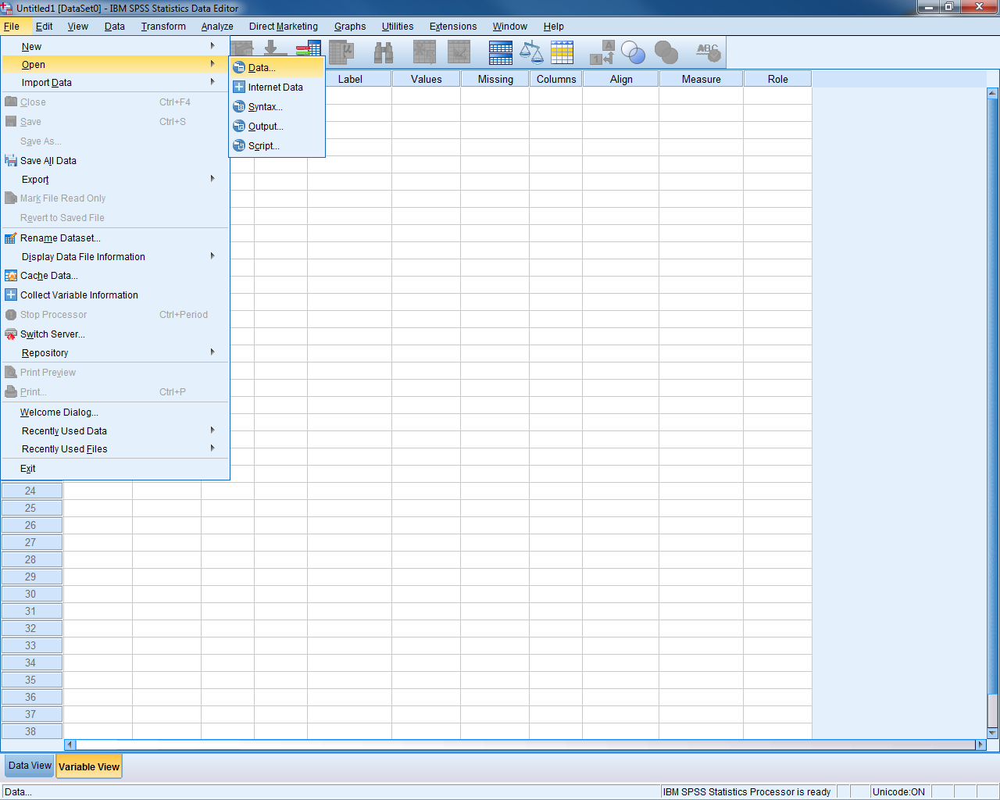{width="6.497395013123359in"
height="4.052083333333333in"}

***Start a New Data File***

To start a new data file, go to "File" at the upper left of the menu
bar. Click "New" then "Data".

### Output Viewer

The output viewer is a window where any statistical results, including
tables or graphs, can be viewed. The output window does not appear until
the first time SPSS is asked to provide some sort of results. The output
viewer will also record the syntax used to generate the results.

**Try it: Open Exercise0\_Output**

{width="6.5in" height="5.2in"}

The output viewer is divided into two parts: on the left, a narrow
window shows an outline which organizes all the results. The outline can
be used to delete certain portions of the output, rearrange pieces of
the output, jump to specific results, and temporarily hide (or make
visible) certain parts of the output. More on this later.

The actual results themselves are in the larger window to the right.
When printing the output, only the information in this window is
printed. Once the viewer has been opened, it will remain open even if
all the output is deleted and the output window is empty.

Occasionally the results from a procedure will be quite lengthy, and
only the first portion will appear in the window. In these cases, a
small red triangle pointing down will appear at the bottom of this
visible portion. To see those results in their entirety, double-click on
that section of output. Scroll bars will appear which pertain to that
piece of output; scroll down to see the remainder.

#### Labels in Output

Variable labels and value labels will be used in place of the actual
variable names or values, by default. This can be changed under "Edit"
"Options" "Output" tab. SPSS can display labels only, the actual names
or values only, or both.

#### Tables & Charts

Results are commonly presented in the output viewer in table form or
chart (graph) form. To edit a table, double-click on that table
(anywhere will do). An editing window is set up around that table,
indicated by a rough gray outline. New menus appear in the menu bar at
the top. Once this editing mode is begun, double-clicking in any cell in
a table will allow you to change the names, labels, or values in those
cells.

**Helpful Hint:** To remove scientific notation in a table, double-click
on the table and highlight the columns or rows containing the notation.
Under "Format" "Cell Properties" and select a new numeric format, such
as \#,\#\#\#.\#\#. The number of decimal places can be increased or
decreased here as well.

Editing a chart is similar to editing a table. Begin by double-clicking
anywhere on the chart and the Chart Editor window will appear. Once in
the Chart Editor, many things can be altered simply by double-clicking
and changing fields in the dialogue boxes which appear.

**Try it: Double click on the Descriptive Statistics table for the
salary variable. Change the Std. Deviation to have only two digits to
the right of the decimal point.**

{width="6.497396106736658in"
height="4.479166666666667in"}

#### Export Output

You can save the output file for future use or to send to colleagues. In
order to open a SPSS output file, your computer must have SPSS.
Sometimes it is useful to export the information from your output file
into another format, such as Microsoft Excel or Microsoft Word. Excel is
a great platform to export to---tables turn out very nicely. To export,
select "File" "Export" and the export wizard will appear. Select the
file type and the location to save the file, then select "OK".

**Try it: Export the output table as an Excel file and investigate the
Excel file.**

{width="6.5in" height="5.200694444444444in"}

Starting with SPSS Version 11.5, selected output objects, such as charts
and tables, can also be exported in an Excel or Word format. This is a
very useful feature that can be used to export selected tables from the
Output Viewer into an Excel format, for additional work such as creation
of custom graphs. To export charts, select the charts in the output
window by clicking once on them, and then go to "File" "Export" select
"Selected" where it asks what objects to export. Choose the "html" file
type for charts, and under the Graphics portion of the dialogue box a
drop down menu allows one to access the various types of image files
available. The bitmap image format is one option. Although these images
are somewhat large in terms of kilobytes, they can be read by a great
many programs, including Word, Power Point and others.

One last option for exporting SPSS output is to copy and paste all
output into a Word file. The steps are as follows:

-   Click once to select the piece(s) of output to move.

-   Go to "Edit" "Copy", press the short-cut ctrl-C, or right-click and
    select "Copy").

-   In Word, place the cursor where the output will go.

-   Under "Edit", click "Paste", or use the short-cut ctrl-V.

You can then resize and move around the pasted objects in Word. The same
process outlined above should work for other Microsoft programs, such as
Power Point or Excel. While pasted objects can be edited in theory, this
is usually difficult. It is best to do all editing in SPSS before
pasting to Word.

### Syntax Window

The Syntax Window looks like the Output Viewer, but it is a text editing
window in which SPSS commands can be written out by hand. It allows
users to type commands in the right-hand side window rather than use
menus. Commands executed using written code are no different from
commands executed using the pull-down menus and dialogue boxes. There
are some rare instances when something is available only by writing
syntax, and cannot be found in any menu.

The syntax window provides these advantages:

-   It allows a user to do repetitive tasks more quickly, using copy &
    paste.

-   It provides a written record of data management and analyses
    performed.

-   It can be sent to other SPSS users to help in setting up data files
    or to re-create your analyses.

**Try it: Open Exercise0\_Syntax.**

{width="6.5in" height="5.2in"}

You can generate syntax in a few different ways:

-   Write out the syntax by hand.

-   Use the "Paste" button inside a dialogue box.

-   Copy and paste the syntax from the output viewer.

The "Paste" button in dialogue boxes causes the written syntax
equivalent of a command to be entered into the syntax window. A new
syntax window will open if no syntax window was open previously.

#### Run Syntax

To run commands in the syntax window, highlight the commands of interest
and go to "Run" "Selection". Alternatively, you can click on the toolbar
button that looks like a "Play" symbol on a CD player or press ctrl-R as
a short-cut. You can also run all commands in the syntax window by using
"Run" "All".

**Try it: In the Syntax Window, highlight number 3 and run the selection
highlighted below. Check the Output Viewer.**

{width="6.497395013123359in"
height="4.041666666666667in"}

*Repetitive Commands*

As a simple example of repetitive commands, consider a user who needs to
take logs of thirty different variables. To go through the menus and do
thirty computations would be quite time-consuming. This is a case where
using syntax would be easier, because cut, copy, and paste commands are
available in the Syntax Window. If you pasted one such computation
command to the syntax window, you could then copy the command out thirty
times. You would only need to edit the variable names in each line.

The steps for using syntax for repetitive commands are:

-   Paste one example command into the syntax window.

-   Copy this command by highlighting it and typing ctrl-C or by right
    clicking and copying.

-   Paste the command repeatedly using ctrl-V or right clicking and
    pasting.

-   Edit each line by changing the variable names.

-   Run the commands!

Once again, the cut, copy, and paste commands have these short-cuts:

-   Cut ctrl-X

-   Copy ctrl-C

-   Paste ctrl-V

**Helpful Hint:** If you want to start setting up a data set, by
formatting variables, recoding, etc., you can begin before you receive
all the data. Test your data management commands on the cases you do
have, and save the syntax file. When you receive the final data
delivery, you can re-run the syntax one last time and be ready to go!

**Try it: Highlight Number 5, copy and paste the syntax. Modify the
syntax such that VARIABLES=salbegin.**

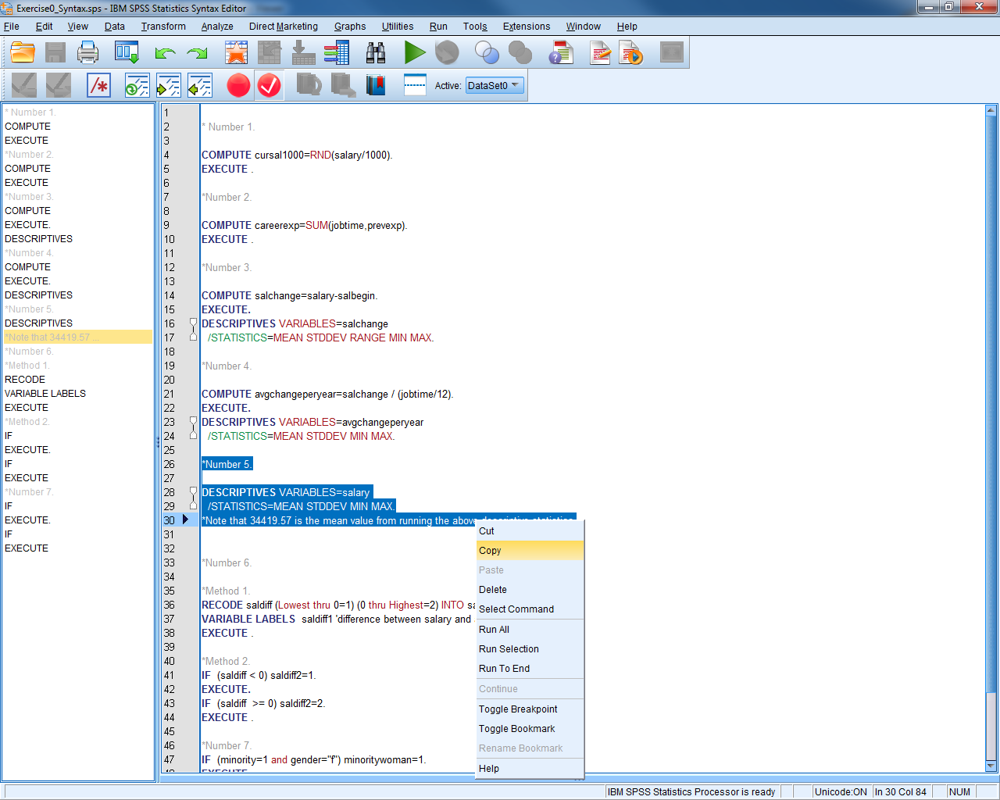{width="6.5in" height="5.2in"}

#### Reading in Raw Data with Syntax

Reading in raw data files is another common use of the syntax window.
Many organizations will provide large, publicly available data sets by
distributing the raw data and a SPSS syntax file which reads in and
formats that data. If you receive a raw data file and a SPSS syntax
file, sometimes referred to as data definition statements, then follow
these steps to get a copy of the data file in SPSS format:

-   Start SPSS, but do not open any data file yet.

-   Open the syntax file containing the commands to read the data.

-   At the top of the syntax, find the "FILE HANDLE" statement. Change
    the path and the name of the file to match the current file location
    and name (the file should contain instructions as well).

-   Select "Run" "All" .

#### Syntax Examples

**1) Accessing an SPSS data file and rename the dataset**

GET FILE = \'C:\\SPSS\\data\\example.sav\'.

EXECUTE .

DATASET NAME example.

**2) Entering new variables and data**

DATA LIST LIST / age (F2.0) sex (A1) income (F2.1) ethnic (F1.0).

BEGIN DATA

45 F 60.9 2

52 M 22.3 1

34 M 45.8 3

67 F 34.5 1

END DATA.

**3) Creating new numeric or string variables**

NUMERIC ses (F1.0) / numkids yrsmarr (F2.0).

STRING state (A2) / region (A1) / citycode (A4).

**4) Labeling variables**

VARIABLE LABELS age \"Age\" sex \"Sex\" income \"Annual income in
thousands\"

ethnic \"Ethnic category\".

**5) Labeling values of a variable**

VALUE LABELS sex \'M\' \"Male\" \'F\' \"Female\"

/ ethnic 1 \"European American\" 2 \"African American\" 3 \"Asian
American\".

**6) Defining missing values**

MISSING VALUES sex ('X') ethnic (8,9) income (7777) age (0).

**7) Calculating a new variable using a function**

COMPUTE log10inc = LG10(income) .

EXECUTE .

**8) Calculating a new variable using "if then" logic**

IF (sex=\'M\' and age \>= 65) olderman=1.

IF (sex=\'F\' or age \< 65) olderman=0.

EXECUTE .

or:

COMPUTE olderman = (sex=\'M\' and age \>= 65).

EXECUTE .

**9) Recoding a variable**

RECODE ethnic (1=0) (2=1) (3=1) .

EXECUTE .

**10) Recoding into a new variable, keeping the original intact**

RECODE ethnic (1=0) (2=1) (3=1) INTO wh\_nonwh .

EXECUTE .

RECODE income (LOWEST THRU 25 = 1) (26 THRU 44 = 2) (45 THRU HIGHEST=3)

INTO incomcat .

EXECUTE .

**11) Obtaining descriptive statistics for continuous variables**

DESCRIPTIVES

VARIABLES=income age

/STATISTICS=MEAN STDDEV VARIANCE MIN MAX SEMEAN .

**12) Getting frequencies for categorical variables**

FREQUENCIES

VARIABLES=sex ethnic olderman.

**13) Obtaining a cross-tabulation between two categorical variables**

CROSSTABS

/TABLES = jobcat BY gender

/STATISTIC = CHISQ

/CELLS = COUNT ROW COLUMN .

**14) Producing a histogram**

GRAPH

/HISTOGRAM(NORMAL)=income

/TITLE= \'Histogram of Income\'.

**15) Creating side-by-side box-plots**

EXAMINE

VARIABLES=income BY ethnic

/PLOT=BOXPLOT

/STATISTICS=NONE

/NOTOTAL.

**16) Generating a scatter plot**

GRAPH

/SCATTERPLOT(BIVAR)=age WITH income

/MISSING=LISTWISE .

**17) Obtaining a line graph**

GRAPH

/LINE(SIMPLE)=MEAN(income) BY ethnic.

**18) Getting a line graph with multiple lines (e.g. one for women, one
for men)**

GRAPH

/LINE(MULTIPLE)=MEAN(income) BY ethnic BY sex.

**19) Choosing a subset of the data to analyze or examine**

COMPUTE filt\_var=(gender=\'m\').

FILTER BY filt\_var.

EXECUTE .

**20) Returning to the entire sample after looking at a subset**

FILTER OFF.

EXECUTE.

**21) Splitting the observations into strata, so that future analyses
will be repeated for each stratum separately**

SORT CASES BY ethnic .

SPLIT FILE

BY ethnic .

#### Writing Syntax Tips

-   Each command must begin on a new line and must end with a period.

-   A comment can be included in a syntax file. The comment starts with
    an asterisk (\*) and can go beyond one line. A period (.) is
    required in the end of the last line to terminate the comment.

-   SPSS syntax is case insensitive. Capitalized words are used to
    indicate keywords and command names in SPSS documentation, while
    lowercase letters indicate user-specified words; this is only a
    convention.

-   String values must be enclosed in single or double quotes.

-   Commands, sub-commands, and keywords can be abbreviated to three
    letters, but use four or five to avoid ambiguities.

-   Variable names must always be typed out in full. Numbers and
    underscores are valid in a variable name if they are not the first
    letter.

-   The use of capitals will not distinguish two variable names; "name"
    and "NAME" are identical.

-   Sub-commands are preceded by a forward slash ( / ); they need not
    begin on a new line. However, lines of code can't be more than 80
    characters long.

-   The word "EXECUTE" and a period (.) should be included after each
    command, such as COMPUTE and RECODE, that requires changes to the
    data set. Adding in "EXECUTE." will never hurt anything; if in
    doubt, include it.

-   Labels and other items enclosed in quotes must not run onto the next
    line.

-   The word "then" never appears in "if then" types of commands.

Good to Know
------------

### Dialogue Boxes

The main way that a user tells SPSS what to do is through dialogue
boxes. These are windows that pop up when you click on an item in a menu
or double-click on particular objects.

**Try it: In Data View for Exercise0\_Data, select "Analyze"
"Descriptive Statistics" "Descriptives".**

{width="5.03125in" height="3.53125in"}

While dialogue boxes vary according to the task involved, they all have
at least some of the following buttons:

-   "OK" Carries out the procedure; executes the command now.

-   "Continue" Returns to the main dialogue box after specifying an
    option.

-   "Paste" Writes out the syntax for the procedure in a syntax window.

-   "Reset" Returns the dialogue box to its original blank state.

-   "Cancel" Closes the dialogue box without taking any action.

-   "Help" Opens up a help window specific to that procedure.

In most dialogue boxes, you select certain variables from the list on
the left and move these variables into the active variable box on the
right. Here are some tips:

-   Click on any variable in the variable list, then type the first few
    letters of a variable name to zoom to that name in the list.

-   Hold down shift and click on any two variables to select every
    variable in between.

-   Hold down ctrl and click to select multiple variables that are not
    necessarily adjacent in the list.

You could choose to display either variable labels or names in the
variable list. For example, if you want the names to be displayed, go to
then "Edit" menu and click "Options". When a new window comes up, click
on the tab labeled "General". In the "Variable Lists" section, choose
option "Display names" and "Display labels" for variable labels.

### Adding Comments

You can add descriptive comments to data files by going to "Utilities"
"Data File Comments".

Tips for Preparing an Excel File for Use with SPSS
--------------------------------------------------

-   Place the variable names in the first row. Be sure the names follow
    these rules:

    -   variable names should be no more than 64 characters long (and no
        longer than 8 characters is usually recommended)

    -   variable names must start with a letter

    -   variable names may only have letters, numbers, or underscores in
        them

    -   the following characters must not appear in variable names:
        %,\$,\#,@,!,+,\*,\~,",-,.

    -   no blank spaces can appear in variable names

    -   each variable name must be unique, with no duplicate variable
        names

    -   variable names can be on one row only

<!-- -->

-   Only include the raw, un-summarized data. Delete extraneous data in
    your Excel file, like row or column totals, graphs, etc.

-   Include an identifying number for each case that is unique. If you
    have several spreadsheets for one person, include the identifier on
    each sheet.

-   Only include one value per cell. Don't enter data such as "120/80"
    for blood pressure. Enter systolic blood pressure as one variable,
    and diastolic blood pressure as another variable.

-   Don\'t leave blank rows in the data.

-   Don't mix numeric and character values, such as names and ID
    numbers, in the same column.

-   Character variables are allowed in statistical packages but are not
    as flexible as numeric variables. Use numeric values when feasible.

-   If you have missing values, you can indicate them with a numeric
    code, such as 99 or 999, or you can leave the cell blank. Be sure,
    if you use a missing value code, that it is not a plausible real
    data value.

-   Save the spreadsheet with values only -- not formulas.

An ideal Excel data set might look like this:

{width="5.59375in" height="2.357273622047244in"}

Exercise 1 -- Properly Formatted Data
-------------------------------------

In order to analyze data properly in SPSS, we need to follow the
guidelines set out in the course notes.

Open Exercise1\_Data and see what guidelines we have ignored.

Importing Data into SPSS
------------------------

SPSS can easily read in data from Excel, SAS or Stata, as well as
several lesser used options.

To open a file from another program, go to "File" "Open". Under "File
Type" find the program the data file was created in. Select this type
and find the file you'd like to open. Click "Open". It's that easy --
the data file should appear. If your data is not stored in a format that
SPSS can read, then first convert the file to Excel format. Excel is a
useful liaison between other programs and SPSS.

**Try it: Select "File" "Open". Investigate the different file types
that you can open.**

{width="5.375in" height="3.490304024496938in"}

Data files that are in TEXT FORMAT (.txt) are either delimited or
divided into columns of fixed length. SPSS provides a wizard that asks
questions and makes intelligent guesses in order to import your text
data. This facility is somewhat like Excel's data-reading wizard.

Delimited files have rows of values that are separated by tabs, commas,
or spaces.

A row of data from a tab-delimited file might look like:

Name Age Gender Occupation Yearly Salary

Jim 25 Male Accountant 65,000

A row of data from a comma-delimited file might look like:

Name,Age,Gender,Occupation,Yearly,Salary

Jim,25 ,Male,Accountant,65,000

Read delimited files into SPSS by going to "File" "Read Text Data".
First, locate the name of the text file and click Open. Answer the
questions as you go along, clicking Next to move on to the next
question. Be sure to choose the Delimited file type, and identify the
character (comma, space, tab, etc) that acts as the delimiter.

Similarly, read fixed-column data files by going to "File" "Read Text
Data". Open the file containing the text data. Follow along with the
questions, clicking Next to move along. Be sure to select the Fixed
width option.

You may name the variables for either delimited or fixed with files
during the import procedure, or after the data have already been read
into the Data Editor. Sometimes the variable names are already in the
top row of the text file. You will be able to tell SPSS whether these
names are present or absent in the text file.

Note that for fixed width data, particularly when many variables are
involved, it may be easier to use syntax commands rather than the menus.
This will provide a record of how the data were imported, and it will
allow you to stop and resume the import process in a later SPSS session.
When using the menus, there is no way to stop halfway through and save
your work.

Exporting Data from SPSS
------------------------

To save files in a certain format so that you can move data from SPSS to
another program (this is exporting from SPSS), make certain you are in
the Data Editor window, and go to "File" "Save As" and then select "File
Type". Be sure to give this new file a name.

You can export to most of the same file types as you can import.

You can also select a subset of variables to save in a new data file by
selecting the "Variables..." button in the "Save Data As" window. Once
you have selected the variables that you want for the new data file,
select "Continue" then "Save".

Try it: Select "File" "Save As". Investigate the different file types.
Select the "Variables" button and investigate.

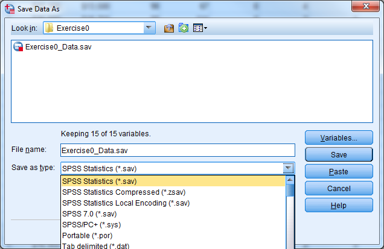{width="6.496790244969379in"
height="3.3645833333333335in"}

{width="4.625in" height="3.5625in"}

Exercise 2 -- Importing/Exporting Excel
---------------------------------------

Open Exercise2\_Data (an Excel file). Modify this Excel file such that
it can be imported into SPSS properly. Save the file and close it.

Open the file in SPSS (import it). Export this file back into Excel, but
only save the following variables: id, salary, minority.

Getting Help from SPSS
----------------------

Underneath the help menu are several different options. Here are a few:

-   "Topics" Search for a word or command

-   "Tutorial" Get an introduction to some SPSS basics

-   "Case Studies" Look at some example analyses using SPSS

-   "Statistics Coach" Get help in choosing the right statistical
    procedure

-   "Syntax Reference" View syntax manuals in their complete form (.pdf)

-   "SPSS Home Page" Open an internet browser and go to www.spss.com

-   "About" View version number and license expiration date

-   "Product Registration" Renew the license once it has expired

When looking at a help entry for a statistical procedure, there will
usually be a link labeled "Show Me", which provides explicit
instructions for carrying out the procedure via an example.

The "Command Syntax Reference" menu allows users to access the entire
text that can be found in the hard-copy manuals. The on-line manuals
open in Adobe Acrobat Reader and come with an index of topics. Click on
any page number to go instantly to that page.

**Helpful Hint:** when examining the on-line syntax guides, click the
small button at the bottom marked "100%" and choose 150% or 200% for
easier reading.

Section 2: Working with Variables
=================================

Variable View in Data Editor
----------------------------

Variables in SPSS vary in length and may consist of letters, numbers,
dates, or dollar values. Some values, such as "don't know" replies on a
survey, may be codes for missing values. SPSS allows you to label
variables and values with more meaningful phrases that can appear in the
output for greater clarity.

To view or edit the current format for a variable, double-click on the
variable's name in the Data Editor. Doing this will open the Variable
View tab in the Data Editor window. Alternatively, select the "Variable
View" tab at the bottom left corner of the data editor window.

**Try it: Open Section2\_Data.sav. Select "Variable View".**

{width="6.5in" height="2.7083333333333335in"}

There are eleven columns in the Variable View, containing values that
are attributes for the variables that you can change:

-   Name The name of each variable in the data set

-   Type The type (numeric, character, date, etc) and length

-   Width The amount of information in bytes stored in memory

-   Decimals The number of decimals displayed for numeric vars

-   Label A specific label for a variable

-   Values Variable value labels

-   Missing Missing value codes

-   Columns Column width for variable display

-   Align The alignment of values within a cell

-   Measure The measurement scale for a variable

-   Input The role of the variable when analyzing the data

### Variable Name

Be sure the names follow these rules:

-   Variable names should be no more than 64 characters long, and
    preferably no more than 8 characters long.

-   Variable names must start with a letter.

-   Variable names may only have letters, numbers, or underscores in
    them.

-   Variable names may not have the following characters:
    %,\$,\#,@,!,+,\*,\~,",-,..

-   Variable names may not have blank spaces.

-   Each variable name must be unique; the same variable name can't
    appear twice.

-   Variable names must be on one row only.

### Variable Type

The most fundamental characteristic of a variable is its type. These are
the four most important types:

-   Numeric includes comma, dot, and scientific notation types

-   String also called character, alpha, or alpha-numeric

-   Dollar includes custom currency type but is still numeric

-   Date is still numeric but displayed using hours, minutes, and
    seconds

{width="3.5729166666666665in"
height="4.572916666666667in"}

Most statistical analyses use only numeric variables. SPSS can handle a
short string variable, such as gender coded as "m" and "f", when that
variable defines groups for a t-test or an analysis of variance (ANOVA).

The Dollar type changes the way the values appear in the data editor and
the output, but all analyses treat the Dollar type as numeric.

The appearance of a date variable does not affect the way that the .sav
file stores the date. SPSS understands date/time variables as the number
of seconds since midnight, October 14, 1582 which is a significant date
marking a change in the Gregorian calendar. If you subtract one date
from the other to create a new variable, the result will be in seconds.
To change back to days, hours, or years, it is necessary to use a
function to turn the information into a more usable, practical form. See
the section Computing New Variables for more information.

**Try it: Use Section2\_Data.sav. Change the Variable Type for the ID
variable from Dollar to Numeric.**

{width="6.5in" height="3.6909722222222223in"}
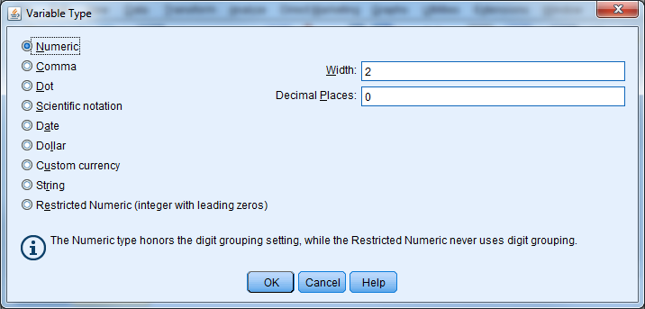{width="6.5in" height="3.113888888888889in"}

### Variable Labels

Variable labels attach a description to a variable, and this description
can show up in the output. To enter a variable label, click in the Label
cell for a given variable in Variable View, and enter a description for
the variable. Variable labels can be up to 255 characters as of Version
15.0.

**Try it: Use Section2\_Data.sav. Provide a label for DepScale
(Depression Scale 1998).**

{width="6.5in" height="3.6909722222222223in"}

### Value Labels

Value labels are similar, except that they refer to specific values
within that variable. You don't have to enter labels for all values. A
value label can be up to 120 bytes long. Suppose the following question
was in a survey:

Which of the following describes your political beliefs best?

1\) Democrat 2) Republican 3) Libertarian 4) Other

You will enter the responses as 1, 2, 3, or 4. These numbers are
arbitrarily, however, and some users may not know or may forget their
meaning. Value labels allow the user to attach meaning to the numbers.
Value labels are absolutely critical in large data files. Like variable
labels, value labels will appear in many of the results provided by
SPSS.

To assign value labels, click on the Values cell for a given variable,
and click on the small grey box. Enter a number in the Value box, then
the corresponding label in the Value Label box. Then press "Add". If you
do not press "Add", the information you have typed for that value will
be ignored.

**Try it: Use Section2\_Data.sav. Enter in value labels for variable
Education:**

**1=High School or Less**

**2=Some College**

**3=College Graduate**

{width="4.875in" height="3.1041666666666665in"}

### Missing Value Labels

There are two kinds of missing values: system-missing, in which the cell
is empty, and user-missing, which flags a value as an invalid response.
There often could be several reasons that a value is not available, and
user-missing values allow us to discriminate between them. Examples of
user-defined missing values are:

-   99 "Don't Know" reply on a survey

-   777 Inapplicable, such as with number of births for a male
    respondent

-   -999 Respondent refused to answer, which often occurs with income

Enter user-missing values just like any other response during data
entry. You need to tag the value as missing, however, so that SPSS does
not include it in any computations. Consider the repercussions if we
forgot to specify the 777 in the above example as Inapplicable, and then
attempted to calculate the average number of births!

You can specify user-missing values by clicking on the cell in the
Missing column for a given variable, and then clicking on the small grey
box that appears as "(...)". You may specify single values or a range of
values.

**Try it: Use Section2\_Data.sav.Enter missing value codes for Education
(99).**

{width="3.375in" height="2.4895833333333335in"}

### Columns & Alignment

You can change the alignment of the data by changing the Columns or
Align attributes. You can use the Align attribute to center values or
align them to the right or left of the cell in the Data Editor.
Additionally, you can decrease or increase the width of the columns
using the Columns attribute. A shortcut is to place the mouse at the
right edge of a variable name, click on the border, and drag the column
to be wider or narrower.

Asterisks (\*) in the cells within a particular column mean that the
column is not wide enough to display the data values. Simply increase
the column width and the values should appear properly in the Data
Editor. Another possible problem might be that the width is too small to
display all of the information for a variable.

The Columns and Align attributes have no effect on the data; they only
affect the way you see the data in the editor.

### Measure

Each variable in SPSS may be designated as

-   Scale a continuous variable

-   Ordinal a categorical variable with natural ordering

-   Nominal categorical without any natural ordering

Graphs from the Interactive graphics method use this information. This
field has no bearing for most procedures.

**Try it: Use Section2\_Data.sav. Change the Measure for the Education
variable from Scale to Ordinal.**

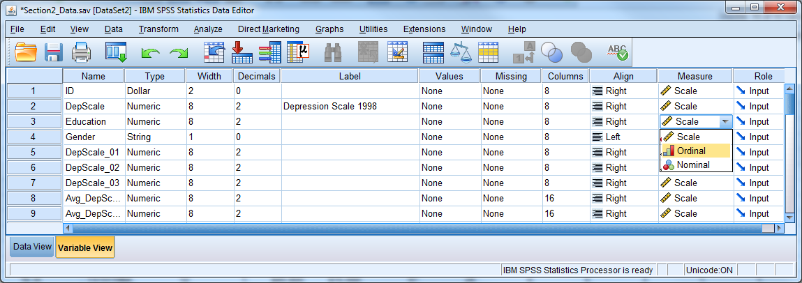{width="6.5in" height="2.296527777777778in"}

### Copy and Paste Variable Attributes

You can set up any of the attributes discussed above, such as type,
labels, missing values, and column format, and apply them to numerous
variables all at once. Suppose a researcher has a series of 50 variables
that all have values 1 through 5 as follows:

1 Strongly disagree

2 Disagree

3 Neutral

4 Agree

5 Strongly agree

Value labels would be useful for these variables, but it would be
extremely tedious to set up value labels for all 50 variables. Set up
the value labels for one of the 50 variables, and then click on the cell
containing the value labels for that variable. Select "Copy" from the
"Edit" menu or hit CTRL + C, and then highlight the value labels cells
for the remaining 49 variables by clicking on the first empty cell and
dragging downward. Select "Paste" from the "Edit" menu or hit CTRL + V,
and the value labels will be applied to the remaining 49 variables
instantly. You can also right-click and use the copy and paste
functions. You can use this same copy and paste feature for other
variable attributes and save a great deal of time!

**Try it: Use Section2\_Data.sav. Copy and paste the missing value code
from Education to DepScale.**

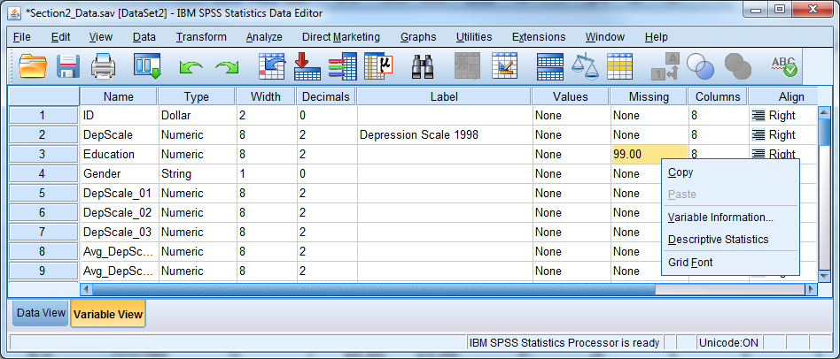{width="6.5in" height="2.7840277777777778in"}
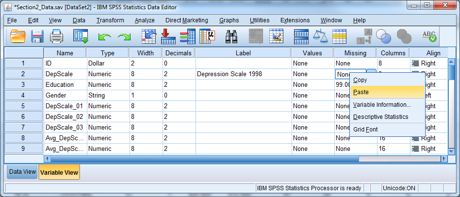{width="6.5in" height="2.7840277777777778in"}

### Exercise 3 -- Variable Attributes

Open Exercise3\_Data and go to Variable View. Practice defining the
correct attributes to each variable by following the code book below.

Creating New Variables and Defining the Correct Attributes
----------------------------------------------------------

To create a new variable in SPSS for entering data, simply double-click
on an empty column's heading, or start entering data directly into the
column in Data View. To enter values, first click in an empty cell; then
type each value and press either return or the down arrow.

During data entry, be aware that the order of cases in an SPSS data file
can change because certain procedures require that cases be sorted.
Therefore, be careful to match values with an ID variable. The case that
occupied the first row in the file a week ago may not be in the first
row any longer!

New variables, including those created by computation or recoding,
appear at the far right of the data file. Use the scroll bar at the
bottom to verify that a new variable was properly created.

Cut, copy, or paste a variable or insert a new empty column by right
clicking on a variable name.

A pasted variable **is not** inserted in between existing variables. It
replaces the highlighted column entirely, and could over-write an
existing variable. Be sure to create a new, blank column and paste on
top of that.

**Try it: Use Section2\_Data.sav. Create a new variable called NewVar.**

{width="6.5in" height="2.7840277777777778in"}

Computing Variables
-------------------

You can use the COMPUTE command to create new numeric or string
variables by:

-   Assigning a particular value to all cases, or a subset of cases

-   Transforming a variable by taking a log, or another mathematical
    function

-   Creating a sum, average, or other summary of several existing
    variables

**Helpful Hint:** You can use the COMPUTE procedure to edit or overwrite
an existing variable, but we highly recommend that you create new
variables. If you do over-write an existing variable, be aware that some
old values may not be overwritten. If some of the necessary information
is missing for a certain case in the file, and the software cannot
compute the new value, then the value from the old variable will remain.

Select "Transform" "Compute Variable" and enter a name for the new
variable in the upper left box, labeled "Target Variable." SPSS will
automatically create the new variable when it executes the compute
command.

{width="6.5in" height="5.0125in"}

By default, SPSS assumes that the user wants to compute a numeric
variable. If you want to create a string variable, click "Type & Label"
underneath the new variable name, and select "String."

In the box titled "Numeric Expression", provide the actual formula or
value for the new variable. You may write the numeric expressions by
hand or insert variables and functions using the mouse.

**Helpful Hint:** Click on the function name to get a function
description in the dialogue box.

If you want to create new dollar or date variables, then proceed as if
creating a numeric variable. The type can be changed after the compute
command is used. Note that seconds are the units of measurement for date
variables. To create date variables, we must use functions specifically
designed for the date variable type. See the List of Functions below for
more information.

### Dealing with Missing Data

Applying a function to a variable containing missing values will result
in a variable with corresponding system-missing values.

When taking the mean or sum of a set of variables, be sure to use the
mean() and sum() functions. SPSS only evaluates formulas such as "(var1
+ var2 + var3 + var4)/4" if all four variables have valid, non-missing
values.

By contrast, the software evaluates the formula "mean(var1, var2, var3,
var4)" as long as an individual has at least one valid response. You can
also stipulate that SPSS perform the calculation only when there are a
minimum number of valid responses. The formula "mean.3(var1, var2, var3,
var4, var5)", for example, would mean that an individual must have
answered at least 3 of the 5 questions. The new variable will have a
missing value otherwise.

**Try it: Use Section2\_Data.sav. Calculate the average depression score
using DepScale\_01, DepScale\_02, DepScale\_3. First use the function
"mean". Next write the expression by hand. Investigate the
differences.**

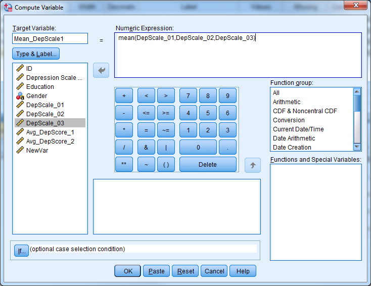{width="6.497297681539807in"
height="4.177083333333333in"}
{width="6.497297681539807in"
height="4.458333333333333in"} {width="6.5in"
height="4.731944444444444in"}

### List of Functions Available in the Compute Command

**Arithmetic Operators:**

\+ Addition

\- Subtraction

\* Multiplication

/ Division

\*\* Exponentiation

**Arithmetic Functions:**

ABS Absolute value

RND Round

TRUNC Truncate

MOD Modulus (remainder)

SQRT Square root

EXP Exponential

LG10 Base 10 log

LN Natural log

ARSIN Arcsin

ARTAN Arctangent

SIN Sine

COS Cosine

**Statistical Functions:**

SUM\[.n\] Sum of arguments

MEAN\[.n\] Mean of arguments

SD\[.n\] Standard deviation of arguments

VARIANCE\[.n\] Variance of arguments

CFVAR\[.n\] Coefficient of variation of arguments

MIN\[.n\] Minimum of arguments

MAX\[.n\] Maximum of arguments

**Missing Values Functions:**

MISSING True if the value is missing

NMISS Number of missing values across variables but within cases

NVALID Number of non-missing values across variables but within cases

**Across-case Function:**

LAG Value from previous case, or from n cases earlier if there is a
second argument n

**Date and Time Functions:**

CTIME.xxx SPSS time values to common units

DATE.xxx Common units to SPSS date values

TIME.xxx Common units to SPSS time values

XDATE.xxx SPSS date values to common units

**Other Functions:**

RV.UNIFORM Uniform pseudorandom no.

RV.NORMAL Normal pseudorandom no.

CDF.NORMAL Standard normal cumulative dis.

**Logical Functions:**

RANGE True if value is within range

ANY True if any value matches

**String Functions:**

ANY Same as for numeric values

CONCAT Concatenate

INDEX Index from left

LAG Same as for numeric values

LENGTH Defined length

LOWER Convert to lower case

LPAD Pad left

LTRIM Trim left

MAX Greatest value

MIN Least value

NUMBER Convert to a number

RANGE Same as for numeric values

RINDEX Index from right

RPAD Pad right

RTRIM Trim right

STRING Convert to a string

SUBSTR Substring

UPCASE Convert to upper case

### Count Values

One useful way to compute new variables is through the "Count Values
within Cases" procedure. This procedure counts how many times particular
values occur, within each case, across certain variables. Suppose we
have a data set of students where we recorded their scores on ten
separate quizzes over the course of a semester. We could use "Count
Values within Cases" to tally up the number of A's each student earned.

To use the Count Values within Cases procedure:

-   Go to "Transform" "Count Values within Cases".

-   Specify a new variable name under "Target Variable".

-   Place the variables to be examined in the "Variables" box.

-   Click "Define Values", and type the values to be counted.

-   Click "Continue", then "OK".

{width="4.875in" height="2.8229166666666665in"}

***Recoding Variables***

Recoding a variable means changing or "mapping" its values to new ones.
Often, you will need to convert string variables into numeric variables
in order to use them in a certain statistical procedure. Recoding is
also a way to collapse a continuous variable into categories.

Below are some pictorial representations of some possible recodes:

**"Male" 1**

**"Female" 0**

**1 0**

**2 1**

**3 2 **

**. **

**.**

**.**

**15**

### Manual Recoding

There are two ways to recode in SPSS:

-   Recode Into Same Variables **Not Recommended**

-   Recode Into Different Variables **Recommended**

By using "Recode Into Different Variables", your original variable will
not change, which is not the case with "Recode Into Same Variables".
"Recode Into Same Variables" is risky since you will not be able to undo
the changes if you make a mistake.

Select "Transform" "Recode into Different Variables"

{width="6.5in" height="3.6305555555555555in"}

In the "Recode Into Different Variables" dialogue box:

-   Select the old (original) variable.

-   Specify a new variable name, and click "Change".

-   Click "Old and New Values".

    -   Specify each old value, or range of values, on the left side of
        the box and each new number you want assigned on the right side
        of the box. Click "Add" each time.

    -   Make sure you include every original value. Unmentioned original
        values become missing values in the new variable.

    -   Click "Continue".

-   Click "OK".

{width="6.5in" height="3.7430555555555554in"}

Note that when using "Recode Into Different Variables", it is also
possible to recode a numeric variable into a character (string)
variable, or vice-versa:

-   Check the box marked "Output variables are strings" to change from
    numeric to string in the "Old and New Values" window

-   Check the box marked "Convert numeric strings to numbers" to change
    from string to numeric in the "Old and New Values" window.

**Try it: Use Section2\_Data.sav. Recode Gender with F=1 and M=2.
Inspect the output.**

{width="6.5in" height="3.6305555555555555in"}

{width="6.5in" height="3.7430555555555554in"}

Automatic Recoding
------------------

The Automatic Recode procedure recodes any variable's values into
consecutive integers 1, 2, 3, etc.... The software codes the lowest
numeric value, or the first value in alphabetical order in the case of
string variables, to a 1 by default. The next lowest number or next item
in alphabetical order becomes a 2, and so forth. Optionally, the
recoding can begin with the highest number of the last string value in
alphabetical order.

Automatic Recode always creates a new variable.

**Helpful Hint:** Automatic Recode is a quick way to make string
variables (e.g., gender) ready for statistical procedures that require
numeric variables.

To use Automatic Recode:

-   Go to "Transform" "Automatic Recode".

-   Choose the original variable to be recoded.

-   Specify a new variable name and click "Add New Name".

-   Select the order -- start numbering from smallest or largest values.

{width="4.677083333333333in"
height="4.854166666666667in"}

**Helpful Hint:** If you had assigned value labels for the old variable,
those labels will carry over to the corresponding new values. If there
were no value labels, then the old values themselves become the new
labels.

**Try it: Use Section2\_Data.sav. Use Automatic Recode to recode Gender.
Call this new variable AutoGender.**

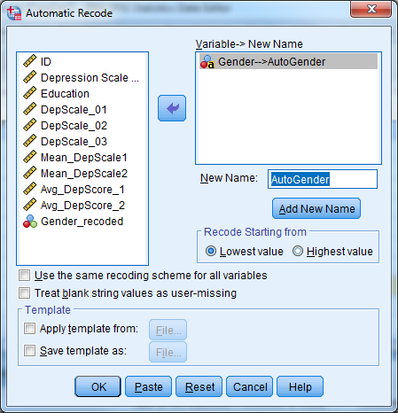{width="4.677083333333333in"
height="4.854166666666667in"}

Conditional Transformations with If/Then Logic
----------------------------------------------

The "If" button, which appears in the Compute, Recode, and Count
dialogue boxes, represents an important feature in variable
transformations. Using the "If" option, users can tell SPSS to perform
calculations or recodes only if cases meet certain conditions.

For example, suppose we surveyed women regarding the number of times
they had given birth, but women who had never been pregnant skipped that
section of the questionnaire. We might now want to assign a "0" for the
number of births for those women who had never been pregnant, to replace
the missing entry they currently have.

Assuming that we have a string variable called "everpreg" coded "Y" and
"N" for yes and no, and that our number of births variable is called
"numbirth", we would proceed as follows:

Go to "Transform" "Compute (Variable)"

-   Put numbirth in the "Target Variable" box.

-   Place a 0 in the "Numeric Expression" box.

-   Click "If".

-   Click "Include if case satisfies condition".

-   Type everpreg = "N" in the condition box.

-   Click "Continue" and "Ok".

{width="5.953517060367454in"
height="4.864583333333333in"}

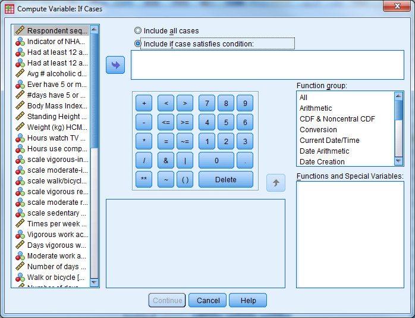{width="5.6875in" height="4.3511811023622045in"}

This "If" button, which allows transformations to take place for
selected cases only, works exactly the same in the Compute, Recode, and
Count procedures.

You can use the words and, or, and not within the If box to help write
your criteria. Some examples of If expressions are as follows:

-   sex = "f" and age \> 50 \[ women over 50 \]

-   not missing(income) \[ participants whose income is known \]

-   educat = 5 or educat = 6 \[ e.g., respondents with a BA or MA \]

Rank Cases
----------

You can perform variable transformations based on the ranked value for a
particular variable. It may be more convenient to analyze the quartiles,
for example, than the variables themselves.

Select "Transform" and then "Rank Cases" to recode a continuous variable
into a new variable based on rank. Select the variable of interest and
then click "Rank Types". You can select quartiles in this dialogue box
by checking the box for Ntiles and placing the number 4 in the blank
space. SPSS will create a new categorical variable and add it to the end
of the original dataset.

{width="5.083333333333333in"
height="3.1458333333333335in"}
{width="3.5729166666666665in"
height="2.2083333333333335in"}

Exercise 4 -- Computing and Transforming Variables
--------------------------------------------------

Open Exercise4\_Data.

Compute a new variable that is the change from beginning salary to
current salary for each employee.

Recode the education variable into a new variable according to the
following

1=High School or Less (educ\<=12)

2=Some College (12\<educ\<=16)

3=Bachelor's Degree or Higher (educ\>=17)

Section 3: Understanding Data Management Tasks
==============================================

Sorting Cases
-------------

Sorting cases based on a particular variable is often necessary when
managing data sets. Go to "Data" "Sort Cases" to place the cases in
order. Choose the variable that determines the ordering, and choose
"Ascending" or "Descending".

{width="4.041666666666667in"
height="3.8854166666666665in"}

Selecting the ID variable and choosing "Ascending" will place the
subject with the smallest ID number in the top row. The bottom row will
contain data on the subject with the largest (highest) ID number.

When sorting by more than one variable, SPSS sorts the data initially
based on the first variable. Within each value of that first variable,
it sorts again based on the second variable. Make sure to select
"Ascending" or "Descending" for each variable when you are sorting by
multiple variables. Highlight the variable by clicking on it, and choose
the correct ordering.

Suppose we want to sort by gender and then by age, with both in
ascending order. Suppose the codes for gender are as follows:

0 male

1 female

SPSS would first put males at the top of the file and females at the
bottom. SPSS would then sort by age within each gender group. The first
rows of the data set would contain the youngest men in the sample and
the last subjects at the bottom would be the oldest women in the sample.

Analyzing Subsets of Data
-------------------------

You can use the "Select Cases" command to instruct the software to
calculate statistical results or summaries based on only some of the
cases in the data set. You can define the subset by certain
characteristics, such as women over age 40, or you can instruct the
software to select a random sample of cases with size that you specify.

**Note:** The Select Cases procedure affects which cases that SPSS
includes in analysis and output only. It has no effect on
transformations of the data, such as computing, recoding, or counting.

Selecting cases involves turning on a filter that handles the inclusion
of certain cases and the exclusion of others. When the filter is on,
analyses or summaries will only use the selected cases. There will be a
message "Filter On" at the bottom right of the Data Editor window
whenever SPSS is using only selected cases.

The first time you invoke the "Select Cases" procedure, the software
creates a variable called filter\_\$ in the data set. This variable is
equal to 0 for excluded cases and 1 for included cases. SPSS deletes and
then re-creates the filter\_\$ variable each time you run "Select
Cases".

Users can specify their own filter variable. He or she can use any
variable as a filter as long as a value of 0 for that variable indicates
exclusion and a value of 1 inclusion. Click the "Use filter variable"
option under "Data" "Select Cases" to do this; move your filter variable
into the box.

### If Condition is Satisfied

Go to "Data" "Select Cases" to use only some of the cases. Click "If
condition is satisfied...." to select cases based on certain criteria.
Then click the "If..." button to pull up a window in which you will
state the condition. Some example conditions are:

gender='m' (selects men only)

age\<=12 and sex=2 (selects children 12 and under of one sex only)

marital=0 (selects all "never married" respondents)

You can return to the data editor by clicking "Continue" and "OK".
Notice that certain rows have been "scratched" out by SPSS. SPSS has
filtered out these cases because they did not satisfy the specified
condition. Analyses will only use those cases that are not scratched
out.

{width="5.239583333333333in"
height="4.729166666666667in"}

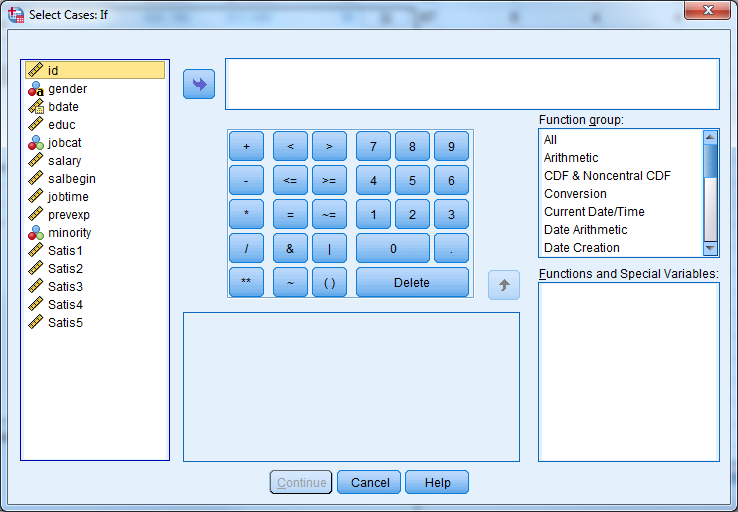{width="6.5in" height="4.03125in"}

To return to the entire sample, go to "Data" "Select Cases", choose the
radio button next to "All Cases," and then click "OK". The "Filter On"
message will disappear and all results from that point on refer to the
entire data set.

### Randomly Selecting Subsets

You may examine a randomly selected portion of the data by clicking
"Random Sample of Cases" in the "Select Cases" window. Then click the
"Sample..." button. You can then give an approximate percentage. If you
want to take an exact number of cases, first determine the total number
of cases (rows) and place this number in the "from the first \-\--
cases" segment of the dialogue box. If you would like to take a precise
number of cases from, say, all women, or all children under twelve, then
sort the data first so that the cases of interest occupy the first rows.
Determine the last row that refers to a female, or to a child under
twelve, and proceed as above.

{width="3.96875in"
height="1.5416666666666667in"}

**Note:** When SPSS selects cases randomly, repeated selections will be
different even when everything specified by the user has stayed the
same. An approximate 30% sample of cases will result in a different 30%
each time the user repeats the procedure.

**Helpful Hint:** To use the same random selection of cases over and
over again, first take the initial random sample. Then re-name the
filter\_\$ variable to any name of your choosing. SPSS will leave the
variable alone, and you can re-use the filter in consecutive SPSS
sessions.

### Output Options

At the bottom of the "Select Cases" dialogue box are three options:

-   Filter out unselected cases (recommended)

-   Copy selected cases to a new dataset (recommended)

-   Delete unselected cases (NOT RECOMMENDED)

{width="5.239583333333333in" height="5.3125in"}

If you set this to "Filter out unselected cases", the unselected cases
remain in the data set but the software temporarily excludes them from
all analyses. If you choose the second option, SPSS copies the selected
cases to a new dataset and you can save the dataset on your disk by
assigning a file name. The content of your original dataset remains
untouched with these two options.

If the you change the option to "Delete unselected cases", unselected
cases disappear from the data entirely. Be careful when permanently
deleting cases, because you CANNOT undo the deletion. Make sure to first
save your data file under a different name if you wish to permanently
delete cases.

**Try it: Use Section2\_Data.sav. Select only observations with
Education = 1 for analysis. **

{width="6.05625in" height="3.84375in"}
{width="6.5in" height="2.7291666666666665in"}

Analyzing Groups of Data Separately
-----------------------------------

When analyzing groups of cases separately, such as men and women, the
Split File command spares you from having to repeatedly select different
groups of cases.

The Split File command first sorts the data into groups based on a
specified variable. After that, SPSS generates any requested output for
each group separately. If we split the file based on gender and then
request the mean current salary, we would receive a mean current salary
for men and a mean current salary for women. A flag at the bottom right
of the data editor will read "Split File On" when you are using this
option.

You can use multiple variables to divide the data. If you use both
gender and job category as grouping variables, for example, then SPSS
will give all output for each job category group within each gender.

To use Split File:

-   Go to "Data" "Split File".

-   Click on "Compare Groups" or "Organize Output by Groups".

-   Select variable(s) which divide the data into groups.

-   Click OK.

-   To turn off the Split File command, return to "Data" "Split File"
    and click on "Analyze all cases, do not create groups".

{width="4.625in" height="3.5833333333333335in"}

**Try it: Use Section2\_Data.sav. Obtain the descriptive statistics for
DepScale\_01 for males and females separately. Hint: Select 'Analyze'
'Descriptive Statistics' 'Descriptives'.**

{width="3.93125in" height="2.875in"}

+---------+---------+---------+---------+---------+---------+---------+
| > **Des |
| criptiv |
| e       |
| > Stati |
| stics** |
+---------+---------+---------+---------+---------+---------+---------+
| > Gende | > N     | > Minim | > Maxim | > Mean  | > Std.  |
| r       |         | um      | um      |         | > Devia |
|         |         |         |         |         | tion    |
+---------+---------+---------+---------+---------+---------+---------+
| > F     | > DepSc | > 4     | > 2.00  | > 12.00 | > 7.250 | > 4.573 |
|         | ale\_01 |         |         |         | 0       | 47      |
+---------+---------+---------+---------+---------+---------+---------+
|         | > Valid | > 4     |         |         |         |         |
|         | > N     |         |         |         |         |         |
|         | > (list |         |         |         |         |         |
|         | wise)   |         |         |         |         |         |
+---------+---------+---------+---------+---------+---------+---------+
| > M     | > DepSc | > 4     | > 4.00  | > 15.00 | > 9.000 | > 4.690 |
|         | ale\_01 |         |         |         | 0       | 42      |
+---------+---------+---------+---------+---------+---------+---------+
|         | > Valid | > 4     |         |         |         |         |
|         | > N     |         |         |         |         |         |
|         | > (list |         |         |         |         |         |
|         | wise)   |         |         |         |         |         |
+---------+---------+---------+---------+---------+---------+---------+

 Exercise 5 -- Subsetting Data
------------------------------

Open Exercise5\_Data.

Select male managers. What is their average age?

(You can obtain the average age by choosing "Analyze" -\> "Descriptive
Statistics" -\> "Descriptives" and placing "Age of Respondednt \[age\]"
in the right hand side.)

Use the "split file" procedure to get the average age for each job
category.

Converting Data Formats
-----------------------

Different statistical methods frequently require different data formats.
A repeated measures analysis of variance, for example, requires that
data be in Wide format, while a linear mixed model requires that the
data be in Long format. SPSS makes it easy to convert between the two
formats. The examples below demonstrate how to use the wizard in SPSS.

To convert a dataset from one format to the other, first select "Data"
and then "Restructure". SPSS uses terminology that differs from
conventional phrasing.

-   Wide to Long Variables into Cases

-   Long to Wide Cases into Variables

We will briefly discuss these two variations, before doing exercises
together which include the instructions.

### Wide to Long (AKA "Variables into Cases")

{width="5.989583333333333in"
height="4.492187226596675in"}

There are seven steps in this Wizard:

1.  Identify the restructuring plan to be from "Variables into Cases".

2.  Select the number of variable groups.

3.  Select variables.

4.  Create index variables (usually one).

5.  Create one index variable.

6.  Choose options.

7.  Finish.

### Long to Wide (AKA "Cases into Variables")

{width="5.229166666666667in"
height="3.9218755468066493in"}

There are five steps in this Wizard:

1.  Identify the restructuring plan as "Cases into Variables".

2.  Select variables.

3.  Sort the data.

4.  Choose options.

5.  Finish.

### Exercise 6 -- Restructuring I (Wide to Long)

Convert Exercise6\_Data from "Wide" format to "Long" format

### Exercise 7 -- Restructuring II (Long to Wide)

Convert Exercise7\_Data from "Long" format to "Wide" format

(Both exercises to be done together.)

Section 4: Understanding Graphical & Statistical Procedures
===========================================================

Thinking About Statistics
-------------------------

Statistics is in a sense a giant toolbox containing a collection of
graphical and statistical procedures.\
\
Each graphical or statistical procedure is good for a particular
situation we may run into while doing data analysis. The main purpose of
any graphical and statistical procedure is to investigate a variable or
the relationships between variables. That is a very important concept!

**THE MAIN PURPOSE OF ANY GRAPHICAL OR STATISTICAL PROCEDURE IS TO
INVESTIGATE A VARIABLE OR THE RELATIONSHIPS BETWEEN VARIABLES.**

Keep in mind that graphical procedures can be more valuable to you than
statistical procedures. You should try to express your results in graphs
whenever you can.

It is not hard to implement or interpret any graphical or statistical
procedure once you understand and can explain the procedure. SPSS is
very helpful in both regards. The biggest challenge facing any
researcher is to know the most appropriate procedure to apply in any
particular situation.\
\
The types of the independent and dependent variables (predictors and
outcome) will guide your choice for the appropriate graphical and
statistical procedure.

Just like in many things in life, the 80/20 rule somewhat applies to
statistics. There are a small number of procedures that you will use
more repeatedly than others. Here, we will divide those essential
procedures, graphical and statistical, into 4 major classifications:

-   One Variable Only Procedures

-   One-on-One Procedures investigating two variables at a time

-   Many-on-One Procedures

-   Repeated, Longitudinal, Clustered, Multilevel, and Mixed Procedures

Correlation vs. Causation
-------------------------

The presence of a correlation between two variables DOES NOT imply that
there is causation between them. Any of the three scenarios below could
explain the correlation between two variables A and B. We can't tell
using statistics alone which scenario it is.

-   A causes B

-   B causes A

-   C causes both A and B

Everything On One Page Handout
------------------------------

The chart on the next page lays out the essential graphical and
statistical procedures by type and classification.

{width="9.269444444444444in"
height="6.001388888888889in"}

Parametric vs. Non-parametric Tests
-----------------------------------

There are varying assumptions that underlie the validity of each
statistical procedure. A common assumption for statistical procedures is
that the samples being analyzed should come from an underlying normal
distribution. If this is not a reasonable assumption, you can use
non-parametric tests. Non-parametric tests do not have this
distributional assumption, and generally use ranks in the place of the
raw scores. The table below gives non-parametric tests that are
equivalent to common parametric tests.

Basic Summary Statistics (Investigate One Variable at a Time)
-------------------------------------------------------------

As the name implies, One-Variable-Only Procedures help us investigate a
single variable at a time. They can tell us about the frequency
distribution of a categorical variable (Frequency Table, Mode, Bar
Graph, Pie Chart, etc.). They can give us insight into the central
tendency of a continuous variable (Mean, Median, Mode, etc.). They can
help us test a hypothesis about the mean of a variable (One Sample
t-test). They can give us insight into the dispersion of a variable
(Standard Deviation, Range, Inter-Quartile Range, Boxplots, Error Bar
Plots, etc.). They can also give us insight into the relative position
of any data point with respect to the other data points in a variable
(Percentiles, Quartiles, Boxplots, etc.).

In SPSS, there are two procedures which provide simple descriptive
statistics. You can find both procedures under "Analyze" "Descriptive
Statistics".

{width="5.0in" height="2.4583333333333335in"}
{width="5.0in" height="2.2395833333333335in"}

**Frequencies** procedure provides the number and % of cases which have
each value of a variable (e.g., 46% male, 54% female). You can request
other output by clicking Statistics. Frequencies are most useful for
categorical variables.

**Try it: Use Section4\_1\_Data.sav. Obtain the frequency (descriptive)
statistics for the variable Sex.**

{width="4.895833333333333in"
height="3.0833333333333335in"}

+-------------------+-----------+--------+
| > **Statistics**  |
+-------------------+-----------+--------+
| Respondent\'s Sex |
+-------------------+-----------+--------+
| > N               | > Valid   | > 1517 |
+-------------------+-----------+--------+
|                   | > Missing | > 0    |
+-------------------+-----------+--------+

+-----------+-----------+-----------+-----------+-----------+-----------+
| > **Respo |
| ndent\'s  |
| > Sex**   |
+-----------+-----------+-----------+-----------+-----------+-----------+
|           | > Frequen | > Percent | > Valid   | > Cumulat |
|           | cy        |           | > Percent | ive       |
|           |           |           |           | > Percent |
+-----------+-----------+-----------+-----------+-----------+-----------+
| > Valid   | > Male    | > 636     | > 41.9    | > 41.9    | > 41.9    |
+-----------+-----------+-----------+-----------+-----------+-----------+
|           | > Female  | > 881     | > 58.1    | > 58.1    | > 100.0   |
+-----------+-----------+-----------+-----------+-----------+-----------+
|           | > Total   | > 1517    | > 100.0   | > 100.0   |           |
+-----------+-----------+-----------+-----------+-----------+-----------+

**Descriptives** provides the mean, standard deviation, minimum, maximum
and non-missing sample size by default. Other statistics are available
by clicking Options. Descriptives are most useful for continuous
variables, and sometimes useful for ordinal data (categorical data with
ordering, e.g., small, medium, large) alongside the frequencies.

**Try it: Use Section4\_1\_Data.sav. Obtain the descriptive statistics
for the variable Age.**

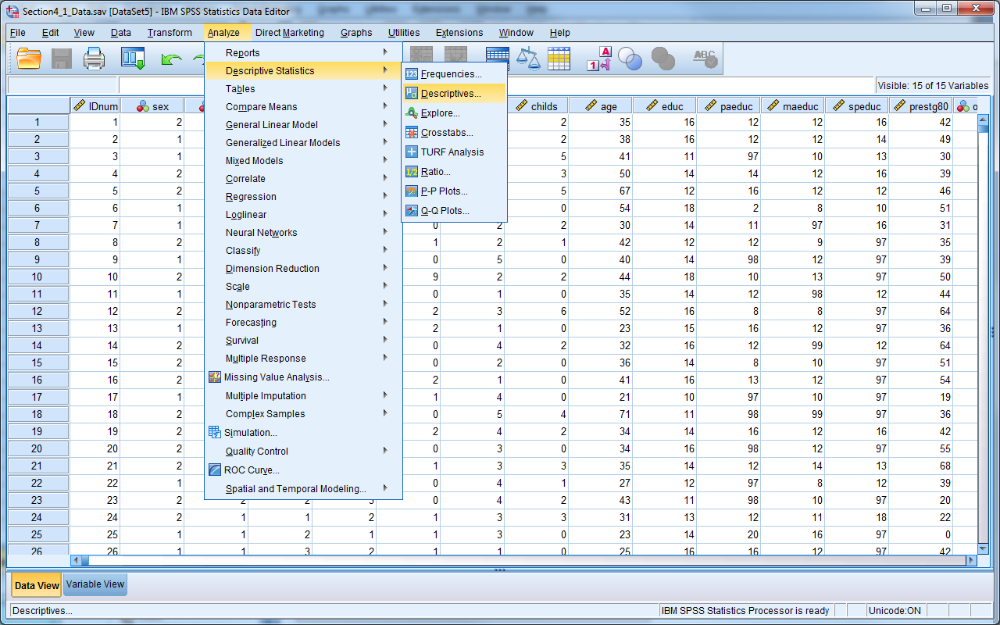{width="6.5in" height="3.2291666666666665in"}

{width="4.416666666666667in" height="2.0in"}

+-----------+-----------+-----------+-----------+-----------+-----------+
| > **Descr |
| iptive    |
| > Statist |
| ics**     |
+-----------+-----------+-----------+-----------+-----------+-----------+
|           | > N       | > Minimum | > Maximum | > Mean    | > Std.    |
|           |           |           |           |           | > Deviati |
|           |           |           |           |           | on        |
+-----------+-----------+-----------+-----------+-----------+-----------+
| > Age of  | > 1514    | > 18      | > 89      | > 45.63   | > 17.808  |
| > Respond |           |           |           |           |           |
| ent       |           |           |           |           |           |
+-----------+-----------+-----------+-----------+-----------+-----------+
| > Valid N | > 1514    |           |           |           |           |
| > (listwi |           |           |           |           |           |
| se)       |           |           |           |           |           |
+-----------+-----------+-----------+-----------+-----------+-----------+

As a first step in data analysis, one might run frequencies on all
categorical variables and descriptives on all continuous variables.
Obtaining descriptive statistics is an important step to detect possible
data entry errors.

Visualizations
--------------

There are two methods for creating charts in SPSS, Chart Builder and
Legacy Dialogs. (There is a third method, in which other analysis
methods create their own graphics, but we're covering only direct
creation of graphics here.)

The newer approach is Chart Builder, which is a more free-form approach.
It has a steeper learning curve but is ultimately more powerful.

The classic approach is legacy dialogs which are much easier to use, but
more restrictive in the types of plots they can create.

### Chart Builder

To create a graph in "Chart Builder", first select the type of graph
that you would like to create by dragging and dropping the appropriate
graph image to the "Chart Preview" area. Once you select a chart, the
Element Properties window will appear. The Element Properties window
allows you to modify what is displayed in the graph

{width="6.5in" height="4.488888888888889in"}

**Try it: Use Section4\_1Data.sav. Create a simple bar chart for
"Region". **

{width="5.05625in"
height="4.614583333333333in"}{width="5.18125in"
height="3.8229166666666665in"}

### Legacy Dialogs

The "Legacy Dialogs" interface requires that you determine the type of
graph you would like to create before providing a dialog box, which is
similar to other procedures in SPSS. After you select the general type
of graph or chart, SPSS will then prompt you to be more specific. If the
general form is a scatter plot, for example, SPSS will ask you to then
specify which type of scatter plot you would like to create. The
software will present you with the graphing dialogue box once you
specify the specific form for the graph.

{width="3.6875in" height="1.6041666666666667in"}
{width="4.552083333333333in" height="4.71875in"}

**Try it: Use Section4\_1Data.sav. Create a simple bar chart for
"Region". **

{width="3.5377318460192475in"
height="4.020833333333333in"}{width="5.18125in"
height="4.177083333333333in"}

Normality
---------

Many statistical procedures assume "normality", which means the
population which the data is from follows the Normal Distribution. You
may know this as the "bell curve".

{width="5.05625in"
height="3.159650043744532in"}

Many real-life variables follow a normal distribution such as height. If
you were to collect a random sample of heights, most people would fall
near the mean height for the population. Some people would be much
taller or shorter, and a very limited number of people would be
extremely short or extremely tall.

The normality assumption as written is usually quite strict; in practice
we often loosen it. Rather than "The data comes from a normal
population", you can think of it as "The data comes from a population
that's not too badly non-normal." Essentially, you're looking for major
violations of normality, rather than trying to determine whether the
bell curve perfectly fits your data.

Finally, a large sample size oftens "protects" you from normality
violations; the larger the sample size, the more extreme a normality
violation needs to be to be a concern.

While there are formal tests of normality, typically assessment is done
with a histogram (looking for that bell shape) or a QQ-plot, which looks
for its values to fall along the 90 line. The histogram can be created
from the Histogram Legacy Dialog, the QQ-plot is created under Analyze
-\> Descriptive Statistics -\> QQPlot.

**Try it: Use Section4\_1Data.sav. Obtain a histogram for the variable
"Age" and display the normal curve. Obtain a QQ plot for the variable
"Age". Hint: 'Analyze' 'Descriptive Statistics' 'QQPlot'.**

{width="3.0625in" height="2.7527777777777778in"}

{width="3.5729166666666665in"
height="2.8314818460192477in"}

{width="3.6979166666666665in"
height="2.7043985126859145in"}{width="3.5625in"
height="2.82245406824147in"}

Exercise 8 -- Data Exploration and Visualization
------------------------------------------------

Open Exercise8\_Data.sav

**Part 1**: Investigate the variable attributes. Determine which
variables are categorical variables (nominal and ordinal), and which
variables are continuous (scale).

Obtain the appropriate descriptive statistics for each variable.
Remember, continuous variables should be investigated with descriptives
and categorical variables should be investigated with frequency tables.

\*Hint: Select more than one variable in the "Analyze" "Descriptive
Statistics" "Descriptives" or "Frequencies" dialog boxes.

**Part 2**: Assess the distribution of the Occupational Prestige Score
("prestg80") with both a histogram (normal curve displayed) and a Q-Q
plot. Is the assumption that the population of Occupational Prestige
Scores is normally distributed reasonable?

**Part 3**: Compare the average highest year of school completed
("educ") for males and females.

\*Hint: First split the file by "sex" ("Data" "Split File"), then
calculate the descriptive statistics. Be sure to return to the "Split
File" menu when you are done with this question and return the dialog
box to "Analyze all cases".

**Part 4**: Produce a pie chart for the variable "region". (We didn't
cover this, you can use either Chart Builder or Legacy Dialogs.)

Investigating Two Variables at a Time
-------------------------------------

The main purpose of any graphical and statistical procedure is to
investigate a variable or the relationships between variables. We start
by examining the relationship between variables using simple
two-variable procedures. The type of independent and dependent variables
that you would like to investigate determines the appropriate
statistical or graphical procedure. Remember that the presence of a
correlation between two variables DOES NOT imply that there is causation
between them.

### Pearson Correlation Coefficient & Scatterplots

The Pearson Correlation Coefficient measures the linear association of
two continuous variables. A scatterplot is an easy way to visually
explore the association between two variables. When you plot the
variables together, you obtain a clear sense of the overall relationship
between the two variables.

The Pearson Correlation Coefficient (Pearson's r) varies from -1 to +1.
A value of zero indicates that there is no linear relationship between
the two variables, a value of +1 indicates that there is a perfect
positive linear relationship, and a value of -1 indicates that there is
a perfect negative relationship. Positive relationships imply that
variable 2 increases when variable 1 increases, and vice versa, while
negative relationships imply variable 2 increases when variable 1
decreases, and vice versa.

Assessing the statistical significance of a correlation is the same as
testing the chance that the observed correlation is significantly
different from zero correlation.

For the Pearson Correlation Coefficient in SPSS, select "Analyze"
"Correlate" "Bivariate".

{width="3.8541666666666665in" height="3.0in"}

For the Scatterplot in SPSS, select "Graphs" "Legacy Dialogs"
"Scatter/Dot" "Simple Scatter" and click "Define".

{width="3.880323709536308in"
height="3.9676115485564303in"}{width="3.18125in"
height="1.6041666666666667in"}

**Try it: Use Section4\_2\_Data.sav. Investigate the correlation between
the individual behavior intention scales. Select "Analyze" "Correlate"
"Bivariate". Select "BIndBehInt\_Pre" and "BIndBehInt\_Post". Select
"OK".**

{width="4.895833333333333in"
height="4.270833333333333in"}

+-----------------+-----------------+-----------------+-----------------+
| > **Correlation |
| s**             |
+-----------------+-----------------+-----------------+-----------------+
|                 | > Individual    | > Individual    |
|                 | > behavior      | > behavior      |
|                 | > intention     | > intention     |
|                 | > scale before  | > scale after   |
|                 | > intervention  | > intervention  |
+-----------------+-----------------+-----------------+-----------------+
| > Individual    | > Pearson       | > 1             | > .701^\*\*^    |
| > behavior      | > Correlation   |                 |                 |
| > intention     |                 |                 |                 |
| > scale before  |                 |                 |                 |
| > intervention  |                 |                 |                 |
+-----------------+-----------------+-----------------+-----------------+
|                 | > Sig.          |                 | > .000          |
|                 | > (2-tailed)    |                 |                 |
+-----------------+-----------------+-----------------+-----------------+
|                 | > N             | > 59            | > 59            |
+-----------------+-----------------+-----------------+-----------------+
| > Individual    | > Pearson       | > .701^\*\*^    | > 1             |
| > behavior      | > Correlation   |                 |                 |
| > intention     |                 |                 |                 |
| > scale after   |                 |                 |                 |
| > intervention  |                 |                 |                 |
+-----------------+-----------------+-----------------+-----------------+
|                 | > Sig.          | > .000          |                 |
|                 | > (2-tailed)    |                 |                 |
+-----------------+-----------------+-----------------+-----------------+
|                 | > N             | > 59            | > 59            |
+-----------------+-----------------+-----------------+-----------------+
| > \*\*.         |
| > Correlation   |
| > is            |
| > significant   |
| > at the 0.01   |
| > level         |
| > (2-tailed).   |
+-----------------+-----------------+-----------------+-----------------+
|                 |
+-----------------+-----------------+-----------------+-----------------+

The table indicates that there is a significant correlation between the
pre intervention and post intervention behavior scale scores. Our
p-value (Sig (2-tailed)) is less than our predetermined 0.05 level of
significance, so we reject the null hypothesis that there is not an
association between these two variables. The correlation coefficient is
positive, indicating that high scores for one variable correspond to
high scores for the other variable. Conversely, low scores for one
variable correspond to low scores for the other variable. Individuals
who scored high on the pre-test also tended to score high on the post
test.

To visually investigate this relationship, use a scatterplot:

Select "Graphs" "Legacy Dialogs" "Scatter/Dot".

Select "Simple Scatter" "Define".

Select "BIndBehInt\_Post" for the Y Axis.

Select "BIndBehInt\_Pre" for the X Axis.

Select "OK".

{width="4.30625in" height="4.572916666666667in"}

{width="6.5in" height="5.197916666666667in"}

The scatterplot indicates a linear relationship between the two
variables.

### Pearson Chi-Square Crosstabs and Test of Independence

The Chi-square test is very common way to explore the relationship
between two categorical variables. This tests the null hypothesis that
there is no relationship between the two variables, and rejecting the
null hypothesis allows us to conclude that the variables have a
statistically significant relationship with each other.

Suppose that we're interested in determining if there is a significant
relationship between smoking status and lung cancer status. Our
variables are:

1\) Smoking Status (1=Yes, 0=No) , and

2\) Lung Cancer Status (1=Diagnosed, 2=Not Diagnosed).

We can summarize these variables in a 2x2 table called a **crosstab**
where the cell values represent the counts in our data that fall in
those particular categories. We can perform a Chi-square test to
determine if there is a relationship between smoking and lung cancer.

Select "Analyze" "Descriptive Statistics" "Crosstabs" for the Chi-square
test of independence and make sure to check the box "Chi-Square" under
"Statistics". You can produce a clustered bar chart to visualize this
table by checking the box for "Display Clustered Bar Chart" in the
"Crosstab" dialog box.

{width="5.046990376202975in"
height="4.510416666666667in"}

{width="3.2414348206474193in"
height="3.7708333333333335in"}

**Try it: Use Section4\_2\_Data.sav. Are females more likely to
participate in jokes that are derogatory to any racial group?
Investigate the data to see what types of variables we have to answer
this question. We have the categorical variable "Sex" and the
categorical variable "Joke". Since we are comparing two categorical
variables, we will use a Chi-square test. Select "Analyze" "Descriptive
Statistics" "Crosstabs". Select "Sex" for rows, "Joke" for column, check
the box to "Display clustered bar charts". Select "Statistics" and check
the box for "Chi-Square". Select "Continue" and the select "OK".**

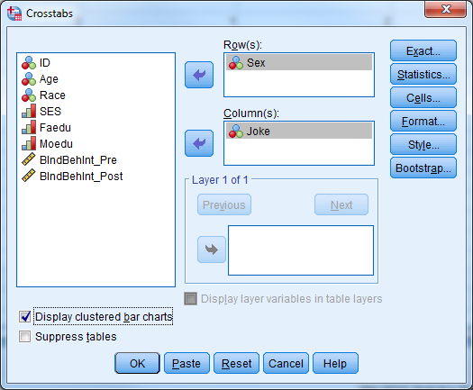{width="4.0in" height="3.7395833333333335in"}

{width="2.6145833333333335in"
height="2.8777777777777778in"}

+-------------+-------------+-------------+-------------+-------------+
| > **Sex \*  |
| > Would you |
| > participa |
| te          |
| > in jokes  |
| > that are  |
| > derogator |
| y           |
| > to any    |
| > racial    |
| > group?    |
| > Crosstabu |
| lation**    |
+-------------+-------------+-------------+-------------+-------------+
| Count       |
+-------------+-------------+-------------+-------------+-------------+
|             | > Would you | > Total     |
|             | > participa |             |
|             | te          |             |
|             | > in jokes  |             |
|             | > that are  |             |
|             | > derogator |             |
|             | y           |             |
|             | > to any    |             |
|             | > racial    |             |
|             | > group?    |             |
+-------------+-------------+-------------+-------------+-------------+
|             | > No        | > Yes       |             |
+-------------+-------------+-------------+-------------+-------------+
| > Sex       | > Male      | > 7         | > 7         | > 14        |
+-------------+-------------+-------------+-------------+-------------+
|             | > Female    | > 27        | > 16        | > 43        |
+-------------+-------------+-------------+-------------+-------------+
| > Total     | > 34        | > 23        | > 57        |
+-------------+-------------+-------------+-------------+-------------+

+-----------+-----------+-----------+-----------+-----------+-----------+
| > **Chi-S |
| quare     |
| > Tests** |
+-----------+-----------+-----------+-----------+-----------+-----------+
|           | > Value   | > df      | > Asympto | > Exact   | > Exact   |
|           |           |           | tic       | > Sig.    | > Sig.    |
|           |           |           | > Signifi | > (2-side | > (1-side |
|           |           |           | cance     | d)        | d)        |
|           |           |           | > (2-side |           |           |
|           |           |           | d)        |           |           |
+-----------+-----------+-----------+-----------+-----------+-----------+
| > Pearson | > .718^a^ | > 1       | > .397    |           |           |
| > Chi-Squ |           |           |           |           |           |
| are       |           |           |           |           |           |
+-----------+-----------+-----------+-----------+-----------+-----------+
| > Continu | > .285    | > 1       | > .594    |           |           |
| ity       |           |           |           |           |           |
| > Correct |           |           |           |           |           |
| ion^b^    |           |           |           |           |           |
+-----------+-----------+-----------+-----------+-----------+-----------+
| > Likelih | > .709    | > 1       | > .400    |           |           |
| ood       |           |           |           |           |           |
| > Ratio   |           |           |           |           |           |
+-----------+-----------+-----------+-----------+-----------+-----------+
| > Fisher\ |           |           |           | > .532    | > .295    |
| 's        |           |           |           |           |           |
| > Exact   |           |           |           |           |           |
| > Test    |           |           |           |           |           |
+-----------+-----------+-----------+-----------+-----------+-----------+
| > Linear- | > .705    | > 1       | > .401    |           |           |
| by-Linear |           |           |           |           |           |
| > Associa |           |           |           |           |           |
| tion      |           |           |           |           |           |
+-----------+-----------+-----------+-----------+-----------+-----------+
| > N of    | > 57      |           |           |           |           |
| > Valid   |           |           |           |           |           |
| > Cases   |           |           |           |           |           |
+-----------+-----------+-----------+-----------+-----------+-----------+
| > a\. 0   |
| > cells   |
| > (0.0%)  |
| > have    |
| > expecte |
| d         |
| > count   |
| > less    |
| > than 5. |
| > The     |
| > minimum |
| > expecte |
| d         |
| > count   |
| > is      |
| > 5.65.   |
+-----------+-----------+-----------+-----------+-----------+-----------+
| > b.      |
| > Compute |
| d         |
| > only    |
| > for a   |
| > 2x2     |
| > table   |
+-----------+-----------+-----------+-----------+-----------+-----------+

{width="4.40625in" height="2.75in"}

The results above indicate that there is not a significant difference
between how females and males answered the question "Would you
participate in jokes that are derogatory to any racial group?"
(p-value=0.397).

***Two-Sample T-Test and One-Way ANOVA***

The purpose of the two-sample t-test, also known as the independent
samples t-test, is to determine if mean values of a particular
continuous variable are significantly different for two groups. The
one-way analysis of variance (ANOVA) is mathematically equivalent to the
two-sample t-test, and is appropriate when there are two or more groups.

There are 3 assumptions that must be met in order to perform these
tests:

1)  Normality of sample means within groups for the two-sample t-test,
    and normality of the underlying variable within groups for ANOVA.

2)  Homogeneity of variance for ANOVA

3)  Independence of groups and observations

You can investigate normality with Q-Q plots or histograms and use
Levene's test to assess homogeneity of variance. You can also
side-by-side box plots to investigate the relationship between a
continuous dependent variable and a categorical predictor.

In SPSS, select "Analyze" "Compare Means" to find the two-sample t-test
and one-way ANOVA

{width="4.229166666666667in"
height="2.3645833333333335in"}

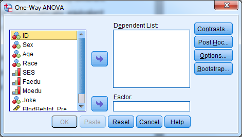{width="4.90625in"
height="2.7916666666666665in"}

For the side-by-side box plots, select "Graphs" "Legacy Dialogs"
"Boxplot" "Simple" "Summaries for groups of cases" "Define" "Variable":
Continuous dependent variable, "Category Axis": Categorical predictor
"OK"

{width="2.0104166666666665in"
height="2.2916666666666665in"}{width="4.114583333333333in"
height="3.5833333333333335in"}

**Try it: Use Section4\_2\_Data.sav. Is there a relationship between sex
and the post intervention intension scale score? Sex is a categorical
variable, the intension scale is continuous. We can use either an
independent samples t-test or one-way ANOVA. Select "Analyze" "Compare
Means" "Independent Samples T Test". Select "BIndBehInt\_Post" for Test
Variable(s). Select "Sex" for Grouping Variable. Select "Define
Groups..." and let group 1=1, group 2=2. Select "Continue". Select
"OK".**

{width="4.895833333333333in"
height="3.0416666666666665in"}

{width="2.4791666666666665in"
height="2.0416666666666665in"}

+-----------+-----------+-----------+-----------+-----------+-----------+
| > **Group |
| > Statist |
| ics**     |
+-----------+-----------+-----------+-----------+-----------+-----------+
|           | > Sex     | > N       | > Mean    | > Std.    | > Std.    |
|           |           |           |           | > Deviati | > Error   |
|           |           |           |           | on        | > Mean    |
+-----------+-----------+-----------+-----------+-----------+-----------+
| > Individ | > Male    | > 14      | > 5.3036  | > 1.66855 | > .44594  |
| ual       |           |           |           |           |           |
| > behavio |           |           |           |           |           |
| r         |           |           |           |           |           |
| > intenti |           |           |           |           |           |
| on        |           |           |           |           |           |
| > scale   |           |           |           |           |           |
| > after   |           |           |           |           |           |
| > interve |           |           |           |           |           |
| ntion     |           |           |           |           |           |
+-----------+-----------+-----------+-----------+-----------+-----------+
|           | > Female  | > 43      | > 5.5940  | > 2.03090 | > .30971  |
+-----------+-----------+-----------+-----------+-----------+-----------+

                                                           Levene\'s Test for Equality of Variances   t-test for Equality of Means
  -------------------------------------------------------- ------------------------------------------ ------------------------------ ------- -------- ----------------- ----------------- ----------------------- ------------------------------------------- ---------- ---------
                                                           F                                          Sig.                           t       df       Sig. (2-tailed)   Mean Difference   Std. Error Difference   95% Confidence Interval of the Difference
                                                                                                                                                                                                                  Lower                                       Upper
  Individual behavior intention scale after intervention   Equal variances assumed                    0.695                          0.408   -0.484   55                0.631             -0.29038                0.60044                                     -1.49370   0.91293
                                                           Equal variances not assumed                                                       -0.535   26.647            0.597             -0.29038                0.54294                                     -1.40509   0.82433

The tables above indicate that the males and females have similar
average intension scale scores (males=5.3, females=5.59). We fail to
reject the null hypothesis for Levene's test, so we will report the
information for "Equal variances assumed". Our p-value is .631, so we
fail to reject the null hypothesis that males and females have similar
average intention scale scores.

Select "Analyze" "Compare Means" "One-Way ANOVA". Select
"BIndBehInt\_Post" for the dependent list. Select "Sex" for the factor.
Select "OK"

{width="3.6875in" height="1.75in"}

+-----------+-----------+-----------+-----------+-----------+-----------+
| > **ANOVA |
| **        |
+-----------+-----------+-----------+-----------+-----------+-----------+
| Individua |
| l         |
| behavior  |
| intention |
| scale     |
| after     |
| intervent |
| ion       |
+-----------+-----------+-----------+-----------+-----------+-----------+
|           | > Sum of  | > df      | > Mean    | > F       | > Sig.    |
|           | > Squares |           | > Square  |           |           |
+-----------+-----------+-----------+-----------+-----------+-----------+
| > Between | > .891    | > 1       | > .891    | > .234    | > .631    |
| > Groups  |           |           |           |           |           |
+-----------+-----------+-----------+-----------+-----------+-----------+
| > Within  | > 209.424 | > 55      | > 3.808   |           |           |
| > Groups  |           |           |           |           |           |
+-----------+-----------+-----------+-----------+-----------+-----------+
| > Total   | > 210.315 | > 56      |           |           |           |
+-----------+-----------+-----------+-----------+-----------+-----------+

The ANOVA table above yields the same p-value and conclusion as using
the two-sample t-test.

Select "Graphs" "Legacy Dialogs" "Boxplot". Select "Simple" "Summaries
for groups of cases" "Define". Select the continuous dependent variable
for "Variable", Categorical predictor for "Category Axis". Select "OK".

{width="3.2604166666666665in"
height="2.1979166666666665in"}

{width="5.5625in" height="4.083333333333333in"}

***Paired T-Test***

A paired t-test, also known as a repeated measures t-test or dependent
samples t-test, is appropriate when there are two related observations
(variables) and we want to determine if the average values of these
variables differ from one another. The purpose of the paired t-test is
to test the same units of observation under different treatment
conditions to see if a treatment effect exists. The test compares the
pre-treatment value to the post-treatment value for each case.

The null hypothesis is that the mean value of the differences for these
two related

variables is 0. If we reject this hypothesis, then we conclude that the
difference is

significantly different from 0. This test assumes that the sample mean
of the differences

is normally distributed. The test only considers cases with both
pre-treatment and

post-treatment values.

In SPSS, select "Analyze" "Compare Means" "Paired Samples T-Test".

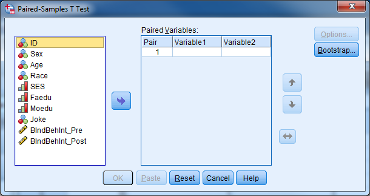{width="6.05625in"
height="3.3645833333333335in"}

**Try it: Use Section4\_2\_Data.sav. Investigate whether or not the
average intention scores are statistically different from each other.
Since these variables are pre and post variables, it would be
interesting to see if the intervention was successful in increasing the
scores of participants. To investigate this, we will use a paired
t-test. Select "Analyze" "Compare Means" "Paired Samples T-Test". Select
"BIndBehInt\_Pre" for Variable 1. Select "BIndBehInt\_Post" for Variable
2. Select "OK".**

{width="6.18125in"
height="3.3645833333333335in"}

+-----------+-----------+-----------+-----------+-----------+-----------+
| > **Paire |
| d         |
| > Samples |
| > Statist |
| ics**     |
+-----------+-----------+-----------+-----------+-----------+-----------+
|           | > Mean    | > N       | > Std.    | > Std.    |
|           |           |           | > Deviati | > Error   |
|           |           |           | on        | > Mean    |
+-----------+-----------+-----------+-----------+-----------+-----------+
| > Pair 1  | > Individ | > 3.7034  | > 59      | > 2.61758 | > .34078  |
|           | ual       |           |           |           |           |
|           | > behavio |           |           |           |           |
|           | r         |           |           |           |           |
|           | > intenti |           |           |           |           |
|           | on        |           |           |           |           |
|           | > scale   |           |           |           |           |
|           | > before  |           |           |           |           |
|           | > interve |           |           |           |           |
|           | ntion     |           |           |           |           |
+-----------+-----------+-----------+-----------+-----------+-----------+
|           | > Individ | > 5.6507  | > 59      | > 2.02827 | > .26406  |
|           | ual       |           |           |           |           |
|           | > behavio |           |           |           |           |
|           | r         |           |           |           |           |
|           | > intenti |           |           |           |           |
|           | on        |           |           |           |           |
|           | > scale   |           |           |           |           |
|           | > after   |           |           |           |           |
|           | > interve |           |           |           |           |
|           | ntion     |           |           |           |           |
+-----------+-----------+-----------+-----------+-----------+-----------+

+-------------+-------------+-------------+-------------+-------------+
| > **Paired  |
| > Samples   |
| > Correlati |
| ons**       |
+-------------+-------------+-------------+-------------+-------------+
|             | > N         | > Correlati | > Sig.      |
|             |             | on          |             |
+-------------+-------------+-------------+-------------+-------------+
| > Pair 1    | > Individua | > 59        | > .701      | > .000      |
|             | l           |             |             |             |
|             | > behavior  |             |             |             |
|             | > intention |             |             |             |
|             | > scale     |             |             |             |
|             | > before    |             |             |             |
|             | > intervent |             |             |             |
|             | ion         |             |             |             |
|             | > &         |             |             |             |
|             | > Individua |             |             |             |
|             | l           |             |             |             |
|             | > behavior  |             |             |             |
|             | > intention |             |             |             |
|             | > scale     |             |             |             |
|             | > after     |             |             |             |
|             | > intervent |             |             |             |
|             | ion         |             |             |             |
+-------------+-------------+-------------+-------------+-------------+

  **Paired Samples Test**
  ------------------------- ------------------------------------------------------------------------------------------------------------------ ---------------- ----------------- ------------------------------------------- ---------- ---------- -------- ---- -------
                            Paired Differences                                                                                                 t                df                Sig. (2-tailed)
                            Mean                                                                                                               Std. Deviation   Std. Error Mean   95% Confidence Interval of the Difference
                                                                                                                                                                                  Lower                                       Upper
  Pair 1                    Individual behavior intention scale before intervention - Individual behavior intention scale after intervention   -1.94729         1.87705           0.24437                                     -2.43645   -1.45813   -7.969   58   0.000

The tables above indicate that there is a significant increase in
average behavior intention score after the intervention (p-value\<.001).

Investigating Many Variables at a Time
--------------------------------------

It is often useful to investigate the relationship between one outcome
variable and multiple predictor variables. The type of the outcome
variable determines the appropriate model; general linear models are
appropriate for continuous outcomes and generalized linear models are
appropriate for categorical outcomes. General linear models include
simple linear regression and multiple linear regression while
generalized linear models include binary logistic regression and ordinal
logistic regression. Linear regression and binary linear regression will
be covered through **EXERCISES** in this workshop, time permitting.

Repeated Measures, Longitudinal, Clustered, Multilevel, Mixed Procedures
------------------------------------------------------------------------

It is very common in many studies to take multiple measurements on a
unit of analysis, typically a subject. These multiple measures may be
occurring over time, conditions, regions, or the levels of any other
variable. Depending on what the measurements are taking place over,
there are many names we give these studies. It is also very common in
many studies to have the units of analysis be clustered (i.e. grouped)
into higher level clusters (i.e. groups). Sometimes the clusters
themselves are further clustered into even higher level clusters, and so
on.

In all of these studies, we must use more advanced statistical
procedures that take into consideration the possible correlation of
observations that are coming from the same unit of analysis. While using
advanced procedures to analyze such data sets is beyond the scope of
this workshop, you should be able to identify these multilevel data sets
and discuss them with your statistician.

Other Procedures in SPSS
------------------------

Here is a non-exhaustive list of other procedures in SPSS that you may
use:

Tests for checking the assumptions of normality

Intraclass correlation coefficient

Partial correlations\
General linear models\
Generalized linear models

Categorical data analysis

Randomized clinical trials

Case-control clinical trials

Matching and propensity scores\
Survival analysis\
Cox regression

Two-stage least squares regression

Probit regression\
Cluster analysis\
Discriminant analysis

Factor analysis\
Principal components analysis\
Reliability analysis\
Path analysis\
Structural equations modeling\
Latent class analysis

Multidimensional ccaling\
Spatial statistics\
Time series analysis\
Complex samples and survey methodology\
Missing data analysis and imputation\
Geographical information systems\
Qualitative data analysis\
Text mining

Receiver operator characteristic (ROC) curve analysis\
Functional data analysis\
Data mining

Classification and regression trees (CART)

Chi-square automatic interaction detection (CHAID)

Neural networks

Miscellaneous
-------------

### Descriptive Statistics

"Analyze" "Descriptive Statistics" "Descriptives"

### Frequencies

"Analyze" "Descriptive Statistics" "Frequencies"

### Rank Cases

"Transform" "Rank Cases" "Rank Types"

### T-Tests & One-Way ANOVA

"Analyze" "Compare Means"

### Chi-Square Test

"Analyze" "Descriptive Statistics" "Crosstabs" Check the Chi-square box
under "Statistics"

### Create a Code Book

"File" "Display Data File Information" "Working File"

Check output

Can export or copy/paste into Word or Excel

### Adjust Options

"Edit" "Options"

You can select to display variable labels or variable names in dialog
boxes

You can change what Output looks like (labels, no labels)

Many other options

### Recall Recently Used Dialogs Button

Will open recently used dialog boxes (chi-square cross tabs,
frequencies, etc.)

Button is forth from the left at the top of the Data View screen

### Jump to a Case

"Edit" "Go to Case"

Can type in or select

### Jump to a Variable

"Edit" "Go to Variable"

Can select the variable from the drop down menu or start typing it

### Spell Check

In Variable View and Data View, upper right corner

Will be grayed out in Data View if you do not have string variables

### Sort Variable

In Data View, right click the variable you would like to sort by

Select "Sort Ascending" or "Sort Descending"

### View Value Labels in Data View

"View" "Check the box for Value Labels"

Check data in Data View

### Weights in Crosstabs

If you don't have raw data (only cell counts) you can still do a
chi-square crosstabs in SPSS

Open a blank SPSS data file

The first variable will serve as the "weights" variable

The next two variables represent rows and columns

Data Weight Cases Weight Cases by Var0001 OK

Analyze Descriptive Statistics Crosstabs

Enter in Var0002 for rows and Var0003 for columns OK

EXAMPLE:

> ***Given a Table of Counts:***
>
> *Yes No*
>
> *Yes 35 90*
>
> *No 50 100*
>
> ***SPSS Data:***
>
> *Var0001 Var0002 Var0003*
>
> *90.00 1.00 .0*
>
> *50.00 .0 1.00*
>
> *35.00 1.00 1.00*

100. *.0 .0*

### Useful websites

Statnotes: http://faculty.chass.ncsu.edu/garson/PA765/statnote.htm

http://www.ats.ucla.edu/stat/SPSS/

Interpreting Interactions in a Regression Model Overview
========================================================

Two-Way Interactions
--------------------

### General

Let our regression model follow this form:

Y=A+B+A\*B

Where Y represents our dependent/outcome variable and A\*B represents
the interaction between A and B.

-   The regression coefficient for A shows the effect of A when B=0.

-   The regression coefficient for B shows the effect of B when A=0.

-   The regression coefficient for A\*B demonstrates how A changes with
    a one unit increase in B. It also demonstrates how B changes with a
    one unit increase in A.

### Two Categorical Variables

-   Let A represent gender

    -   0=Female

    -   1=Male

-   Let B represent treatment condition

    -   0=Control

    -   1=Experimental

-   The interaction regression coefficient shows whether the effect of
    treatment condition is different for males and females.

-   The regression coefficient for A shows the difference in Y between
    males and females for the 'control' treatment group.

-   The regression coefficient for B shows the difference in Y between
    treatment and control groups for females.

### One Categorical and One Continuous Variable

-   Let A represent gender

    -   0=Female

    -   1=Male

-   Let B represent a continuous variable: age in years.

-   The interaction regression coefficient shows if the effect of age on
    Y is different for males and females.

-   The regression coefficient for A shows the difference between males
    and females when age is equal to zero.

-   The regression coefficient for B shows the effect of age for
    females.

### Two Continuous Variables

-   Let A represent a continuous variable: IQ score.

-   Let B represent a continuous variable: Age.

-   The interaction regression coefficient shows

    -   if the relationship between age and Y differs according to IQ

    -   if the relationship between IQ and Y differs according to age.

-   The regression coefficient for A shows the relationship between IQ
    and Y when age equals zero.

-   The regression coefficient for B shows the relationship between age
    and Y when IQ equals zero.

Three-Way Interactions
----------------------

The same principles apply from above. The general model:

Y=A+B+C+A\*B+A\*C+B\*C+A\*B\*C

-   The coefficient for A shows the effect of A on Y when both B and C
    are zero.

-   The coefficient for B shows the effect of B on Y when both A and C
    are zero.

-   The coefficient for C shows the effect of C on Y when both A and B
    are zero.

-   The coefficient for A\*B shows the interaction between A and B when
    C is zero.

-   The coefficient for A\*C shows the interaction between A and C when
    B is zero.

-   The coefficient for B\*C shows the interaction between B and C when
    A is zero.

-   The interaction regression coefficient shows if the relationship
    between

    -   A and Y differs according to B and C

    -   B and Y differs according to A and C

    -   C and Y differs according to A and B.
